# 论文框架图制图 Skill

<a id="chinese"></a>

## 中文 | [English](#english)

`paper-framework-figure-studio-pro` 是面向计算机科学论文框架图的制图 skill。它的目标是为绘制框架图提供多样性的参考草案，方便后续人工对照制图；适合 method overview、architecture diagram、pipeline/process figure 和 agent workflow。感谢 bristol 的刘欣阳同学提供的协助。

| 最终结果图 | 架构图 |
|---|---|
|  | 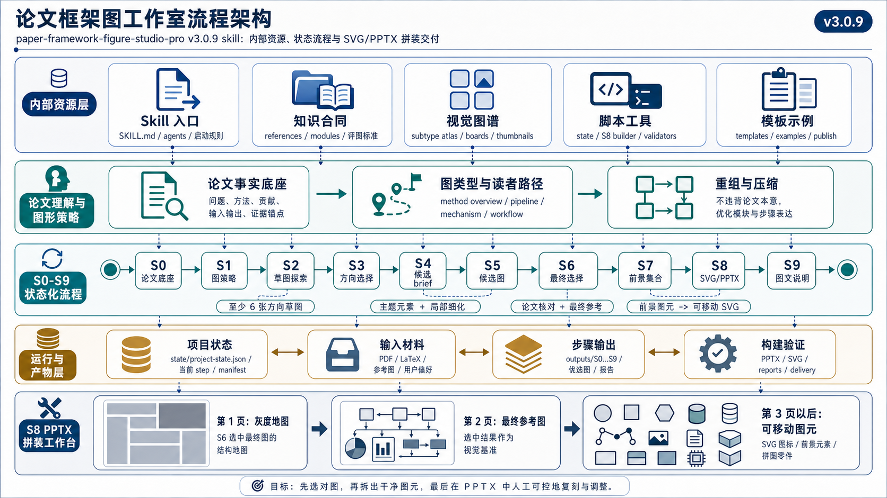 |

## 总结

- 当前介绍的版本包是 `paper-framework-figure-studio-pro-v3.0.9-skill.zip`。备注：`paper-framework-figure-studio-pro-v3.0.9a-skill.zip` 是 v3.0.9a 修订版，主要修复 v3.0.9 在断点续跑时遇到的问题。
- v3.0.9 继承了 v2.5.0 的核心交互思想：先用内置参考图谱建立视觉决策坐标，再通过第一轮多样化候选和第二轮局部优化完成“先发散、后收敛”的人工选择流程，同时保留目标论文图像与文本分析分离的 `IMAGE_ONLY` 产物边界。
- v3.0.9 强调松耦合、高内聚、分层调用和断点续跑，并将论文理解、候选生成、最终选择、交付转换与状态审计分开管理。
- v3.0.9 的制图理念是先论文后画图、先发散后收敛，以多样化参考草案服务人工接手，并让视觉表达始终服从论文结构准确性和审稿可读性。
- v3.0.9 是矢量优先的语义简约风格，倾向于清晰图标、少文字、少公式和少而准的关系线，并在不违背论文内容的前提下提炼出醒目、易懂、便于 SVG/PPT 人工重构的架构图。
- v3.0.9 还提供了一种拼图式制图辅助流程：用户可以参照给定的灰度参考底图和部分 SVG 元素，继续拼装、调整并完成最终 SVG 图；不过这一交付形态目前效果还不理想，仍在持续改进中。
- 新版本不一定在所有场景下都比 `v2.5.0` 更好；不同论文、不同审美偏好和不同使用方式下，旧版仍可能更适合。
- `v2.5.0` 已被指出存在绝对路径硬编码隐患；如果仍然要使用，建议先在 Codex 中自行检查并修正相关路径后，再正式投入使用。
- 这个项目的核心目标不是给出唯一答案，而是提供多样性的结构和视觉参考草案，帮助用户做比较、筛选和后续人工制图。
- 不管在 ChatGPT 网页环境还是 Codex 环境下，整个流程通常都比较慢；其中 Codex 在一些工程化场景下可能效果更好，但往往也更费 token。

## 架构介绍


从架构图来看，v3.0.9 不是简单的一串 prompt，而是一个带状态、带治理、可恢复的分层执行系统。整体可以理解为四层：最前面的论文事实底座层，中间的探索与选择层，后面的交付与转换层，以及贯穿全流程的状态治理与检查层。

- **论文事实底座层**：`S0-PAPER-FOUNDATION` 负责把论文中的算法、模块、公式、术语、箭头关系和证据锚点先抽取出来，作为后续所有步骤共享的事实基线。
- **探索与选择层**：`S1` 到 `S6` 负责图类型诊断、草图探索、方向筛选、候选细化和最终选择。这一层强调先发散后收敛，先给出可比较的参考草案，再逐步收束到更贴近论文的结果。
- **交付与转换层**：`S7` 到 `S9` 负责 foreground-only、SVG/PPT 交付以及图题文字整理。它不是单纯再出一张图，而是把前面选中的结果继续转成更适合人工接手的交付形态。
- **状态治理与检查层**：围绕整个流程，系统会维护步骤状态、产物边界和恢复点，使流程更容易回滚、重跑和检查。

内置参考图谱主要服务于探索与选择层：它在 `S1-FIGURE-STRATEGY` 和 `S2-SKETCH-EXPLORE` 之前提供图类型、布局语法、读者细节密度和视觉风格坐标，避免后续候选图只靠文字说明发散。

v3.0.9 的主线如下：

```text
S0-PAPER-FOUNDATION -> S1-FIGURE-STRATEGY -> S2-SKETCH-EXPLORE -> S3-DIRECTION-SELECT -> S4-CANDIDATE-BRIEF -> S5-CANDIDATE-IMAGE -> S6-FINAL-SELECT -> S7-FOREGROUND-IMAGE -> S8-SVG-PPT -> S9-FIGURE-TEXT
```

## 内置参考图谱

v3.0.9 继续把 F1-F4 作为设计参考图谱。把这些图列入设计思想，是为了在进入目标论文候选图之前，先建立四类可见的视觉决策坐标：图类型、布局语法、读者角色与细节密度、视觉传达风格。这样后续的候选图比较不只依赖文字描述，而是在可对照的参考体系中发散和收敛。

这些图是参考/概念图，不是某篇目标论文的候选图，也不能替代正式候选图生成步骤。

| F1 | F2 |
|---|---|
|  | 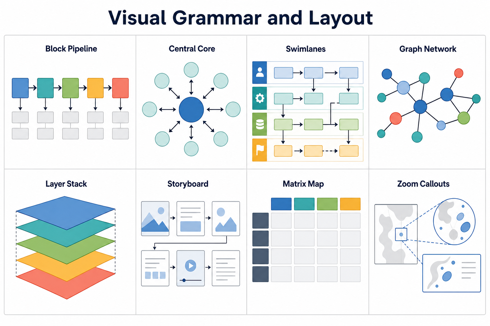 |

| F3 | F4 |
|---|---|
|  |  |

- `F1.png`：framework figure subtype overview，用于判断目标图更接近 method overview、architecture diagram、pipeline/process figure 还是 agent workflow。
- `F2.png`：visual grammar and layout，用于比较 panel 组织、模块分组、箭头流向和整体阅读路径。
- `F3.png`：reader role and detail，用于决定读者需要的细节密度，以及文字、公式、callout 和证据锚点保留到什么程度。
- `F4.png`：visual communication styles，用于校准图标化程度、色彩语义、视觉隐喻和简约/细节之间的取舍。

## 三段式流程

- **全局探索过程**：`S1-FIGURE-STRATEGY -> S2-SKETCH-EXPLORE -> S3-DIRECTION-SELECT`
- **局部细化过程**：`S4-CANDIDATE-BRIEF -> S5-CANDIDATE-IMAGE -> S6-FINAL-SELECT`
- **交付过程**：`S7-FOREGROUND-IMAGE -> S8-SVG-PPT -> S9-FIGURE-TEXT`

## 步骤列表

| Step | 类型 | 作用 |
|---|---|---|
| S0-PAPER-FOUNDATION | TEXT_ONLY | 论文精读底座，梳理论文中的算法、模块、术语、公式和箭头关系 |
| S1-FIGURE-STRATEGY | TEXT_ONLY | 诊断图类型、叙事角色和读者效果 |
| S2-SKETCH-EXPLORE | IMAGE_ONLY_PLUS_PROMPT | 全局探索草图 |
| S3-DIRECTION-SELECT | TEXT_ONLY | 从全局探索中筛出进入局部细化的方向 |
| S4-CANDIDATE-BRIEF | TEXT_ONLY | 局部细化准备，生成正式候选矩阵和 prompts |
| S5-CANDIDATE-IMAGE | IMAGE_ONLY_PLUS_PROMPT | 局部细化正式候选图 |
| S6-FINAL-SELECT | TEXT_ONLY | 从候选中选出最终架构图 |
| S7-FOREGROUND-IMAGE | IMAGE_ONLY_PLUS_PROMPT_WITH_MANIFEST | 生成 foreground-only 无底纹 final |
| S8-SVG-PPT | TEXT_ONLY_ARTIFACTS | 生成 SVG/PPT 交付结果 |
| S9-FIGURE-TEXT | TEXT_ONLY | 写图题、caption、legend 和正文引用文字 |

## 限制与已知问题

- 不管在哪种环境下，整体流程都不会特别快，尤其是 `S7-FOREGROUND-IMAGE` 和 `S8-SVG-PPT` 往往更慢。
- 效果并不稳定，仍需要人工干涉和评审；不同论文、不同环境和不同轮次下的输出质量波动较大，仍然需要人工判断、人工筛选和人工修正，当前示例里也保留了不少反面例子。
- Codex 环境下在一些完整工程场景里可能效果更好，但通常会更费 token。
- 我们没有实现“完整可编辑 PPT 复刻版”；当前交付更接近一种带参考地图的拼图式交付。
- 这种拼图式交付的好处是更稳、更容易局部替换，也更方便用户按自己的论文版式和投稿要求重新排版。
- 但它也有边界：并不是所有元素都能稳定自动变成高质量、语义完整、可直接编辑的矢量对象。
- 一些 SVG 图标仍然可能需要借助 ChatGPT 或其他 AI 模型先识别截图，再进一步转成更干净的 SVG。

## ChatGPT 网页版使用

1. 先把 `paper-framework-figure-studio-pro-v3.0.9-skill.zip` 放进项目的 Sources。
2. 再把目标论文 PDF 放进 Sources；如果要复现实验结果，可使用 `semiDFL.pdf`。
3. 打开 **Extended thinking**。
4. 在需要图像阶段时，切换到 **Create image**。

启动示例：

```text
请严格按照paper-framework-figure-studio-pro-v3.0.9-skill.zip里skill的人机交互步骤，对semiDFL.pdf绘制diagram。不要查看semiDFL.pdf里面的diagram，注意这里说的不要查看并不是说不能自己也构思出类似的，而是说不要将其先入为主，而是根据实际情况决定生成或不生成类似的
```

## Codex 使用

1. 把 `paper-framework-figure-studio-pro-v3.0.9-skill.zip` 放在当前工程目录中。
2. 把目标论文 PDF 也放在工程目录中，或者在 prompt 里写清楚相对路径。
3. 如果 token 额度有限，优先用 ChatGPT 网页环境。

启动示例：

```text
请严格按照 paper-framework-figure-studio-pro-v3.0.9-skill.zip 里skill的人机交互步骤， 对 semiDFL.pdf 绘制diagram。不要查看semiDFL.pdf里面的diagram，注意这里说的不要查看并不是说不能自己也构思出类似的，而是说不要将其先入为主，而是根据实际情况决定生成或不生成类似的
```

## 实验结果

本节实验在 ChatGPT 网页版和 Codex 下执行，使用的 LLM 是 GPT-5.5；如果使用其他模型、不同推理强度或不同运行环境，生成质量和流程表现可能不一致。

在 ChatGPT 网页版中，如果下一步需要生成图像，建议先在输入框位置手动点击 `Create image` 标签，再继续执行。

上图是 `example_semiDFL_v3.0.9/final_Image_codex_v3.0.9.png`，对应本仓库随附的 semiDFL 示例流程最终选定框架图。`example_semiDFL_v3.0.9/semiDFL.pdf` 是这个例子使用的论文；同目录还保留了 Codex 环境下的全局筛选草图、局部筛选设计稿、最终图、SVG/PPT 交付文件、ChatGPT 网页环境交互记录和 Codex 运行录像，方便完整对照流程。

- 示例结果目录：`example_semiDFL_v3.0.9/`
- 示例论文：`example_semiDFL_v3.0.9/semiDFL.pdf`
- 第一轮全局筛选草图（Codex）：`example_semiDFL_v3.0.9/R1_results_codex_v3.0.9/`
- 第二轮局部筛选设计稿（Codex）：`example_semiDFL_v3.0.9/R2_results_codex_v3.0.9/`
- 最终选择的框架图（Codex）：`example_semiDFL_v3.0.9/final_Image_codex_v3.0.9.png`
- ChatGPT 网页环境交互记录：`example_semiDFL_v3.0.9/semiDFL_chatgpt_web_v3.0.9.mhtml`
- SVG/PPT 拼图交付文件（Codex）：`example_semiDFL_v3.0.9/svg-ppt-delivery_codex_v3.0.9.pptx`
- Codex 运行情况记录：`example_semiDFL_v3.0.9/semiDFL_codex_v3.0.9.mp4`
- Codex v3.0.9a 断点续跑模拟录像：`example_semiDFL_v3.0.9/semiDFL_codex_v3.0.9a.mp4`

### 中文实验截图

#### 第一轮全局筛选草图（R1, Codex）

| R1-01 | R1-02 | R1-03 |
|---|---|---|
| 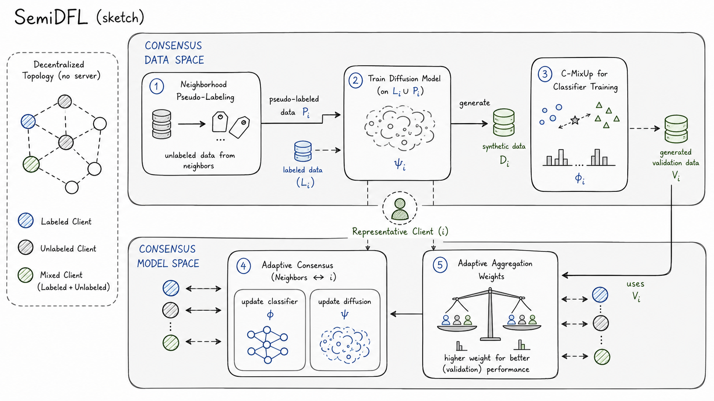 | 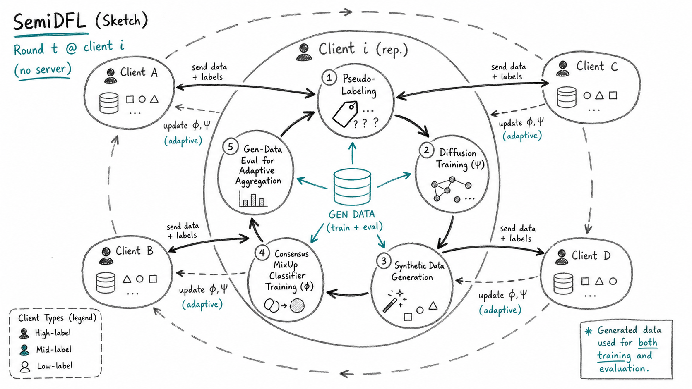 | 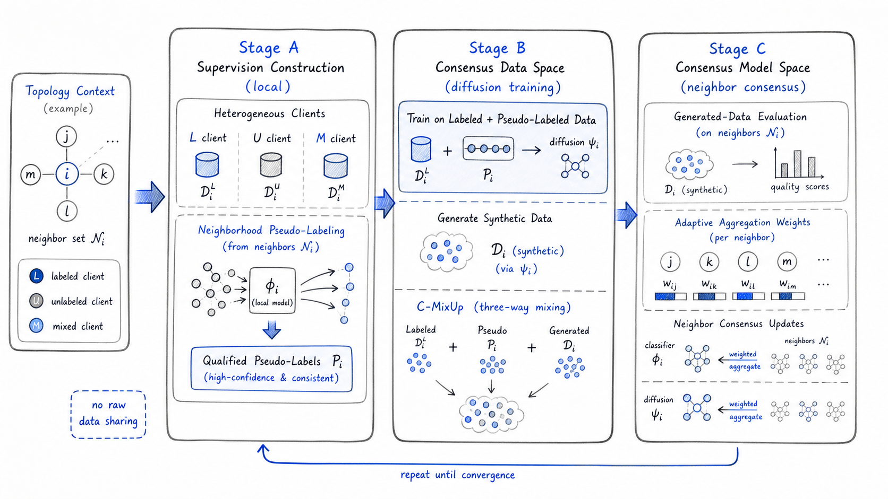 |
| R1-04 | R1-05 | R1-06 |
| 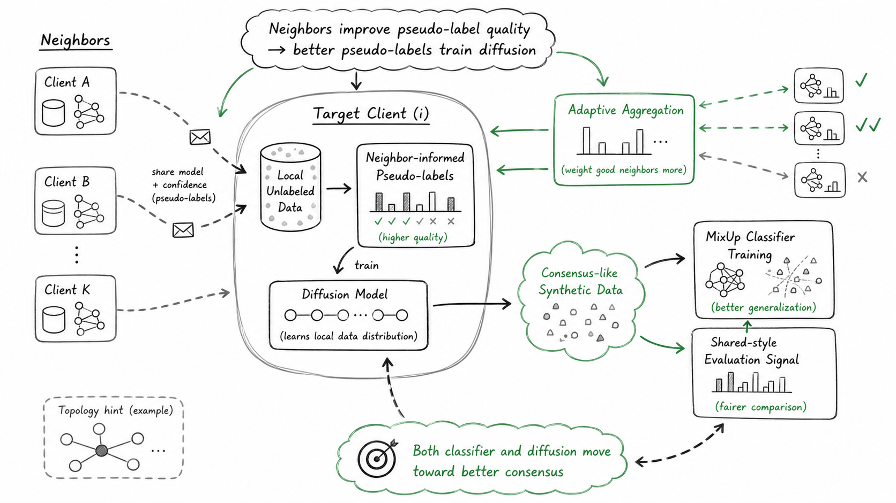 | 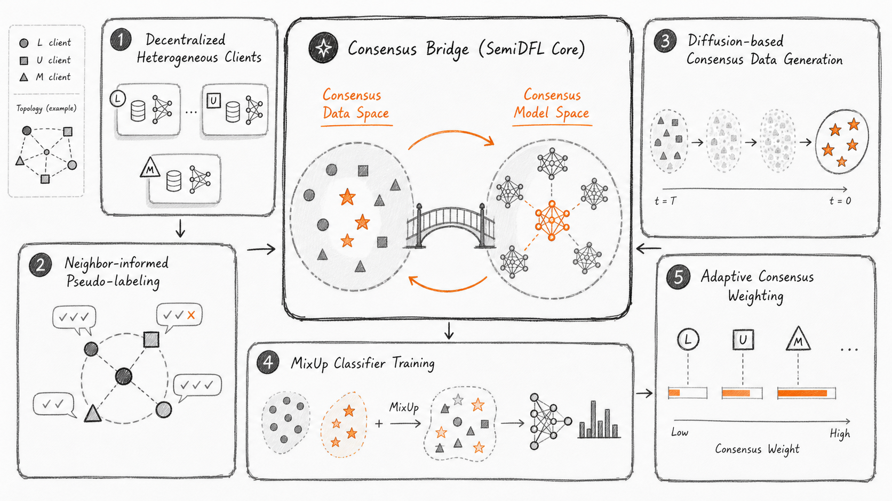 | 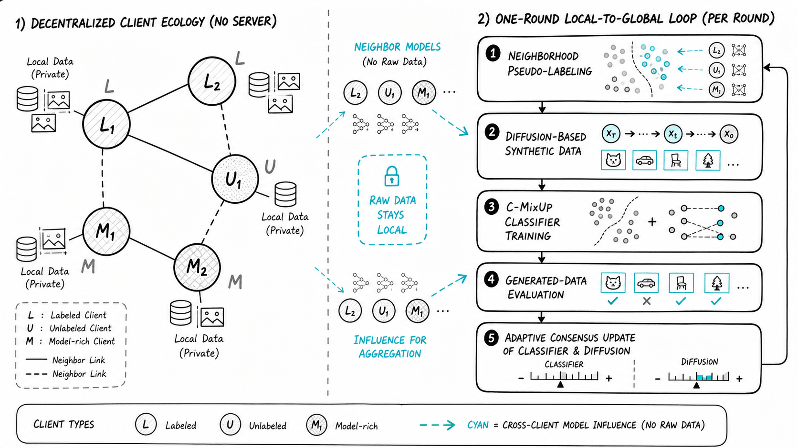 |

#### 第二轮局部筛选设计稿（R2, Codex）

| D1-A | D1-B | D1-C |
|---|---|---|
| 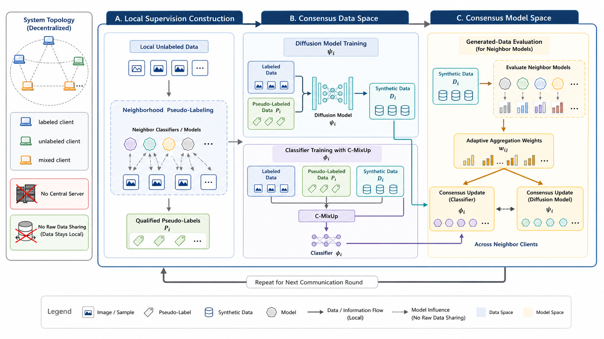 | 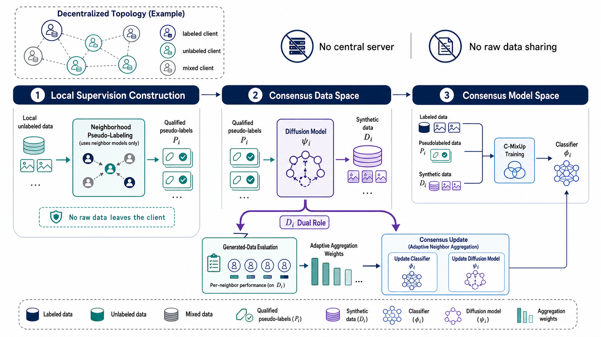 | 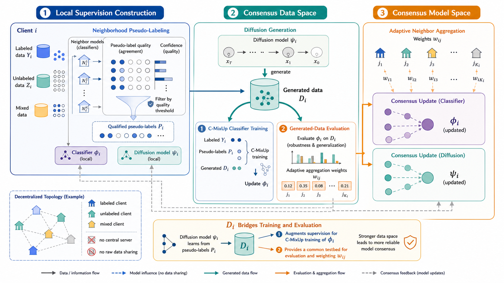 |
| D2-A | D2-B | D2-C |
| 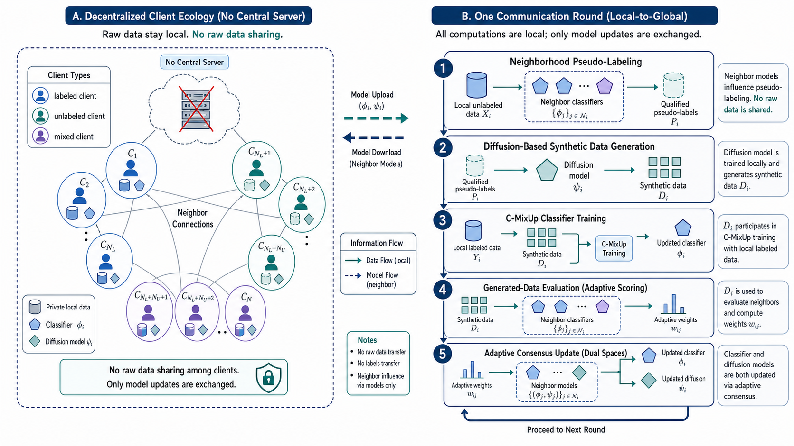 | 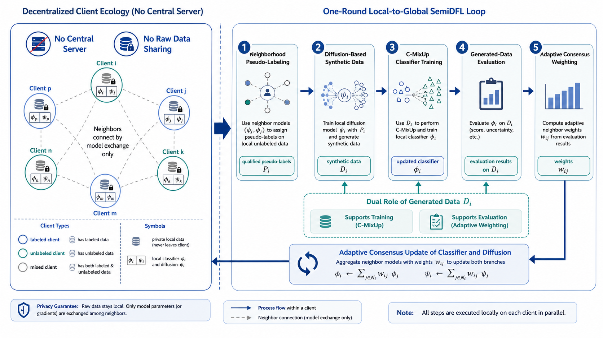 | 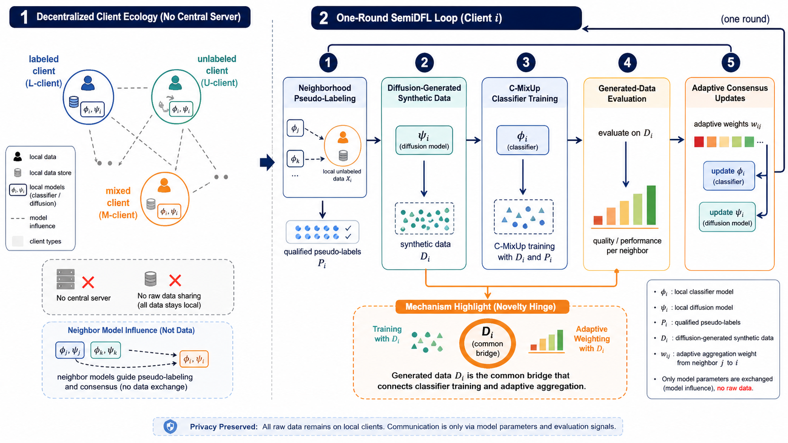 |

<a id="english"></a>

## paper-framework-figure-studio-pro | [中文](#chinese)

`paper-framework-figure-studio-pro` is a skill for making computer-science paper framework diagrams. Its goal is to provide diverse reference drafts for drawing framework figures so that users can continue the final figure-making process manually by comparing and following those drafts. It is suitable for method overviews, architecture diagrams, pipeline/process figures, and agent workflows. Special thanks to Xinyang Liu from Bristol for the support.

| Final Result | Architecture |
|---|---|
|  | 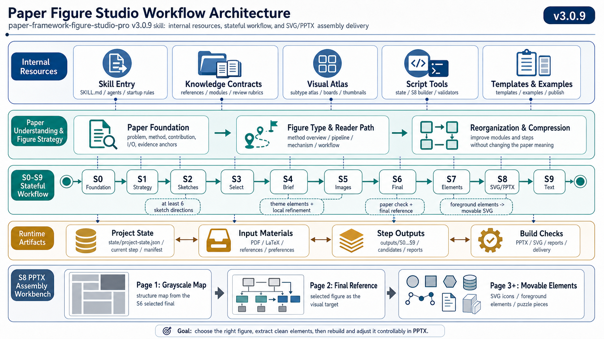 |

## Summary

- The package documented here is `paper-framework-figure-studio-pro-v3.0.9-skill.zip`. Note: `paper-framework-figure-studio-pro-v3.0.9a-skill.zip` is the v3.0.9a revision, mainly fixing issues encountered by v3.0.9 during breakpoint resume runs.
- v3.0.9 inherits the core interaction pattern from v2.5.0: it uses the built-in reference atlas to establish visual decision coordinates, then combines diverse first-round candidates with second-round paper-local optimization for a diverge-then-converge human selection workflow, while preserving the `IMAGE_ONLY` artifact boundary between target-paper images and text analysis.
- The v3.0.9 design emphasizes loose coupling, high cohesion, layered invocation, and resumable execution, while separating paper understanding, candidate generation, final selection, delivery conversion, and state audits.
- The v3.0.9 figure-making philosophy is paper first, image second, then divergence before convergence: it uses diverse reference drafts to support human continuation while keeping visual expression subordinate to structural accuracy and reviewer readability.
- The v3.0.9 style is vector-first and semantically minimalist: it favors clear icons, less text, fewer formulas, and fewer but more precise relation lines, while distilling an eye-catching, readable architecture figure that remains faithful to the paper and is easier to reconstruct manually in SVG/PPT.
- The v3.0.9 workflow also includes a puzzle-like figure-construction aid: users can continue assembling and refining the final SVG by following a grayscale reference underlay together with selected SVG elements; however, this delivery form is still not ideal in its current state and remains under active refinement.
- The new version is not guaranteed to be better than `v2.5.0` in every scenario; depending on the paper, aesthetic preference, and workflow, the older version may still fit better.
- `v2.5.0` was reported to contain hard-coded absolute-path risks. If you still want to use it, the safer approach is to inspect and fix those path issues in Codex before using it seriously.
- The core goal of this project is not to force a single answer, but to provide diverse structural and visual reference drafts that support comparison, filtering, and later manual figure-making.
- In both ChatGPT web and Codex, the workflow is generally slow. Codex may perform better in some engineering-heavy scenarios, but it is usually much more token-expensive.

## Architecture Overview


From the architecture figure, v3.0.9 is not just a linear prompt chain. It is a stateful, governed, and recoverable execution system. At a high level, it can be understood as four layers: the paper-foundation layer, the exploration-and-selection layer, the delivery-and-transformation layer, and the cross-cutting state/governance/check layer.

- **Paper-foundation layer**: `S0-PAPER-FOUNDATION` extracts algorithms, modules, formulas, terminology, arrow relationships, and evidence anchors from the paper first, so later stages share the same factual baseline.
- **Exploration-and-selection layer**: `S1` to `S6` handle figure-type diagnosis, sketch exploration, direction filtering, candidate refinement, and final selection. This layer emphasizes divergence first and convergence later.
- **Delivery-and-transformation layer**: `S7` to `S9` handle foreground-only outputs, SVG/PPT delivery, and figure text. The goal is not just to generate one more image, but to convert the selected result into a form that is easier for humans to continue editing.
- **State/governance/check layer**: across the whole workflow, the system maintains step states, artifact boundaries, and recovery points so the process is easier to resume, rerun, rewind, and inspect.

The built-in reference atlas mainly supports the exploration-and-selection layer. Before `S1-FIGURE-STRATEGY` and `S2-SKETCH-EXPLORE`, it provides visible coordinates for figure subtype, layout grammar, reader detail density, and visual style, so later candidates do not diverge from prose alone.

The v3.0.9 mainline is:

```text
S0-PAPER-FOUNDATION -> S1-FIGURE-STRATEGY -> S2-SKETCH-EXPLORE -> S3-DIRECTION-SELECT -> S4-CANDIDATE-BRIEF -> S5-CANDIDATE-IMAGE -> S6-FINAL-SELECT -> S7-FOREGROUND-IMAGE -> S8-SVG-PPT -> S9-FIGURE-TEXT
```

## Built-In Reference Atlas

v3.0.9 continues to use F1-F4 as a design reference atlas. They are part of the design philosophy because they establish four visible decision coordinates before target-paper candidates are generated: figure subtype, layout grammar, reader role and detail density, and visual communication style. This keeps later candidate comparison from relying only on prose, and gives the workflow a visible reference system for divergence and convergence.

These are reference/concept images, not candidate figures for a target paper, and they do not replace the formal candidate-generation steps.

| F1 | F2 |
|---|---|
|  |  |

| F3 | F4 |
|---|---|
|  |  |

- `F1.png`: framework figure subtype overview, used to decide whether the target figure is closer to a method overview, architecture diagram, pipeline/process figure, or agent workflow.
- `F2.png`: visual grammar and layout, used to compare panel organization, module grouping, arrow flow, and the overall reading path.
- `F3.png`: reader role and detail, used to decide the needed detail density and how much text, formula content, callout structure, and evidence anchoring should remain.
- `F4.png`: visual communication styles, used to calibrate icon intensity, color semantics, visual metaphor, and the balance between minimalism and detail.

## Three-Stage Workflow

- **Global exploration**: `S1-FIGURE-STRATEGY -> S2-SKETCH-EXPLORE -> S3-DIRECTION-SELECT`
- **Local refinement**: `S4-CANDIDATE-BRIEF -> S5-CANDIDATE-IMAGE -> S6-FINAL-SELECT`
- **Delivery**: `S7-FOREGROUND-IMAGE -> S8-SVG-PPT -> S9-FIGURE-TEXT`

## Step List

| Step | Type | Purpose |
|---|---|---|
| S0-PAPER-FOUNDATION | TEXT_ONLY | Build the factual paper foundation across algorithms, modules, terminology, formulas, and arrow relationships |
| S1-FIGURE-STRATEGY | TEXT_ONLY | Diagnose figure type, narrative role, and reader effect |
| S2-SKETCH-EXPLORE | IMAGE_ONLY_PLUS_PROMPT | Global exploration sketches |
| S3-DIRECTION-SELECT | TEXT_ONLY | Filter directions for local refinement |
| S4-CANDIDATE-BRIEF | TEXT_ONLY | Prepare the local-refinement candidate matrix and prompts |
| S5-CANDIDATE-IMAGE | IMAGE_ONLY_PLUS_PROMPT | Generate local-refinement candidate figures |
| S6-FINAL-SELECT | TEXT_ONLY | Select the final framework figure |
| S7-FOREGROUND-IMAGE | IMAGE_ONLY_PLUS_PROMPT_WITH_MANIFEST | Generate the foreground-only final |
| S8-SVG-PPT | TEXT_ONLY_ARTIFACTS | Generate the SVG/PPT delivery result |
| S9-FIGURE-TEXT | TEXT_ONLY | Write the title, caption, legend, and in-paper references |

## Limitations and Known Issues

- The workflow is not especially fast in either environment, and `S7-FOREGROUND-IMAGE` plus `S8-SVG-PPT` are usually even slower.
- The results are not fully stable and still require human intervention and review. Output quality can vary across papers, environments, and rounds, so human judgment, filtering, and correction are still necessary. The bundled example also preserves several negative cases.
- Codex may produce better results in some full-project scenarios, but it is usually much more token-hungry.
- We do not currently provide a fully editable PPT recreation. The current delivery is closer to a reference-map puzzle style.
- The advantage of this puzzle-style delivery is that it is more stable, easier to replace locally, and easier to re-layout for a user's own paper format and submission requirements.
- But it also has clear limits: not every element can yet be stably converted into a high-quality, semantically clean, directly editable vector object.
- Some SVG icons may still need help from ChatGPT or another AI model to recognize screenshot content before turning it into a cleaner SVG.

## Using in ChatGPT Web

1. First add `paper-framework-figure-studio-pro-v3.0.9-skill.zip` to the project's Sources.
2. Then add the target paper PDF to Sources. To reproduce the example, you can use `semiDFL.pdf`.
3. Turn on **Extended thinking**.
4. When the workflow reaches an image stage, switch to **Create image**.

Startup example:

```text
Please strictly follow the human-in-the-loop workflow steps in paper-framework-figure-studio-pro-v3.0.9-skill.zip to draw a diagram for semiDFL.pdf. Do not look at the diagram already inside semiDFL.pdf. What I mean here is not that the model is forbidden from independently coming up with something similar, but that it should not be anchored by the existing figure and should decide based on the actual situation whether a similar structure should or should not be generated.
```

## Using in Codex

1. Put `paper-framework-figure-studio-pro-v3.0.9-skill.zip` in the current project directory.
2. Put the target paper PDF in the same directory, or specify its relative path in the prompt.
3. If token budget is limited, prefer ChatGPT web.

Startup example:

```text
Please strictly follow the human-in-the-loop workflow steps in paper-framework-figure-studio-pro-v3.0.9-skill.zip to draw a diagram for semiDFL.pdf. Do not look at the diagram already inside semiDFL.pdf. What I mean here is not that the model is forbidden from independently coming up with something similar, but that it should not be anchored by the existing figure and should decide based on the actual situation whether a similar structure should or should not be generated.
```

## Experimental Results

The experiments in this section were run in both ChatGPT web and Codex, using GPT-5.5 as the LLM. Results may differ when using other models, different reasoning settings, or different runtime environments.

In ChatGPT web, when the next step is image generation, it is better to manually click the `Create image` label in the input area before continuing.

The figure above is `example_semiDFL_v3.0.9/final_Image_codex_v3.0.9.png`, the final selected framework figure from the bundled semiDFL example workflow. `example_semiDFL_v3.0.9/semiDFL.pdf` is the paper used in this example. The same directory also keeps the Codex global-screening sketches, local-screening drafts, final figure, SVG/PPT delivery file, ChatGPT web interaction record, and Codex runtime video for full workflow comparison.

- Example results directory: `example_semiDFL_v3.0.9/`
- Example paper: `example_semiDFL_v3.0.9/semiDFL.pdf`
- First-round global screening sketches (Codex): `example_semiDFL_v3.0.9/R1_results_codex_v3.0.9/`
- Second-round local screening design drafts (Codex): `example_semiDFL_v3.0.9/R2_results_codex_v3.0.9/`
- Final selected framework figure (Codex): `example_semiDFL_v3.0.9/final_Image_codex_v3.0.9.png`
- ChatGPT web interaction record: `example_semiDFL_v3.0.9/semiDFL_chatgpt_web_v3.0.9.mhtml`
- SVG/PPT delivery file for figure assembly (Codex): `example_semiDFL_v3.0.9/svg-ppt-delivery_codex_v3.0.9.pptx`
- Codex runtime recording: `example_semiDFL_v3.0.9/semiDFL_codex_v3.0.9.mp4`
- Codex v3.0.9a breakpoint-resume simulation recording: `example_semiDFL_v3.0.9/semiDFL_codex_v3.0.9a.mp4`

### Experimental Screenshots

#### Round 1 Global Screening Sketches (R1, Codex)

| R1-01 | R1-02 | R1-03 |
|---|---|---|
|  |  |  |
| R1-04 | R1-05 | R1-06 |
|  |  |  |

#### Round 2 Local Screening Design Drafts (R2, Codex)

| D1-A | D1-B | D1-C |
|---|---|---|
|  |  |  |
| D2-A | D2-B | D2-C |
|  |  |  |
