# 论文框架图制图 Skill

`paper-framework-figure-studio-pro` 是一个面向研究论文框架图的专项制图 skill，适合制作 method overview、architecture diagram、pipeline/process figure、agent workflow、system/data-flow figure、mechanism-intuition diagram、case walkthrough 和审稿人友好的 schematic figure。

本 skill 设计的初衷是从广度和深度两个角度展示不同的设计草图，方便使用者进行选择。它没有打算直接生成矢量图，因为目前相关技术还不成熟，修改一个到处出错的矢量图也许比从头做更麻烦。不过后续马上更新后，skill 会将选中的参考图中的元素提取出来做成矢量图，方便使用者后续手动对着参考图进行编排。

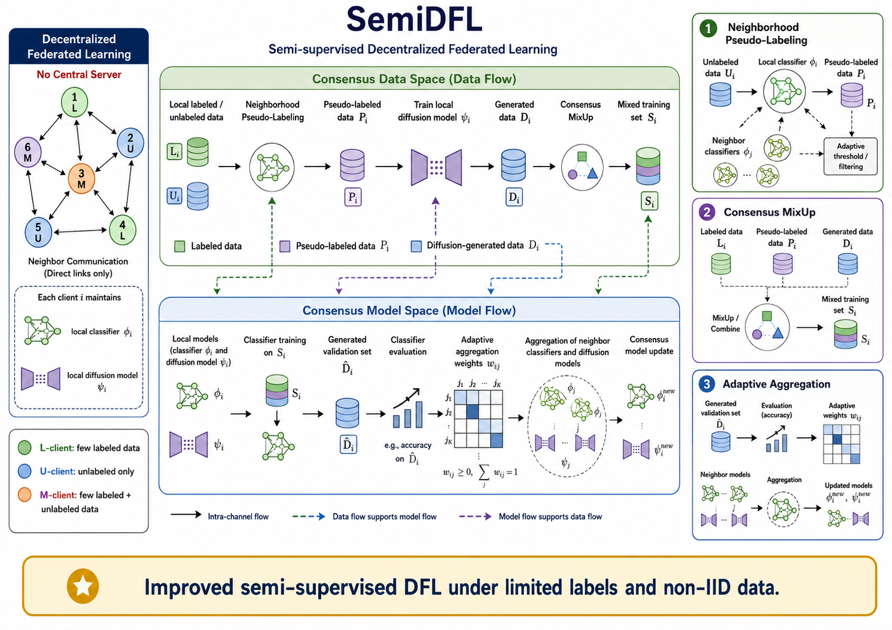

上图是 `example_semiDFL/result.png`，是本仓库随附 semiDFL 示例流程得到的最终论文（semiDFL)框架图. 这里特别感谢bristol的刘同学提供的素材支持。`example_semiDFL/semidfl-chatgpt-example.mhtml` 是 ChatGPT 网页版执行记录导出，`example_semiDFL/semiDFL_codex_v.mp4` 为 Codex 版执行部分片段，上述可作为完整流程参考。为了方便对照快速使用，提供了示例中论文 PDF 文件 `example_semiDFL/semiDFL.pdf`。

当前 README 按 `paper-framework-figure-studio-pro-v2.5.0-skill.zip` 更新。该版本由 `research-paper-figure-skill-factory` v2.0.5 生成，核心规则是：启动只给计划和内置参考图谱；抽象视觉决策必须配参考/概念图；视觉结构不能只用文字描述；目标论文候选图、二轮变体图、正式图和修订图必须放在独立 `IMAGE_ONLY` 步骤中；第一轮候选图强调方向多样性，P6 后必须经过 P6b / P6b-IMAGE / P6c 二轮局部优化后才能进入 P7 最终 prompt。

## 适合的任务

- 把论文 PDF、摘要、方法说明、LaTeX 草稿或模块列表转成可比较的框架图方案。
- 为方法总览图、模型架构图、训练/推理流程图、agent 工作流图、机制解释图或案例走查图生成候选图。
- 比较不同图类型、布局语法、视觉风格、信息密度和读者理解路径。
- 从多张候选图中选择方向，再围绕论文局部模块、证据/案例、标签、颜色语义、callout 和审稿可读性做二轮优化。
- 生成正式图 prompt、修订建议、caption、legend 和正文中的图说明文字。

## 关键规则

- **启动只给计划**：首次触发时只展示启动计划和已保存的 subtype/style atlas，不分析目标论文，不生成目标论文图像。
- **抽象视觉决策必须配图**：当文本回复解释 subtype、布局语法、视觉风格、密度、metaphor、建模模式、候选方案差异或最终内容架构时，必须嵌入已保存参考图或非目标论文概念/建模示例图。
- **视觉结构必须用图展示**：当文本回复解释视觉结构、布局骨架、panel choreography、module topology、arrow grammar、candidate-board structure、second-round optimization geometry 或 final image-brief structure 时，必须嵌入结构参考图或非目标概念/建模示例图。不能只用段落、列表、ASCII、Mermaid、SVG 或代码渲染草图替代。
- **目标论文图像隔离**：目标论文候选图、二轮变体图、草稿图、正式图、最终图和修订图必须在 `IMAGE_ONLY` 步骤中输出，不能嵌入普通文本回复。
- **第一轮要多样**：第一轮候选图用于搭建方向，通常生成 6 张，重点变化 subtype、布局、metaphor、密度、panel rhythm 和 style family。
- **第二轮做论文局部优化**：P6 选出第一轮当前最佳方向后，必须进入 P6b / P6b-IMAGE / P6c，从模块关系、证据/案例锚点、标签经济性、panel 过渡、色彩语义、callout 位置和审稿可读性角度再生成并选择二轮变体。
- **自由提问也要对齐状态**：即使用户直接说“继续”“出图”“改得更简洁”，skill 也要判断请求对应的流程步骤，记录执行前后状态和下一步建议。

## 内置参考图谱

skill 包内包含保存好的 subtype/style atlas。启动和后续抽象视觉决策中，skill 会用 Markdown 图片嵌入展示相关参考图，而不是只列路径。

本仓库的 `example_semiDFL` 目录保留了对应示例（视频为 Codex 下运行的部分片段）：

| F1 | F2 |
|---|---|
|  |  |

| F3 | F4 |
|---|---|
|  |  |

- `F1.png`：framework figure subtype overview。
- `F2.png`：visual grammar and layout。
- `F3.png`：reader role and detail。
- `F4.png`：visual communication styles。

这些图是参考/概念图，不是某篇目标论文的候选图，也不能替代正式候选图生成步骤。

## semiDFL 示例文件

`example_semiDFL` 目录保存了一个完整 ChatGPT 网页版制图例子：

- `semidfl-chatgpt-example.mhtml`：ChatGPT 网页版执行记录。
- `F1.png` 到 `F4.png`：构建 skill 时总结出的图类型/风格参考图。
- `R1C1.png` 到 `R1C6.png`：第一轮生成的 6 张目标论文候选图，用于比较多样化方向。
- `R2C1.png` 到 `R2C6.png`：第二轮生成的 6 张目标论文候选图，用于围绕第一轮选定方向做局部优化和再选择。
- `result.png`：最终选定并整理后的论文框架图。

第一轮候选图示例（R1C*）：

| R1C1 | R1C2 | R1C3 |
|---|---|---|
| 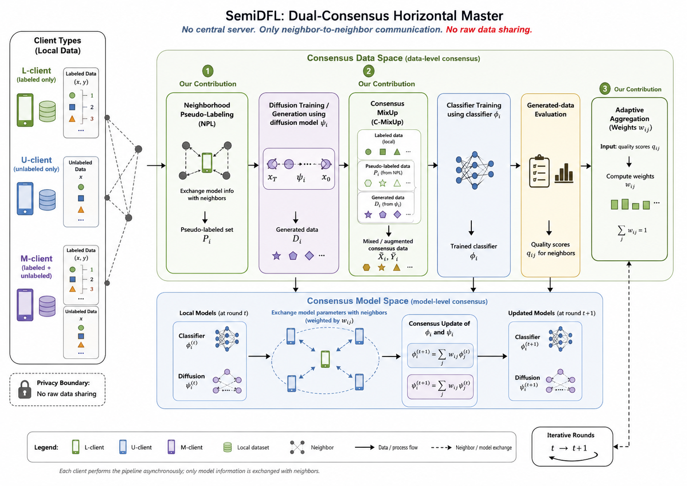 | 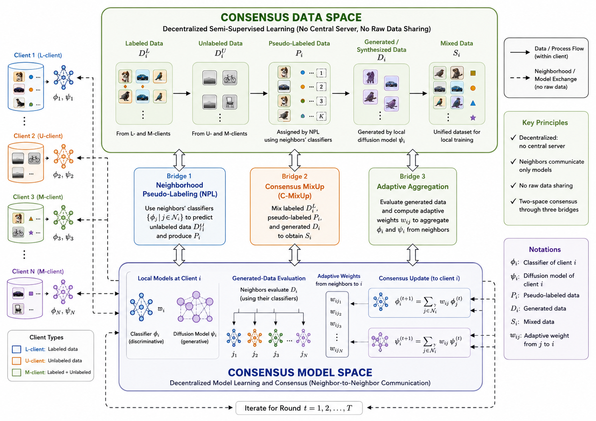 | 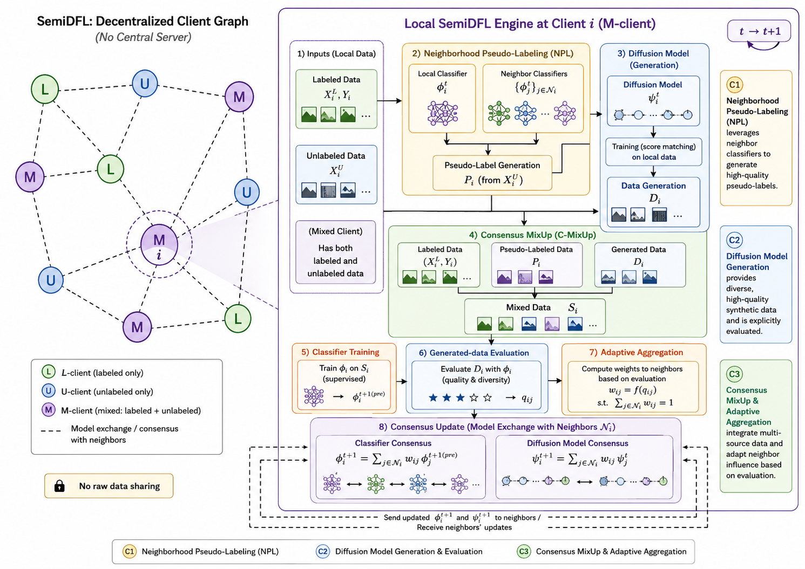 |

| R1C4 | R1C5 | R1C6 |
|---|---|---|
| 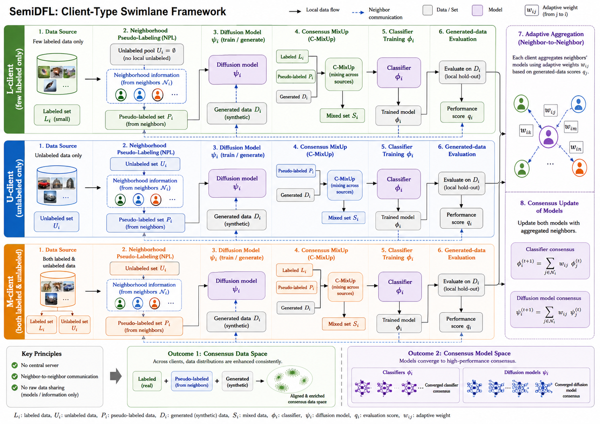 | 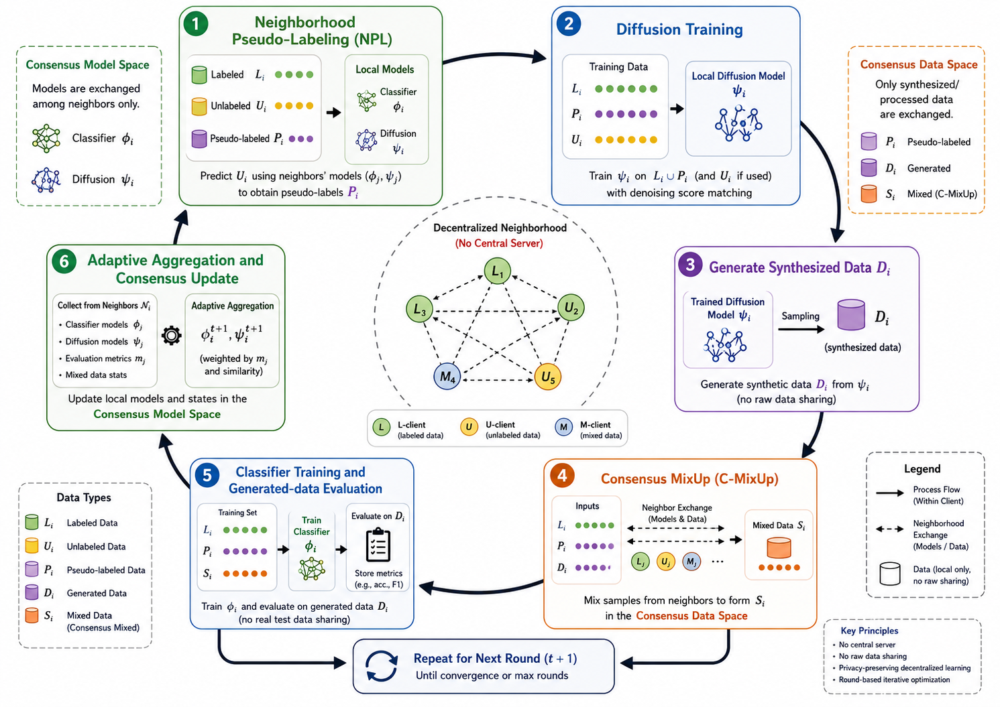 | 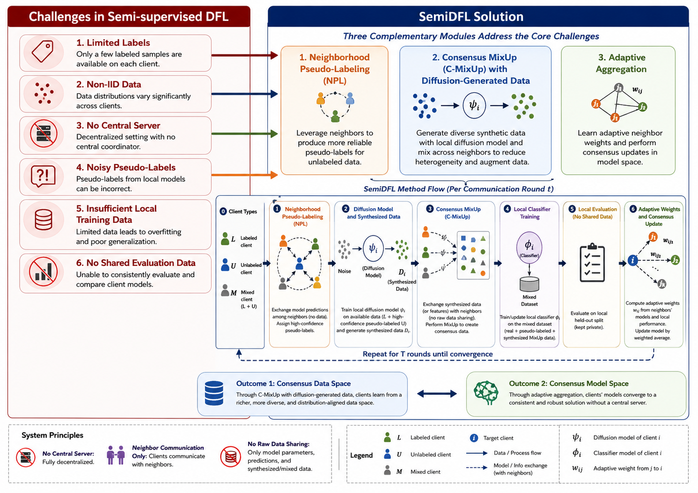 |

第二轮候选图示例（R2C*）：

| R2C1 | R2C2 | R2C3 |
|---|---|---|
| 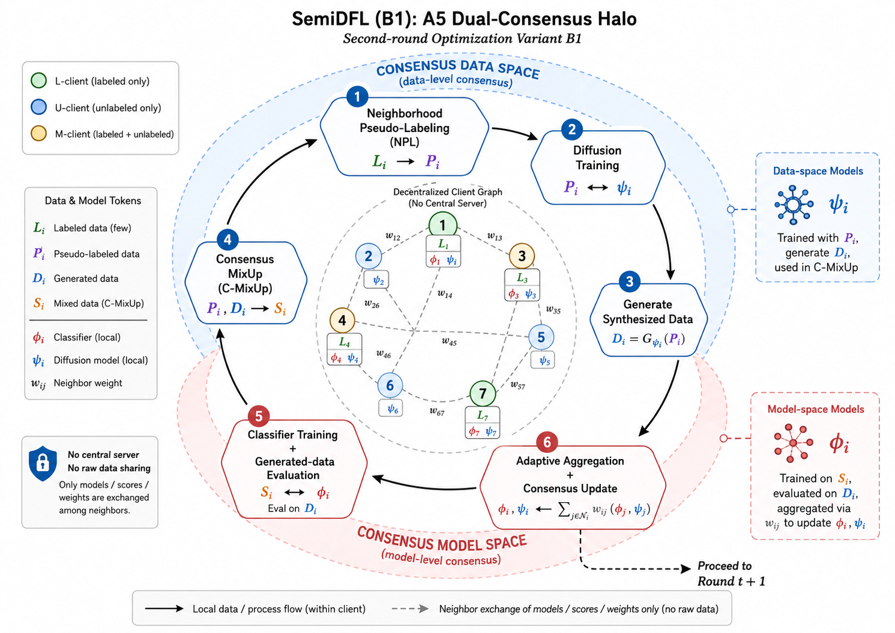 | 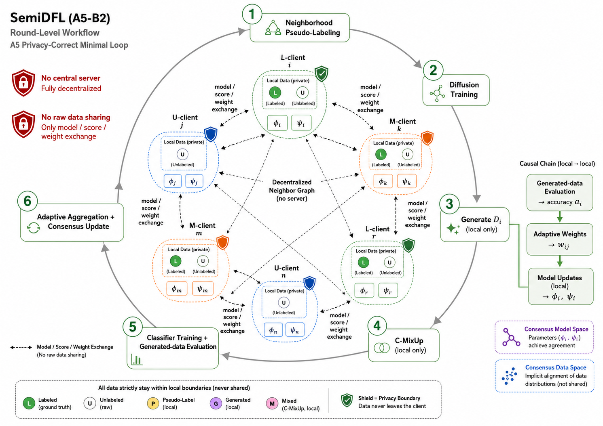 | 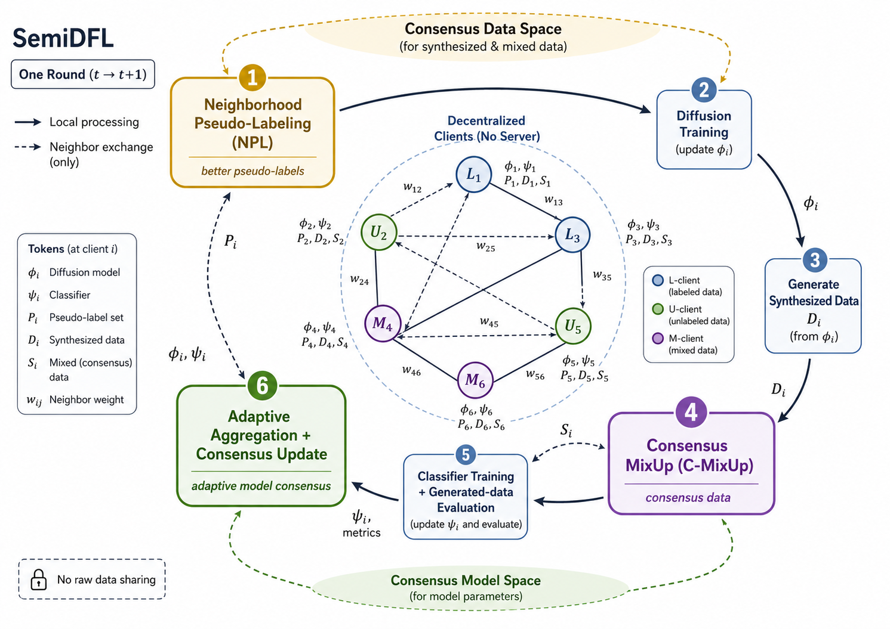 |

| R2C4 | R2C5 | R2C6 |
|---|---|---|
| 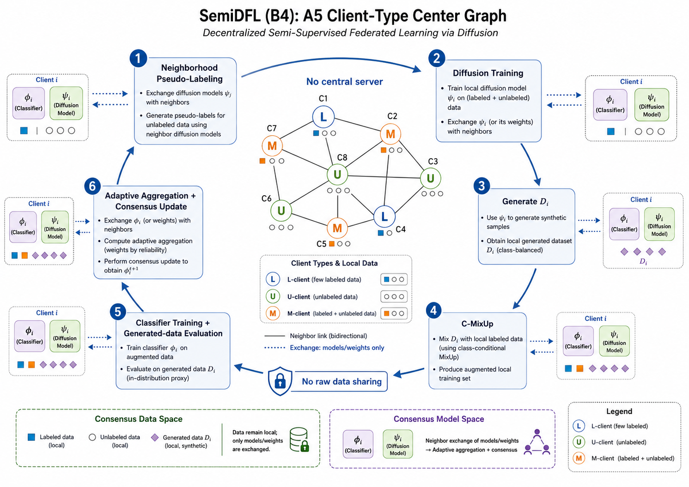 | 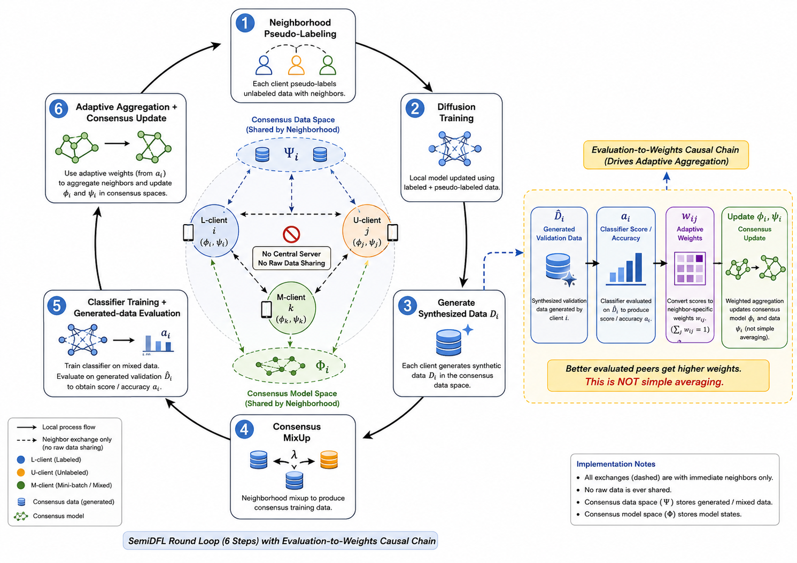 | 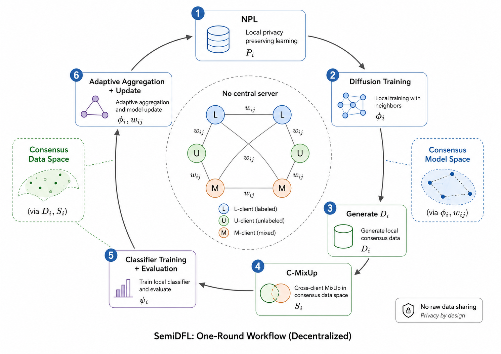 |

## 工作流

1. **S0 启动**：只显示启动计划和保存的 atlas，不分析目标论文，不生成目标论文图。
2. **P1 材料导入**：读取论文 PDF、摘要、方法说明、目标章节、草图、参考图或用户约束。
3. **P2 图需求诊断**：判断读者问题、论文位置、叙事功能和候选图类型，并展示相关参考/概念/结构图。
4. **P3 文本候选**：提出 4-6 个文本方案，通常 6 个。
5. **P4 第一轮候选图设置**：定义候选图数量、多样化轴、固定内容、渲染路线和比较标准；如解释结构，必须嵌入结构参考图。
6. **P5 第一轮候选图**：`IMAGE_ONLY` 生成或展示 4-6 张目标论文候选图，通常 6 张，强调方向多样性。
7. **P6 第一轮复盘**：记录第一轮 image batch，比较候选图，选出当前最佳方向，但不能直接进入最终 prompt。
8. **P6b 二轮优化设置**：从论文局部细节和最佳实践提出 4-6 个优化轴，通常 6 个。
9. **P6b-IMAGE 二轮变体图**：`IMAGE_ONLY` 生成 4-6 张目标论文二轮变体图，使用新的 `second_round_candidate_batch_id`。
10. **P6c 二轮选择**：记录二轮 batch，比较变体，锁定或组合最终方向。
11. **P7 最终图 brief / prompt**：在 P6c 后构建正式图像 prompt 和版面要求。
12. **P8 正式生成/修订**：`IMAGE_ONLY` 生成正式图或修订图。
13. **P9 审稿式检查与整合**：输出 critique、caption、legend、正文引用文本和修改建议。

## 推荐使用方式

新版已在 ChatGPT 网页版和 Codex 中进行了测试。当在 ChatGPT 网页版中使用时，要开启 **Extended thinking**。

当下一步是图像生成时，在 ChatGPT 网页版中手动选择 **Create image** 模式，再让 skill 继续生成候选图、二轮变体图、正式图或修订图。ChatGPT 网页版应使用 Create image / ChatGPT Images 2.0。

在 Codex 中也可以使用该 skill。Codex 应优先使用 `$imagegen`，不可用时再使用 ChatGPT Images 2.0 API 或其他批准的图像生成 API。Codex 更适合整理本地文件、检查 README、更新 skill、打包和安装；完整制图流程通常更适合放在 ChatGPT 网页版完成。

## ChatGPT 网页版使用步骤

1. 将 `paper-framework-figure-studio-pro-v2.5.0-skill.zip` 放入 ChatGPT Sources。
2. 将目标论文 PDF 也放入 Sources，例如 `semiDFL.pdf`。
3. 选择 Extended thinking。
4. 输入类似下面的 prompt：

```text
请严格按照 paper-framework-figure-studio-pro-v2.5.0-skill.zip 里的 skill 步骤，为 semiDFL.pdf 绘制 diagram。不要参考 semiDFL.pdf 里已有的 diagram。
```

如果你的论文文件名不是 `semiDFL.pdf`，请把 prompt 里的文件名替换为实际上传到 Sources 的文件名。

首次回复只会展示启动计划和内置 atlas，不会分析论文或生成目标论文图像。后续当 skill 完成文本方案比较，并提示下一步需要生成候选图、二轮变体图或最终图时，再切换到 **Create image** 模式继续。

## Codex 使用示例

可以在 Codex 工程目录中使用压缩包形式的 skill。把 `paper-framework-figure-studio-pro-v2.5.0-skill.zip` 放在工程目录下，大模型推荐使用 GPT-5.5，并确认目标论文 PDF 也在同一工程目录中，或在 prompt 里写清楚 PDF 的相对路径。Codex 里使用可能会消耗大量 token，额度不高情况下建议使用 ChatGPT 网页版方式。

示例 prompt：

```text
请为一个 agent 配置 paper-framework-figure-studio-pro-v2.5.0-skill.zip 里的 skill，然后严格按照 skill 的步骤，对 semiDFL.pdf 绘制 diagram。不要查看 semiDFL.pdf 里面的 diagram，注意这里说的不要查看并不是说不能自己也构思出类似的，而是说不要将其先入为主，而是根据实际情况决定生成或不生成类似的。
```

如果论文文件名不是 `semiDFL.pdf`，请替换为实际文件名。这里的“不要查看已有 diagram”指的是避免把论文原图作为先验模板；它不禁止 skill 根据论文内容独立构思出相似的信息结构或视觉组织。

## 使用时的交互规则

- 每次文本回复都会报告当前步骤、当前状态、已生成产物和下一步建议。
- 文本回复可以嵌入已保存 atlas、参考图、非目标概念图或建模示例图。
- 文本回复不能嵌入目标论文候选图、二轮变体图、正式图、最终图或修订图。
- 多个文本方案之后，下一步应优先生成多张候选图进行视觉比较，而不是只让用户从文字方案中锁定方向。
- P6 选出第一轮当前最佳方向后，默认必须继续做 P6b / P6b-IMAGE / P6c 二轮优化选择。

## English

`paper-framework-figure-studio-pro` designs publication-ready research-paper framework figures, including method overviews, architecture diagrams, pipelines, agent workflows, system/data-flow figures, mechanism-intuition diagrams, case walkthroughs, and reviewer-facing schematics.

This skill is designed to show different design sketches from both breadth and depth, making it easier for users to compare and choose. It is not intended to generate vector graphics directly, because the current technology is not mature enough; fixing a vector file that breaks in many places may be more troublesome than rebuilding it from scratch. In an upcoming update, however, the skill will extract elements from the selected reference image and convert them into vector graphics, so users can manually arrange them against the reference image later.


The image above is `example_semiDFL/result.png`, the final paper (semiDFL) framework diagram from the included semiDFL example workflow. Special thanks to Liu from Bristol for providing the supporting materials. `example_semiDFL/semidfl-chatgpt-example.mhtml` is the exported ChatGPT web execution record, `example_semiDFL/semiDFL_codex_v.mp4` is a partial clip from the Codex version run, and the above materials can be used as a complete workflow reference. For quick side-by-side use, the example paper PDF is also provided at `example_semiDFL/semiDFL.pdf`.

This README is updated for `paper-framework-figure-studio-pro-v2.5.0-skill.zip`. This version was generated by `research-paper-figure-skill-factory` v2.0.5, and its core rules are: startup-only first replies, saved atlas display, concept/reference images for abstract visual decisions, image-embedded visual-structure explanations, strict `IMAGE_ONLY` isolation for target-paper images, diverse first-round candidate boards, and a mandatory P6b/P6b-IMAGE/P6c second-round paper-local optimization before P7 final prompt construction.

### Suitable Tasks

- Turn a paper PDF, abstract, method description, LaTeX draft, or module list into comparable framework-figure directions.
- Generate candidate figures for method overviews, model architectures, training/inference pipelines, agent workflows, mechanism explanations, and case walkthroughs.
- Compare figure types, layout grammars, visual styles, information density, and reader-comprehension paths.
- Select a direction from multiple candidate figures, then run second-round optimization around local modules, evidence/case anchors, labels, color semantics, callouts, and reviewer readability.
- Produce final image prompts, revision notes, captions, legends, and in-paper figure descriptions.

### Key Rules

- **Startup plan only**: the first response shows only the startup plan and saved subtype/style atlas. It does not analyze the target paper or generate target-paper images.
- **Abstract visual decisions need images**: explanations of subtype, layout grammar, style, density, metaphor, modeling pattern, candidate differences, or final content architecture must embed saved references or non-target concept/modeling examples.
- **Visual structure must be visual**: explanations of layout skeletons, panel choreography, module topology, arrow grammar, candidate-board structure, second-round optimization geometry, or final image-brief structure must include structure references or non-target examples, not only prose, lists, ASCII, Mermaid, SVG, or code-rendered sketches.
- **Target-paper image isolation**: target-paper candidate figures, second-round variants, drafts, formal figures, final figures, and revisions must be output in `IMAGE_ONLY` steps.
- **Diverse first round**: the first candidate round usually generates 6 figures and varies subtype, layout, metaphor, density, panel rhythm, and style family.
- **Paper-local second round**: after P6 selects the current best first-round direction, the workflow must continue through P6b / P6b-IMAGE / P6c for local optimization before final prompt construction.
- **Free-form requests must still align with state**: even if the user says only "continue," "generate the figure," or "make it simpler," the skill must identify the corresponding workflow step, record the before/after state, and suggest the next step.

### Built-In Reference Atlas

The skill package includes a saved subtype/style atlas. During startup and later abstract visual decisions, the skill embeds relevant reference images with Markdown instead of only listing file paths.

The `example_semiDFL` directory keeps the corresponding examples; the video is a partial clip from a Codex run:

| F1 | F2 |
|---|---|
|  |  |

| F3 | F4 |
|---|---|
|  |  |

- `F1.png`: framework figure subtype overview.
- `F2.png`: visual grammar and layout.
- `F3.png`: reader role and detail.
- `F4.png`: visual communication styles.

These are reference/concept images, not candidate figures for a target paper, and they do not replace the formal candidate-generation steps.

### semiDFL Example Files

The `example_semiDFL` directory preserves a complete ChatGPT web figure-making example:

- `semidfl-chatgpt-example.mhtml`: exported ChatGPT web execution record.
- `F1.png` to `F4.png`: figure-type and style references summarized while building the skill.
- `R1C1.png` to `R1C6.png`: 6 first-round target-paper candidate figures for comparing diverse directions.
- `R2C1.png` to `R2C6.png`: 6 second-round target-paper candidate figures for paper-local optimization around the selected first-round direction.
- `result.png`: final selected and organized research-paper framework diagram.

First-round candidate examples (R1C*):

| R1C1 | R1C2 | R1C3 |
|---|---|---|
|  |  |  |

| R1C4 | R1C5 | R1C6 |
|---|---|---|
|  |  |  |

Second-round candidate examples (R2C*):

| R2C1 | R2C2 | R2C3 |
|---|---|---|
|  |  |  |

| R2C4 | R2C5 | R2C6 |
|---|---|---|
|  |  |  |

### Workflow

1. **S0 startup**: show only the startup plan and saved atlas; do not analyze the target paper or generate target-paper images.
2. **P1 material intake**: read the paper PDF, abstract, method description, target sections, sketches, references, or user constraints.
3. **P2 figure-need diagnosis**: identify the reader question, paper slot, narrative role, and candidate figure types, with relevant reference/concept/structure images.
4. **P3 text candidates**: propose 4-6 text directions, usually 6.
5. **P4 first-round candidate setup**: define candidate count, diversity axes, fixed content, rendering route, and comparison criteria; if explaining structure, embed a structure reference image.
6. **P5 first-round candidates**: generate or display 4-6 target-paper candidate figures in `IMAGE_ONLY`, usually 6, emphasizing direction diversity.
7. **P6 first-round review**: record the first image batch, compare candidates, and select the current best direction without jumping directly to the final prompt.
8. **P6b second-round setup**: define 4-6 optimization axes from paper-local details and best practices, usually 6.
9. **P6b-IMAGE second-round variants**: generate 4-6 target-paper second-round variants in `IMAGE_ONLY` with a new `second_round_candidate_batch_id`.
10. **P6c second-round selection**: record the second batch, compare variants, and lock or combine the final direction.
11. **P7 final figure brief / prompt**: build the formal image prompt and layout requirements after P6c.
12. **P8 formal generation / revision**: generate the formal figure or revision in `IMAGE_ONLY`.
13. **P9 reviewer-style check and integration**: produce critique, caption, legend, in-paper reference text, and revision notes.

### Recommended Use

The new version has been tested in both the ChatGPT web app and Codex. When using it in the ChatGPT web app, enable **Extended thinking**.

When the next step is image generation, manually select **Create image** mode in ChatGPT web before asking the skill to continue with candidate figures, second-round variants, formal figures, or revisions. ChatGPT web should use Create image / ChatGPT Images 2.0.

You can also use this skill in Codex. Codex should use `$imagegen` first; if unavailable, it should use the ChatGPT Images 2.0 API or another approved image-generation API. Codex is best for local file organization, README checks, skill updates, packaging, and installation. The complete figure-making workflow is usually better in ChatGPT web.

### ChatGPT Web Usage

1. Add `paper-framework-figure-studio-pro-v2.5.0-skill.zip` to ChatGPT Sources.
2. Add the target paper PDF to Sources, for example `semiDFL.pdf`.
3. Select Extended thinking.
4. Type a prompt like this:

```text
Please strictly follow the workflow in paper-framework-figure-studio-pro-v2.5.0-skill.zip to draw a diagram for semiDFL.pdf. Do not refer to any existing diagram inside semiDFL.pdf.
```

If your paper file is not named `semiDFL.pdf`, replace it with the exact file name uploaded to Sources.

The first response only shows the startup plan and built-in atlas. It does not analyze the paper or generate target-paper images. Later, when the skill finishes comparing text directions and says the next step requires candidate figures, second-round variants, or a final figure, switch to **Create image** mode before continuing.

### Codex Usage Example

You can use the zipped skill from a Codex project directory. Put `paper-framework-figure-studio-pro-v2.5.0-skill.zip` in the project directory. GPT-5.5 is recommended for the large model. Make sure the target paper PDF is also in the same directory, or provide its relative path in the prompt. Using it in Codex may consume a large number of tokens; if your quota is limited, the ChatGPT web workflow is recommended.

Example prompt:

```text
Please configure an agent with the skill inside paper-framework-figure-studio-pro-v2.5.0-skill.zip, then strictly follow the skill workflow to draw a diagram for semiDFL.pdf. Do not look at the existing diagram inside semiDFL.pdf. By "do not look," I do not mean that the agent is forbidden from independently designing something similar; I mean that the existing diagram should not be treated as a prior template, and the agent should decide whether to generate a similar structure based on the actual paper content.
```

If your paper file is not named `semiDFL.pdf`, replace it with the actual file name. The instruction not to look at the existing diagram is meant to prevent anchoring on the paper's original figure; it does not prohibit the skill from independently reaching a similar information structure or visual organization.

### Interaction Rules

- Every text reply reports the current step, current state, produced artifacts, and suggested next step.
- Text replies may embed saved atlas images, references, non-target concept images, or modeling examples.
- Text replies must not embed target-paper candidate figures, second-round variants, formal figures, final figures, or revisions.
- After multiple text directions, the next step should prioritize visual comparison with multiple candidate figures instead of locking the direction from text alone.
- After P6 selects the current best first-round direction, the default path must continue through P6b / P6b-IMAGE / P6c for second-round optimization and selection.
