# 论文框架图制图 Skill

<a id="chinese"></a>

## 中文 | [English](#english)

`paper-framework-figure-studio-pro` 是面向计算机科学论文框架图的制图 skill。它的目标是为论文 method overview、architecture diagram、pipeline/process figure 和 agent workflow 提供多样化候选草案，方便作者后续筛选、对照、人工编辑和定稿。本文档以 **v3.2.15b** 为主：目前 Codex 下调用 image gen 似乎不太稳定（不仅仅是质量问题，还经常无法正常调用），建议在网页端使用。感谢 Bristol 的刘欣阳同学提供协助。

之前在抖音发的预告图文里展示的结果来自 **v3.2.15**。该版本也一并保留在仓库中，但相对 v3.2.15b 稍微不稳定；如觉得更倾向于该版本，请看 `v3.2.15/` 文件夹。

<p align="center">
  
</p>

**重要提示：1，仓库根目录里有 v3.2.15b 使用介绍视频；2，非 Codex 用户、非计算机专业用户如果想改这个 skill，请直接看中文部分最后的指南。**

| v3.2.15b 示例                                                                                                   | v3.2.15 示例                                                                                 |
| --------------------------------------------------------------------------------------------------------------- | -------------------------------------------------------------------------------------------- |
|  |  |

## 总结

- 本文档主要介绍 **v3.2.15b**。相对 v3.1.6a，这一版的核心变化是把“图生成后再审”的质量控制前移到 S1/S4 的 prompt package：先审 semantic graph、visual render graph、visible text contract、line-carried variables 和 negative constraints，再让 S2/S5 执行生图。
- v3.2.15b skill 包：`paper-framework-figure-studio-pro-v3.2.15b-skill.zip`。
- 这一版采用 S0-S5 人机协作流程，把论文事实、节点/边/端口、变量位置、可见文字和图文分工先编译成可审计的生图 prompt，再进入生图阶段。
- v3.2.15b 仍然保留两轮候选机制：第一轮 S2 做全局探索，默认生成 `C01-C08`；第二轮 S5 做正式候选，默认生成 `F01-F06`。这点和之前版本的“先发散、后收敛”逻辑一致。
- 经过再三思量，第一轮默认风格放弃手绘风，而采用正式出版风格；如果需要手绘风，可以在输入 S2 提示词时声明第一轮为手绘风。
- v3.2.15b 的流程明确收束到 **S5**。S5 之后不再由 skill 自动做最终选择。
- v3.2.15b 仍然不把可编辑 SVG/PPT 作为默认交付目标。默认产物是提供给人工对照复刻的候选参考图；如果需要完全可编辑版本，仍需要后续人工重绘或单独处理。
- 图文关系仍然重要，但重点改成 **prompt 级图文分工**：在 S1/S4 先决定哪些信息留在图里，哪些交给 caption、legend 或正文解释。
- checkpoint 治理更严格：每个阶段的 checkpoint 需要能从累计 roots、已有 assets 和登记 rasters 中重建为完整恢复包；如果无法恢复，就触发 repair-or-redo，而不是把残缺 checkpoint 当作可继续状态。
- 旧版本统一放在 `old_versions/` 文件夹下。因为每个人的审美观不一样，可能有的用户更喜欢之前的版本。
- 不管在 ChatGPT 网页环境还是 Codex 环境下，整个流程通常都比较慢；如果一开始启动 skill 时模型试图一口气跑完，建议重启 session，并明确要求不要一次跑完整流程。
- 觉得效果不好怎么办？chatgpt网页端直接在输入S4,S5提示词的地方，重新编辑执行就行，多试试，总有好的, “随机之美”。都走到这步了，就多试几次呗，反正用网页端又不费token。
- 如果在 Codex 里执行，建议每个 public stage 结束后不要继续接着跑，而是重启一个 session，再粘贴类似这句默认提示词继续：`刚才中断了，请按照 paper-framework-figure-studio-pro skill 的要求，根据当前状态和已登记产物，继续执行下一步；不要重跑已经完成的步骤。`

## 分段式流程

| Step                       | 类型                             | 作用                                                                    |
| -------------------------- | -------------------------------- | ----------------------------------------------------------------------- |
| Bootstrap / plan-only gate | TEXT_ONLY                        | 建立执行边界，避免一口气跑完整流程                                      |
| S0-PAPER-FOUNDATION        | TEXT_ONLY                        | 梳理论文中的算法、模块、术语、公式、箭头关系、证据锚点和风险项          |
| S1-FIGURE-STRATEGY         | TEXT_ONLY + PROMPT_PACKAGE_PREP  | 诊断图类型、读者路径和视觉策略，并准备/预审 S2 prompt packages          |
| S2-SKETCH-EXPLORE          | IMAGE_GENERATION_ONLY            | 按 S1 的 prompt-index 生成第一轮 C01-C08 候选图                         |
| S3-DIRECTION-SELECT        | TEXT_ONLY                        | 审阅 S2 候选，形成 issue ledger、方向选择、风格信号和用户偏好承接记录   |
| S4-CANDIDATE-BRIEF         | TEXT_ONLY + PROMPT_PACKAGE_PREP  | 生成正式候选矩阵、S5 prompt-index 和 prompt packages                    |
| S5-CANDIDATE-IMAGE         | IMAGE_GENERATION_ONLY / TERMINAL | 生成第二轮正式候选图；assistant workflow 到此结束，后续由人类筛选和定稿 |

## Prompt 契约与框架图描述

<p align="center">
  
</p>

v3.2.15b 把“画一张框架图”拆成可检查的结构说明：审稿人第一眼应理解什么、读者路径如何安排、哪些节点和边必须出现、哪些文字允许出现在图内、变量应该在线上还是在图例/caption 中解释，以及哪些内容必须禁止。这样 prompt 更像规格书，而不是普通散文描述。

## 修复与检查点设置

<p align="center">
  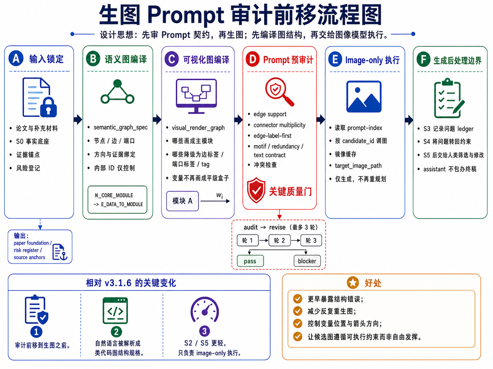
</p>

S2/S5 是 image-generation-only public stages，不承担重新规划、排序或终审。真正的修复发生在 S1/S4 的 prompt package 阶段：如果 prompt 契约中存在 source、箭头、变量位置、文字白名单、重复流程或负约束问题，先修 prompt，再进入生图。

偏好驱动的第二轮覆盖也必须在 S4 分配阶段落实。如果用户在 S3 指定了 C01、C02 或 C08 这类第一轮候选偏好，S4/S5 需要把它们转化为 formal candidate 的 local-essence refinement，而不是静默丢弃。

## 结构化 Prompt 模板

<p align="center">
  
</p>

结构化 prompt 建议按候选身份、读者目标、语义图契约、可视化渲染规则、可见文字白名单、变量承载规则、布局、内部 motif、风格与负约束来组织。S2/S5 只负责执行这些已审计的 prompt，不在图像阶段补写结构逻辑。

## 当前目录说明

- v3.2.15b skill 包：`paper-framework-figure-studio-pro-v3.2.15b-skill.zip`
- v3.2.15b 使用介绍视频：`chatgpt-web-usage-v3.2.15b.mp4` 和 `codex-usage-v3.2.15b.mp4`
- v3.2.15b 示例结果：`example_semiDFL_v3.2.15b/`
- v3.2.15b ChatGPT 网页端 S0-S3 沟通记录截图：`example_semiDFL_v3.2.15b/S0-S3_chatgpt_web_v3.2.15b.png`
- v3.2.15b ChatGPT 网页端 S4-S5 沟通记录截图：`example_semiDFL_v3.2.15b/S4-S5_chatgpt_web_v3.2.15b.png`
- v3.2.15b 第一轮候选：`example_semiDFL_v3.2.15b/R1_results_chatgpt_web_v3.2.15b/`，`C01.png` 到 `C08.png`
- v3.2.15b 第二轮候选：`example_semiDFL_v3.2.15b/R2_results_chatgpt_web_v3.2.15b/`，`F01.png` 到 `F06.png`
- v3.2.15 资料目录：`v3.2.15/`
- v3.2.15 skill 包：`v3.2.15/paper-framework-figure-studio-pro-v3.2.15-skill.zip`
- v3.2.15 第一轮候选：`v3.2.15/R1_results_chatgpt_web_v3.2.15/`
- v3.2.15 第二轮候选：`v3.2.15/R2_results_chatgpt_web_v3.2.15/`
- v3.2.15 ChatGPT 网页沟通记录截图：`v3.2.15/semiDFL_chatgpt_web_v3.2.15.png`
- 老版本目录：`old_versions/`

## 许可

本项目采用 **MIT-0 License** 发布，便于他人复用、修改和再分发 skill 文本、示例与模板。

## 使用方式

ChatGPT 网页版使用时，先把 skill zip 和目标论文 PDF 放进项目 Sources；如需要，可使用 `example_semiDFL_v3.2.15b/semiDFL.pdf`。在需要图像生成的阶段，手动切换到 `Create image`。

Codex 使用时，把 skill zip 和目标论文 PDF 放在当前工程目录中，或在 prompt 中写清楚相对路径。

当前目录提供两个 v3.2.15b 使用介绍视频：`chatgpt-web-usage-v3.2.15b.mp4` 和 `codex-usage-v3.2.15b.mp4`。

ChatGPT 网页端启动提示词示例：

```text
请严格按照sources里paper-framework-figure-studio-pro-v3.2.15b-skill.zip 里 skill 的人机交互步骤，对sources里semiDFL.pdf 绘制 diagram。不要查看semiDFL.pdf 里面已有的diagram；这里的“不要查看”不是说不能自己构思出类似图，而是不要被原图先入为主，应根据论文实际内容决定生成或不生成类似结构。
```

Codex 启动提示词示例：

```text
请严格按照paper-framework-figure-studio-pro-v3.2.15b-skill.zip 里 skill 的人机交互步骤，对semiDFL.pdf 绘制 diagram。不要查看semiDFL.pdf 里面已有的diagram；这里的“不要查看”不是说不能自己构思出类似图，而是不要被原图先入为主，应根据论文实际内容决定生成或不生成类似结构。
```

中断后继续时，可以只要求下一步建议。ChatGPT 网页端示例：

```text
刚才中断了， 请使用 paper-framework-figure-studio-pro-v3.2.15b-skill.zip 里的 skill 根据当前状态（见stage-S3.zip),只建议下一步提示词，不要自动执行下一步
```

Codex 示例：

```text
刚才中断了，请使用 paper-framework-figure-studio-pro v3.2.15b skill 根据当前状态，只建议下一步提示词，不要自动执行下一步。
```

保存 checkpoint 的 zip 文件可能有冗余，可以使用下面提示词清理：

```text
“下载 S3 累加 checkpoint / restore bundle“ 里面有冗余重复内容，不应该包含前面stage的checkpoint打包文件。 请删除后，再给我。
```

## 实验结果

本节只展示当前目录中实际存在的 **v3.2.15b** 结果。示例论文为 `example_semiDFL_v3.2.15b/semiDFL.pdf`。第一轮是全局探索候选 `C01-C08`，第二轮是正式候选 `F01-F06`，均来自 ChatGPT 网页环境。

### 第一轮候选图（R1, v3.2.15b）

| C01                                                                                                       | C02                                                                                                       |
| --------------------------------------------------------------------------------------------------------- | --------------------------------------------------------------------------------------------------------- |
| 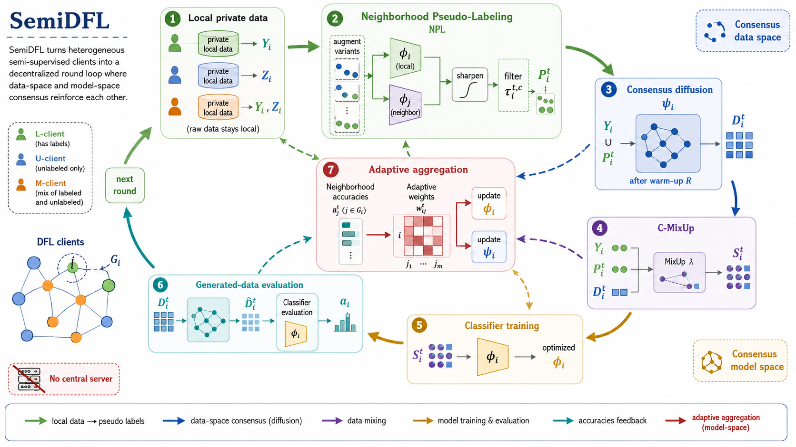 | 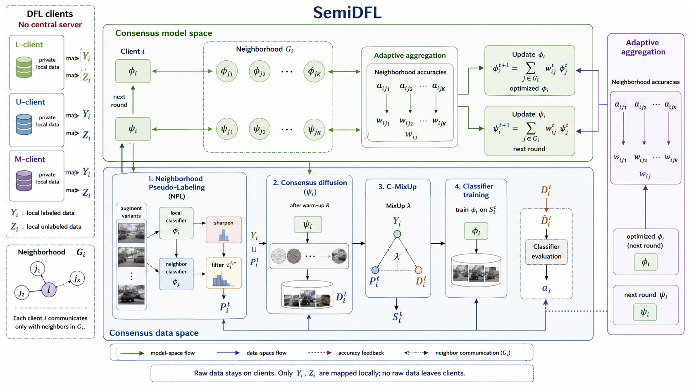 |
| C03                                                                                                       | C04                                                                                                       |
|  | 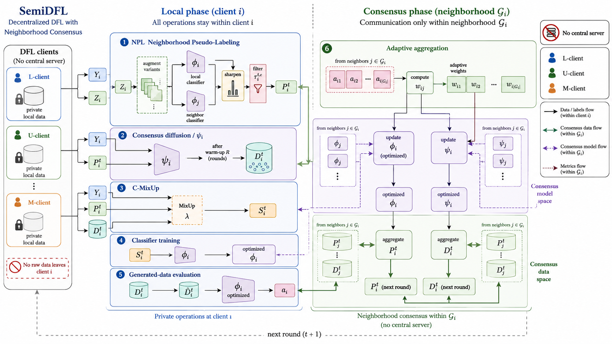 |
| C05                                                                                                       | C06                                                                                                       |
| 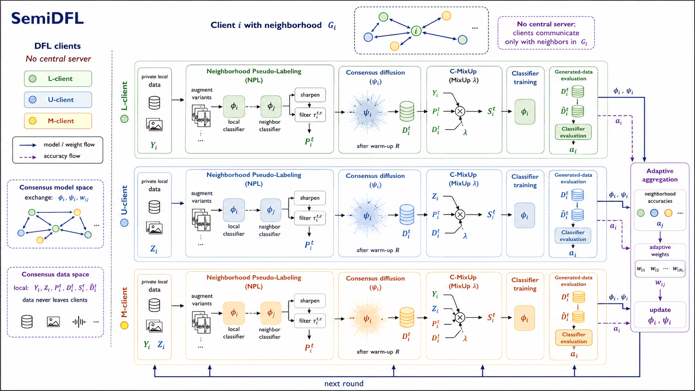 | 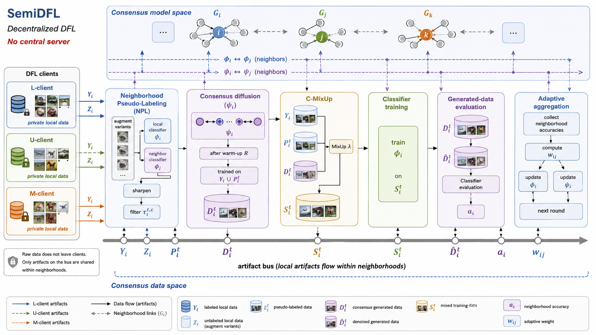 |
| C07                                                                                                       | C08                                                                                                       |
| 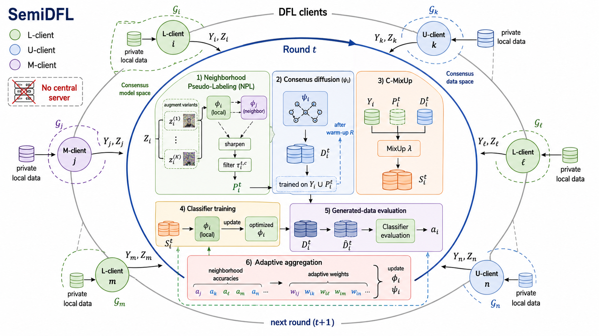 | 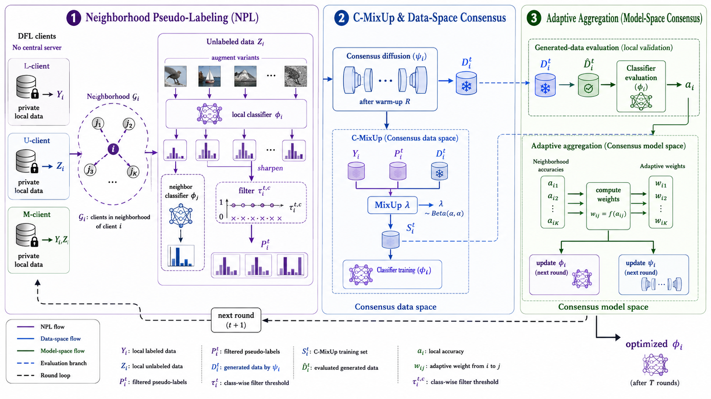 |

### 第二轮候选图（R2, v3.2.15b）

| F01                                                                                                       | F02                                                                                                       |
| --------------------------------------------------------------------------------------------------------- | --------------------------------------------------------------------------------------------------------- |
| 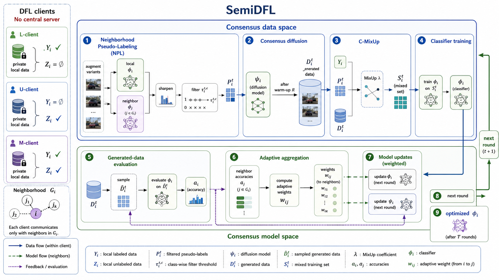 | 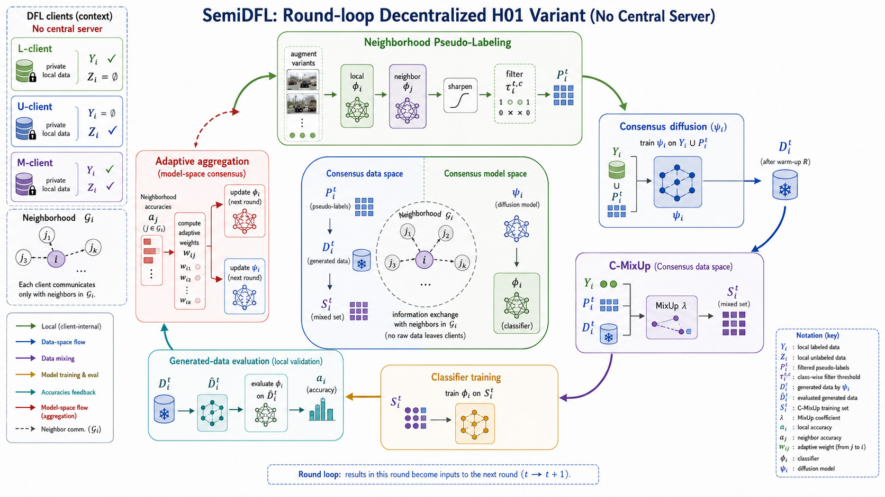 |
| F03                                                                                                       | F04                                                                                                       |
| 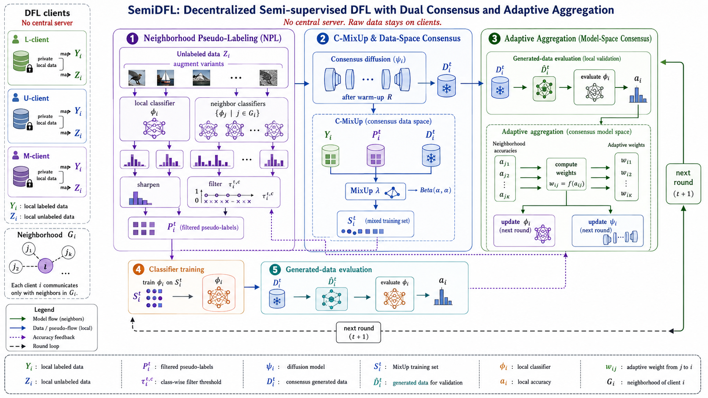 | 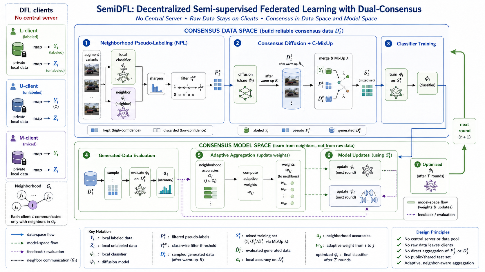 |
| F05                                                                                                       | F06                                                                                                       |
|  |  |

## 非 Codex / 非计算机专业改 Skill 指南

如果你不是计算机专业，但使用的是 Codex，可以让 Codex 参考这个 skill 的本地知识，倒推出构建过程，然后迁移到你的领域：

```text
我是 ** 专业，但是这个 skill 是面向计算机专业的，因为它的内在知识来源于对计算机文献的阅读。现在请你参考 skill 里的本地知识，倒推出这个 skill 的建立过程，然后为我所在的 ** 领域构建类似的框架图 skill。我已经将相关文献 PDF 放在了 ** 文件夹里。
```

如果使用其他工具，例如 Trae 或 Claude Code，可以先说明当前环境的生图能力，让工具把 skill 调整到可用路线：

```text
目前这个 skill 需要调用 ChatGPT Images 2.0，或者通过 image gen 调用 Images 2.0。我现在的环境里没有配置这个能力，使用的是 ***。请根据我目前的环境修改 skill。如果能直接使用当前环境的生图 skill，就直接使用；否则，如果需要调用 API，请向我询问相关信息。
```

<a id="english"></a>

## English | [中文](#chinese)

`paper-framework-figure-studio-pro` is a skill for making computer-science paper framework diagrams. It provides diverse candidate drafts for method overviews, architecture diagrams, pipeline/process figures, and agent workflows so authors can screen, compare, manually edit, and finalize the figure later. This README focuses on **v3.2.15b**: image generation from Codex currently seems unstable, not only in quality but also in whether image gen can be invoked reliably, so the web version is recommended. Special thanks to Xinyang Liu from Bristol for the support.

The preview image-post previously shared on Douyin used **v3.2.15** outputs. That version is also provided in this repository, but it is slightly less stable than v3.2.15b. If you prefer that version, see the `v3.2.15/` folder.

<p align="center">
  
</p>

**Important: 1. The repository root includes v3.2.15b usage walkthrough videos. 2. If you are not using Codex, or if you are outside computer science and want to adapt this skill, see the guide at the end of the English section.**

| v3.2.15b example                                                                                                | v3.2.15 example                                                                              |
| --------------------------------------------------------------------------------------------------------------- | -------------------------------------------------------------------------------------------- |
|  |  |

## Summary

- This README mainly introduces **v3.2.15b**. Compared with v3.1.6a, the key change is that quality control is moved from "audit after image generation" into the S1/S4 prompt package: semantic graph, visual render graph, visible text contract, line-carried variables, and negative constraints are audited before S2/S5 generate images.
- v3.2.15b skill package: `paper-framework-figure-studio-pro-v3.2.15b-skill.zip`.
- This version uses an S0-S5 human-in-the-loop workflow. Paper facts, nodes/edges/ports, variable placement, visible text, and figure-text division are first compiled into auditable image-generation prompts before the workflow enters the image generation stage.
- v3.2.15b still keeps the two-round candidate mechanism: S2 performs global exploration and defaults to `C01-C08`; S5 produces formal candidates and defaults to `F01-F06`. This keeps the earlier "diverge first, converge later" logic.
- After repeated consideration, the default first-round style no longer uses a hand-drawn look; it uses a formal publication style instead. If a hand-drawn first round is needed, state that explicitly when entering the S2 prompt.
- The v3.2.15b workflow explicitly ends at **S5**. After S5, the skill no longer makes the final selection automatically.
- v3.2.15b still does not use editable SVG/PPT as the default delivery target. The default outputs are candidate reference images for manual comparison and reconstruction. Fully editable versions still require later manual redrawing or a separate process.
- Figure-text coordination remains important, but the emphasis is now **prompt-level figure-text division**: S1/S4 decide which information stays in the figure and which information should be explained by the caption, legend, or manuscript text.
- Checkpoint governance is stricter: each stage checkpoint should be rebuildable from cumulative roots, existing assets, and registered rasters into a complete restore bundle. If it cannot be restored, repair-or-redo is triggered instead of treating the incomplete checkpoint as usable.
- Older versions are kept under `old_versions/`. Because aesthetic preference differs from person to person, some users may prefer earlier versions.
- The workflow is usually slow in both ChatGPT web and Codex. If the model tries to run the whole skill in one pass at startup, restart the session and explicitly tell it not to run the full workflow at once.
- What if the result does not look good? In ChatGPT Web, directly edit and rerun the S4/S5 prompt in the input area. Try a few more times; a good one usually appears eventually. I call this "random beauty". At that point, it is worth trying several times, and the web version does not consume Codex tokens.
- In Codex, it is better not to continue immediately after each public stage. Restart a session, then paste a continuation prompt such as: `The previous run was interrupted. Please continue with the next step according to the paper-framework-figure-studio-pro skill, based on the current state and registered artifacts. Do not rerun completed steps.`

## Staged Workflow

| Step                       | Type                             | Purpose                                                                                                             |
| -------------------------- | -------------------------------- | ------------------------------------------------------------------------------------------------------------------- |
| Bootstrap / plan-only gate | TEXT_ONLY                        | Establish execution boundaries and prevent the full workflow from running in one pass                               |
| S0-PAPER-FOUNDATION        | TEXT_ONLY                        | Extract algorithms, modules, terminology, formulas, arrow relationships, evidence anchors, and risks                |
| S1-FIGURE-STRATEGY         | TEXT_ONLY + PROMPT_PACKAGE_PREP  | Diagnose figure type, reader path, and visual strategy; prepare and pre-audit S2 prompt packages                    |
| S2-SKETCH-EXPLORE          | IMAGE_GENERATION_ONLY            | Generate first-round C01-C08 candidates from the S1 prompt index                                                    |
| S3-DIRECTION-SELECT        | TEXT_ONLY                        | Review S2 candidates, build an issue ledger, choose directions, and record style signals plus user preferences      |
| S4-CANDIDATE-BRIEF         | TEXT_ONLY + PROMPT_PACKAGE_PREP  | Produce the formal candidate matrix, S5 prompt index, and prompt packages                                           |
| S5-CANDIDATE-IMAGE         | IMAGE_GENERATION_ONLY / TERMINAL | Generate second-round formal candidates; the assistant workflow ends here, and humans screen and finalize afterward |

## Prompt Contracts and Figure Description

<p align="center">
  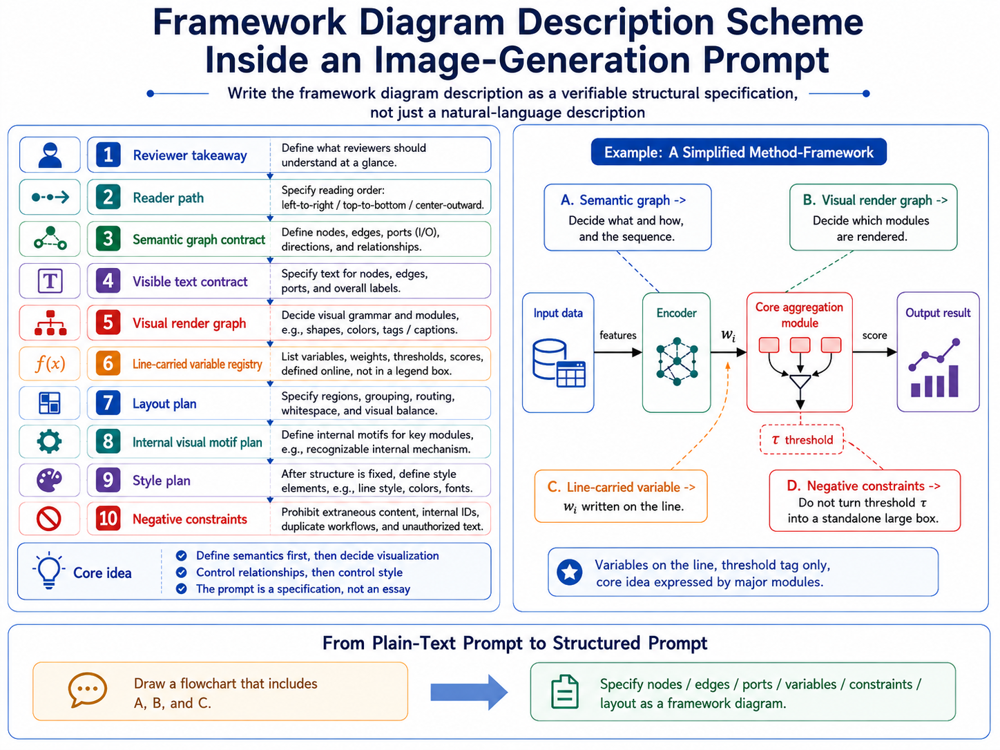
</p>

v3.2.15b turns "draw a framework figure" into a checkable structural specification: what reviewers should understand at a glance, how the reader path should flow, which nodes and edges must appear, which visible text is allowed, whether variables should sit on lines or be explained in the caption, and which content must be prohibited. The prompt behaves more like a specification than a prose request.

## Repair and Checkpoint Gate

<p align="center">
  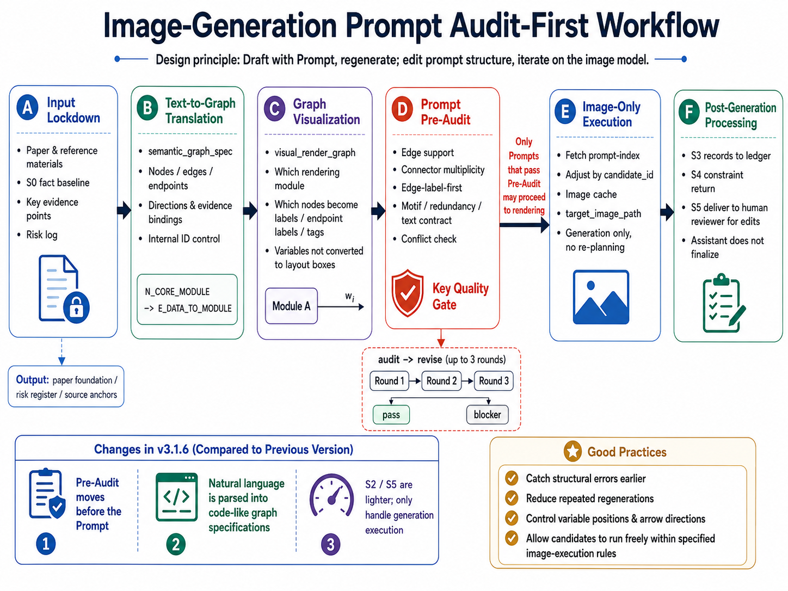
</p>

S2/S5 are image-generation-only public stages. They do not re-plan, rank, or terminally audit candidates. Repair happens during S1/S4 prompt-package preparation: if a prompt contract has source, arrow, variable-placement, visible-text, duplicate-workflow, or negative-constraint problems, the prompt is repaired before generation.

Preference-led second-round coverage must also be handled during S4 allocation. If users name preferred first-round candidates such as C01, C02, or C08 in S3, S4/S5 should translate them into formal candidates through local-essence refinement rather than silently dropping them.

## Structured Prompt Template

<p align="center">
  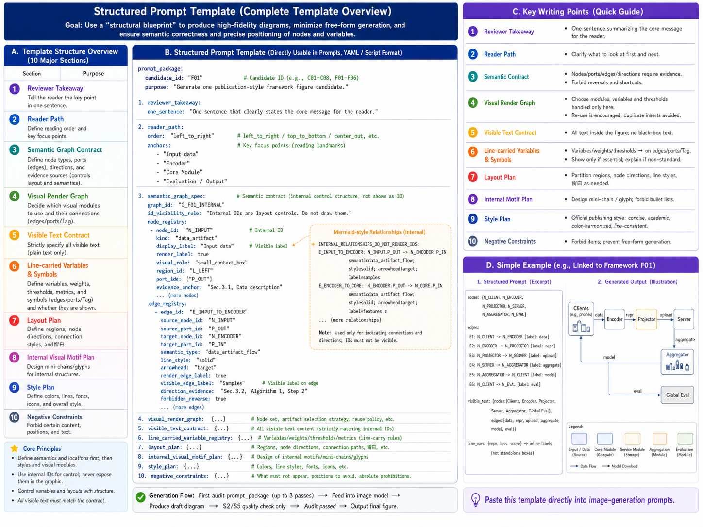
</p>

The recommended prompt structure covers candidate identity, reader goal, semantic graph contract, visual rendering rules, visible text allowlist, variable-carrying rules, layout, internal motifs, style, and negative constraints. S2/S5 execute these audited prompts instead of adding new structural logic in the image stage.

## Current Directory Map

- v3.2.15b skill package: `paper-framework-figure-studio-pro-v3.2.15b-skill.zip`
- v3.2.15b usage walkthrough videos: `chatgpt-web-usage-v3.2.15b.mp4` and `codex-usage-v3.2.15b.mp4`
- v3.2.15b example results: `example_semiDFL_v3.2.15b/`
- v3.2.15b ChatGPT web S0-S3 conversation screenshot: `example_semiDFL_v3.2.15b/S0-S3_chatgpt_web_v3.2.15b.png`
- v3.2.15b ChatGPT web S4-S5 conversation screenshot: `example_semiDFL_v3.2.15b/S4-S5_chatgpt_web_v3.2.15b.png`
- v3.2.15b first-round candidates: `example_semiDFL_v3.2.15b/R1_results_chatgpt_web_v3.2.15b/`, `C01.png` to `C08.png`
- v3.2.15b second-round candidates: `example_semiDFL_v3.2.15b/R2_results_chatgpt_web_v3.2.15b/`, `F01.png` to `F06.png`
- v3.2.15 materials directory: `v3.2.15/`
- v3.2.15 skill package: `v3.2.15/paper-framework-figure-studio-pro-v3.2.15-skill.zip`
- v3.2.15 first-round candidates: `v3.2.15/R1_results_chatgpt_web_v3.2.15/`
- v3.2.15 second-round candidates: `v3.2.15/R2_results_chatgpt_web_v3.2.15/`
- v3.2.15 ChatGPT web conversation screenshot: `v3.2.15/semiDFL_chatgpt_web_v3.2.15.png`
- Older versions directory: `old_versions/`

## License

This project is released under the **MIT-0 License**, so the skill text, examples, and templates can be reused, modified, and redistributed.

## Usage

In ChatGPT Web, add the skill zip and the target paper PDF to the project Sources. If needed, use `example_semiDFL_v3.2.15b/semiDFL.pdf`. When the workflow reaches an image-generation stage, manually switch to `Create image`.

In Codex, put the skill zip and target paper PDF in the current project directory, or specify the relative PDF path in the prompt.

The repository root includes two v3.2.15b walkthrough videos: `chatgpt-web-usage-v3.2.15b.mp4` and `codex-usage-v3.2.15b.mp4`.

ChatGPT Web startup prompt example:

```text
Please strictly follow the human-in-the-loop workflow steps in the skill inside sources/paper-framework-figure-studio-pro-v3.2.15b-skill.zip to draw a diagram for sources/semiDFL.pdf. Do not look at the existing diagram inside semiDFL.pdf. Here, "do not look" does not mean you cannot independently design a similar figure; it means you should not be anchored by the original figure, and should decide from the actual paper content whether to generate a similar structure or not.
```

Codex startup prompt example:

```text
Please strictly follow the human-in-the-loop workflow steps in paper-framework-figure-studio-pro-v3.2.15b-skill.zip to draw a diagram for semiDFL.pdf. Do not look at the existing diagram inside semiDFL.pdf. Here, "do not look" does not mean you cannot independently design a similar figure; it means you should not be anchored by the original figure, and should decide from the actual paper content whether to generate a similar structure or not.
```

When continuing after an interruption, ask only for the next suggested prompt. ChatGPT Web example:

```text
The previous run was interrupted. Please use the skill in paper-framework-figure-studio-pro-v3.2.15b-skill.zip and the current state (see stage-S3.zip) to suggest only the next prompt. Do not automatically execute the next step.
```

Codex example:

```text
The previous run was interrupted. Please use the paper-framework-figure-studio-pro v3.2.15b skill and the current state to suggest only the next prompt. Do not automatically execute the next step.
```

The checkpoint zip may contain redundant files. Use the following prompt to clean it:

```text
The "download S3 cumulative checkpoint / restore bundle" contains redundant repeated content. It should not include checkpoint zip files from previous stages. Please remove them and give it to me again.
```

## Experimental Results

This section shows only the **v3.2.15b** outputs that currently exist in this directory. The example paper is `example_semiDFL_v3.2.15b/semiDFL.pdf`. Round 1 contains global-exploration candidates `C01-C08`; Round 2 contains formal candidates `F01-F06`; both were produced in the ChatGPT web environment.

### Round 1 Candidates (R1, v3.2.15b)

| C01                                                                                                       | C02                                                                                                       |
| --------------------------------------------------------------------------------------------------------- | --------------------------------------------------------------------------------------------------------- |
|  |  |
| C03                                                                                                       | C04                                                                                                       |
|  |  |
| C05                                                                                                       | C06                                                                                                       |
|  |  |
| C07                                                                                                       | C08                                                                                                       |
|  |  |

### Round 2 Candidates (R2, v3.2.15b)

| F01                                                                                                       | F02                                                                                                       |
| --------------------------------------------------------------------------------------------------------- | --------------------------------------------------------------------------------------------------------- |
|  |  |
| F03                                                                                                       | F04                                                                                                       |
|  |  |
| F05                                                                                                       | F06                                                                                                       |
|  |  |

## Adapting This Skill Outside Codex or Computer Science

If you are outside computer science but use Codex, ask Codex to infer the construction process from the local knowledge in this skill and migrate it to your field:

```text
I am in **, but this skill is designed for computer science, because its internal knowledge comes from reading computer-science papers. Please use the local knowledge inside this skill as a reference, infer the process used to build it, and then build a similar framework-diagram skill for my ** field. I have put the relevant paper PDFs in the ** folder.
```

If you are using another tool such as Trae or Claude Code, first describe your current image-generation capability and ask the tool to adapt the skill to that route:

```text
This skill currently needs to call ChatGPT Images 2.0, or to call Images 2.0 through image gen. My current environment does not have that configured; I am using *** instead. Please modify the skill according to my current environment. If the current environment has an image-generation skill that can be used directly, use it directly. Otherwise, if an API call is needed, ask me for the required information.
```
