# 论文框架图制图 Skill

<a id="chinese"></a>

## 中文 | [English](#english)

`paper-framework-figure-studio-pro` 是面向计算机科学论文框架图的制图 skill。它的目标是为绘制框架图提供多样性的参考草案，方便后续人工对照制图；适合 method overview、architecture diagram、pipeline/process figure 和 agent workflow。感谢 bristol 的刘欣阳同学提供的协助。

| 最终结果图 | 手绘风格候选图样例 |
|---|---|
|  | 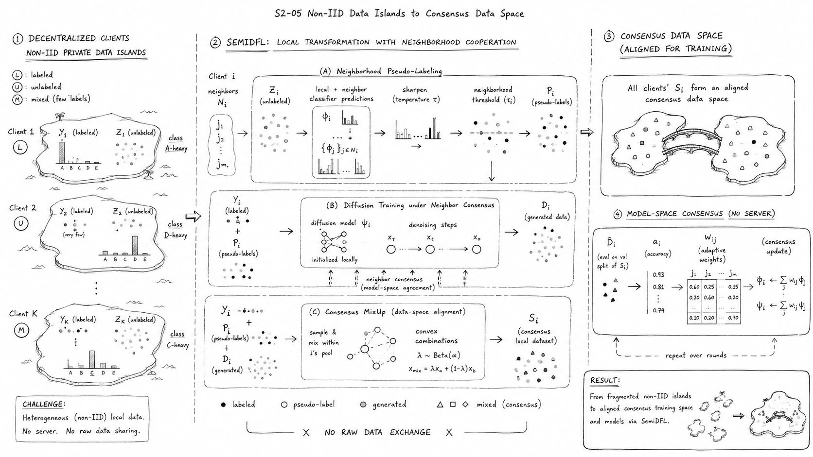 |

## 总结

- 当前介绍的版本包是 `paper-framework-figure-studio-pro-v3.1.4-skill.zip`。旧版本放在 `old_versions/` 文件夹中，可能有时候旧版本更合适。
- 第二轮结果更偏向后续手动 PPT 作图，因此视觉美感不如第一轮手绘草图。如果更希望保留手绘风格，可以在第二轮开始时（S3步骤之后）明确要求继续采用手绘表达。
- v3.1.4 的默认主线收敛为 `S0` 到 `S6`：从论文事实底座、图策略、草图探索、方向选择、候选 brief、候选图，到最终图与说明配套输出；这一版不考虑提供可编辑的 SVG 图。
- 这一版新增“图文说明协同”：生成候选图时同步考虑 title、caption、legend 和正文引用，让说明文字承接符号解释和必要背景，从而减少图中不必要的文字、符号和重复标注。
- 默认风格调整为干净出版示意候选图，同时保留“有故事性的轻量手绘”作为可选风格透镜，用在确实有助于讲清机制或读者路径的场景。
- 风格分类进一步关注图类型、布局语法、读者路径、信息密度、图文分工和后续 SVG/PPT 近似重绘可行性。
- 这个项目的核心目标仍然不是给出唯一答案，而是提供多样性的结构和视觉参考草案，帮助用户做比较、筛选和后续人工制图。
- 不管在 ChatGPT 网页环境还是 Codex 环境下，整个流程通常都比较慢；其中 Codex 在一些工程化场景下可能效果更好，但往往也更费 token。

## 架构介绍

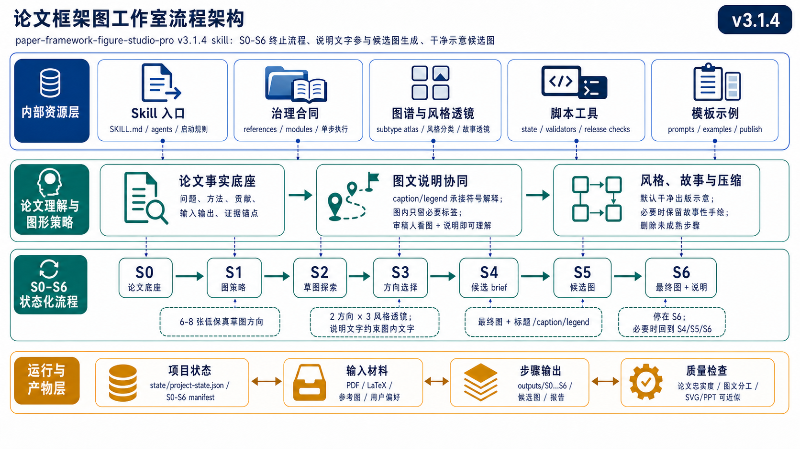

从流程设计来看，v3.1.4 不是简单的一串 prompt，而是一个带状态、带治理、可恢复的分层执行系统。整体可以理解为三类工作：最前面的论文事实底座，中间的探索、候选与最终选择，以及贯穿全流程的状态产物与质量检查。

- **论文事实底座层**：`S0-PAPER-FOUNDATION` 负责把论文中的算法、模块、公式、术语、箭头关系和证据锚点先抽取出来，作为后续所有步骤共享的事实基线。
- **探索与选择层**：`S1` 到 `S6` 负责图类型诊断、草图探索、方向筛选、候选细化和最终选择。这一层强调先发散后收敛，先给出可比较的参考草案，再逐步收束到更贴近论文的结果。
- **图文说明协同层**：在 `S4` 到 `S6` 中同步考虑 title、caption、legend 和正文引用，让图像本身保留必要结构，让说明文字承担符号解释、背景补充和读者引导。
- **状态治理与检查层**：围绕整个流程，系统会维护步骤状态、产物边界和恢复点，使流程更容易回滚、重跑和检查。

内置参考图谱主要服务于探索与选择层：它在 `S1-FIGURE-STRATEGY` 和 `S2-SKETCH-EXPLORE` 之前提供图类型、布局语法、读者细节密度和视觉风格坐标，避免后续候选图只靠文字说明发散。

v3.1.4 的默认主线如下：

```text
S0-PAPER-FOUNDATION -> S1-FIGURE-STRATEGY -> S2-SKETCH-EXPLORE -> S3-DIRECTION-SELECT -> S4-CANDIDATE-BRIEF -> S5-CANDIDATE-IMAGE -> S6-FINAL-SELECT
```

## 内置参考图谱

v3.1.4 继续把 F1-F4 作为设计参考图谱，并在此基础上更强调风格透镜、读者路径和图文分工。把这些图列入设计思想，是为了在进入目标论文候选图之前，先建立可见的视觉决策坐标，让候选图比较不只依赖文字描述，而是在可对照的参考体系中发散和收敛。

这些图是参考/概念图，不是某篇目标论文的候选图，也不能替代正式候选图生成步骤。

| F1 | F2 |
|---|---|
| 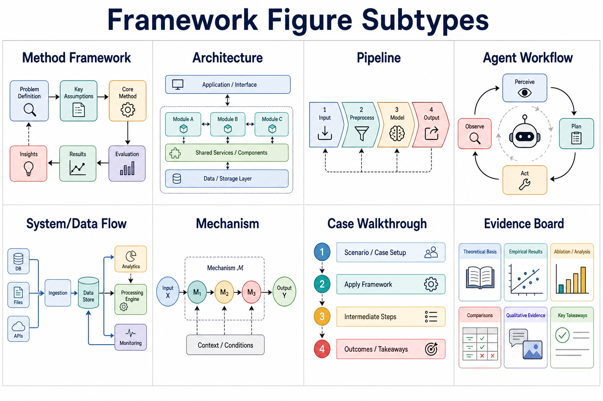 |  |

| F3 | F4 |
|---|---|
| 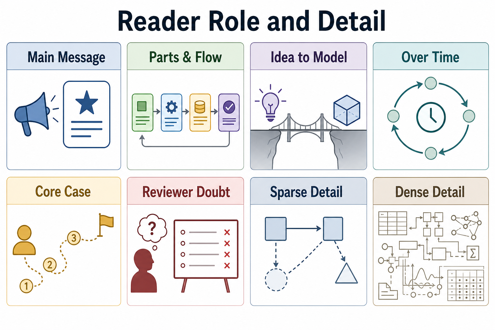 | 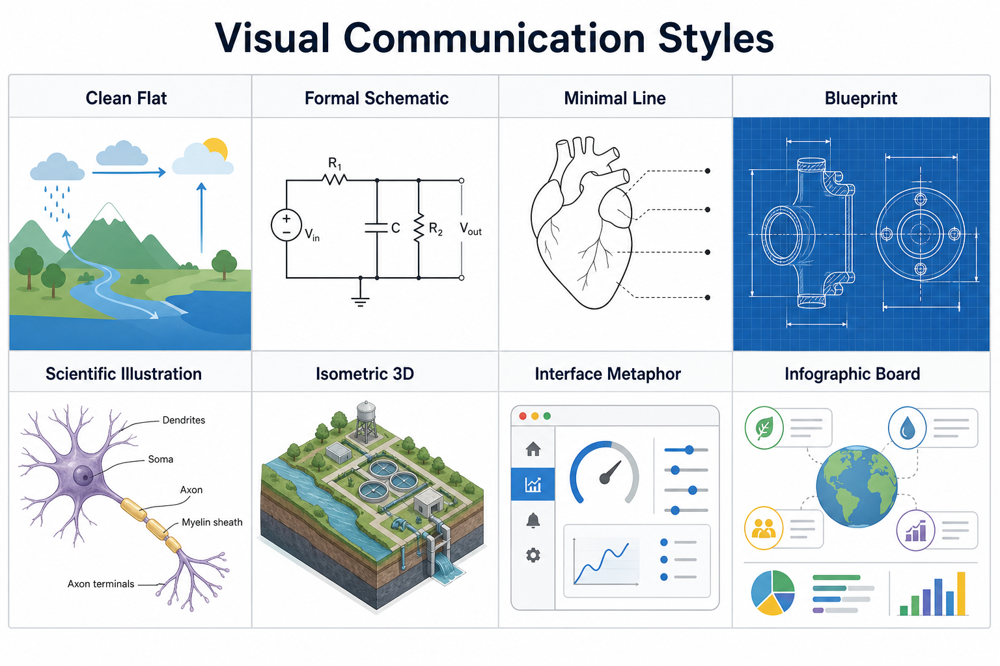 |

- `F1.png`：framework figure subtype overview
- `F2.png`：visual grammar and layout
- `F3.png`：reader role and detail
- `F4.png`：visual communication styles

## 两段式流程

- **全局探索过程**：`S1-FIGURE-STRATEGY -> S2-SKETCH-EXPLORE -> S3-DIRECTION-SELECT`
- **局部细化与最终选择**：`S4-CANDIDATE-BRIEF -> S5-CANDIDATE-IMAGE -> S6-FINAL-SELECT`
- **图文说明协同**：贯穿 `S4` 到 `S6`，用 caption/legend 承接解释，减少图内不必要的文字和符号。

## 步骤列表

| Step | 类型 | 作用 |
|---|---|---|
| S0-PAPER-FOUNDATION | TEXT_ONLY | 论文精读底座，梳理论文中的算法、模块、术语、公式和箭头关系 |
| S1-FIGURE-STRATEGY | TEXT_ONLY | 诊断图类型、叙事角色和读者效果 |
| S2-SKETCH-EXPLORE | IMAGE_ONLY_PLUS_PROMPT | 全局探索草图 |
| S3-DIRECTION-SELECT | TEXT_ONLY | 从全局探索中筛出进入局部细化的方向 |
| S4-CANDIDATE-BRIEF | TEXT_ONLY | 局部细化准备，生成正式候选矩阵和 prompts |
| S5-CANDIDATE-IMAGE | IMAGE_ONLY_PLUS_PROMPT | 局部细化正式候选图 |
| S6-FINAL-SELECT | TEXT_ONLY | 从候选中选出最终架构图，并配套 title、caption、legend 和正文引用建议 |

## 限制与已知问题

- 不管在哪种环境下，整体流程都不会特别快，尤其是需要多轮候选图生成和人工筛选时。
- 效果并不稳定，仍需要人工干涉和评审；不同论文、不同环境和不同轮次下的输出质量波动较大，仍然需要人工判断、人工筛选和人工修正，当前示例里也保留了不少反面例子。
- Codex 环境下在一些完整工程场景里可能效果更好，但通常会更费 token。
- v3.1.4 暂不把 SVG/PPT 复刻作为默认交付目标；如果需要完全可编辑版本，仍需要后续人工重绘或单独处理。
- 图文说明协同可以减少图内文字，但仍需要用户检查 caption、legend 和正文引用是否准确覆盖关键符号与机制。

## ChatGPT 网页版使用

1. 先把 `paper-framework-figure-studio-pro-v3.1.4-skill.zip` 放进项目的 Sources。
2. 再把目标论文 PDF 放进 Sources；如果要复现实验结果，可使用 `semiDFL.pdf`。
3. 打开 **Extended thinking**。
4. 在需要图像阶段时，切换到 **Create image**。

启动示例：

```text
请严格按照paper-framework-figure-studio-pro-v3.1.4-skill.zip里skill的人机交互步骤，对semiDFL.pdf绘制diagram。不要查看semiDFL.pdf里面的diagram，注意这里说的不要查看并不是说不能自己也构思出类似的，而是说不要将其先入为主，而是根据实际情况决定生成或不生成类似的
```

## Codex 使用

1. 把 `paper-framework-figure-studio-pro-v3.1.4-skill.zip` 放在当前工程目录中。
2. 把目标论文 PDF 也放在工程目录中，或者在 prompt 里写清楚相对路径。
3. 如果 token 额度有限，优先用 ChatGPT 网页环境。

启动示例：

```text
请严格按照 paper-framework-figure-studio-pro-v3.1.4-skill.zip 里skill的人机交互步骤， 对 semiDFL.pdf 绘制diagram。不要查看semiDFL.pdf里面的diagram，注意这里说的不要查看并不是说不能自己也构思出类似的，而是说不要将其先入为主，而是根据实际情况决定生成或不生成类似的
```

## 实验结果

本节实验在 ChatGPT 网页版和 Codex 下执行，使用的 LLM 是 GPT-5.5；如果使用其他模型、不同推理强度或不同运行环境，生成质量和流程表现可能不一致。

在 ChatGPT 网页版中，如果下一步需要生成图像，建议先在输入框位置手动点击 `Create image` 标签，再继续执行。

上图是 `example_semiDFL_v3.1.4/final_Image_codex_v3.1.4.png`，对应本仓库随附的 semiDFL 示例流程最终选定框架图。`example_semiDFL_v3.1.4/semiDFL.pdf` 是这个例子使用的论文；同目录还保留了 chatgpt网页环境下的全局筛选草图、局部筛选设计稿、最终图、ChatGPT 网页环境交互记录和 Codex 运行录像，方便完整对照流程。

- 示例结果目录：`example_semiDFL_v3.1.4/`
- 示例论文：`example_semiDFL_v3.1.4/semiDFL.pdf`
- 第一轮全局筛选草图（Chatgpt网页）：`example_semiDFL_v3.1.4/R1_results_codex_v3.1.4/`
- 第二轮局部筛选设计稿（Chatgpt网页）：`example_semiDFL_v3.1.4/R2_results_codex_v3.1.4/`
- 最终选择的框架图（Chatgpt网页）：`example_semiDFL_v3.1.4/final_Image_codex_v3.1.4.png`
- ChatGPT 网页环境交互记录：`example_semiDFL_v3.1.4/semiDFL_chatgpt_web_v3.1.4.mhtml`
- Codex 运行情况记录：`example_semiDFL_v3.1.4/semiDFL_codex_v3.1.4.mp4`

### 中文实验截图

#### 第一轮全局筛选草图（R1, Chatgpt网页）

| S1-02 | S2-01 | S2-03 |
|---|---|---|
| 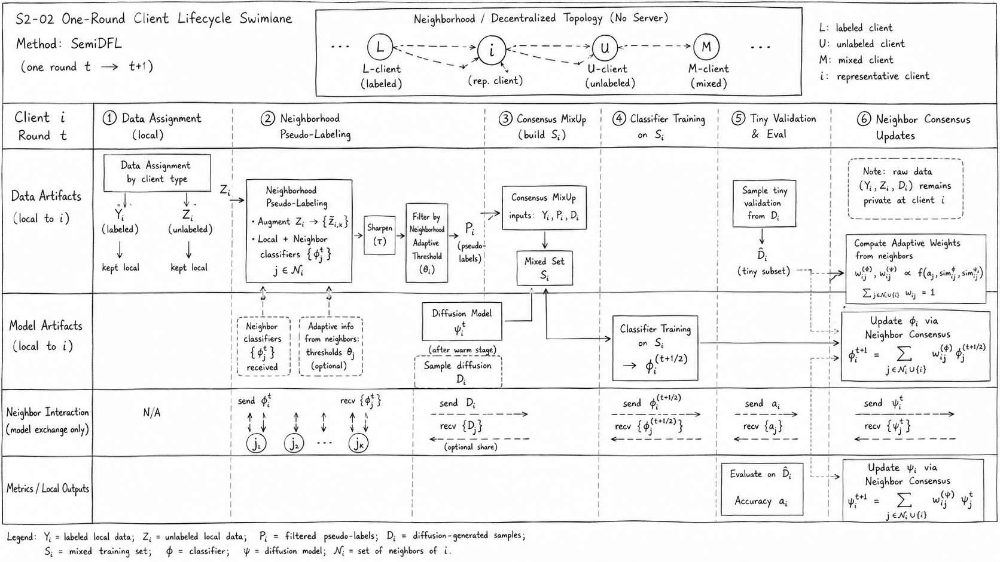 | 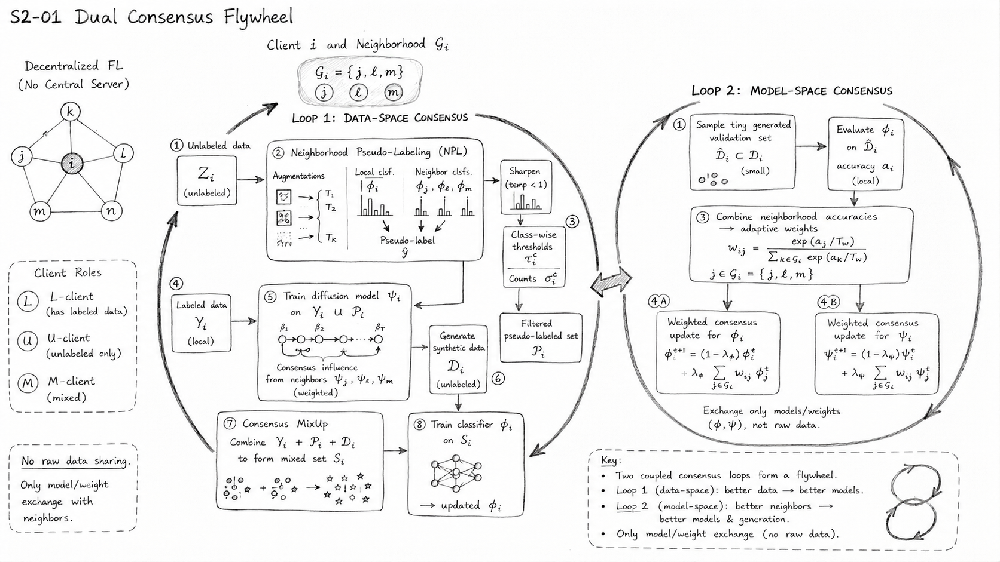 | 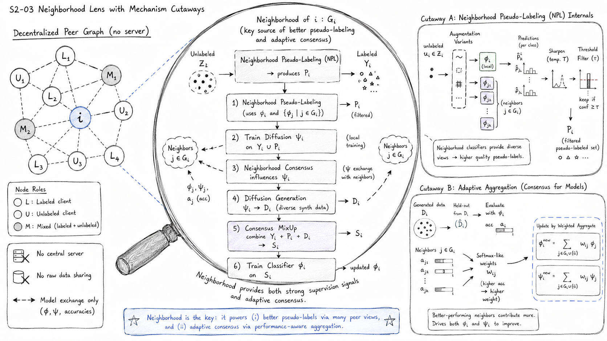 |
| S2-04 | S2-05 | S2-06 |
| 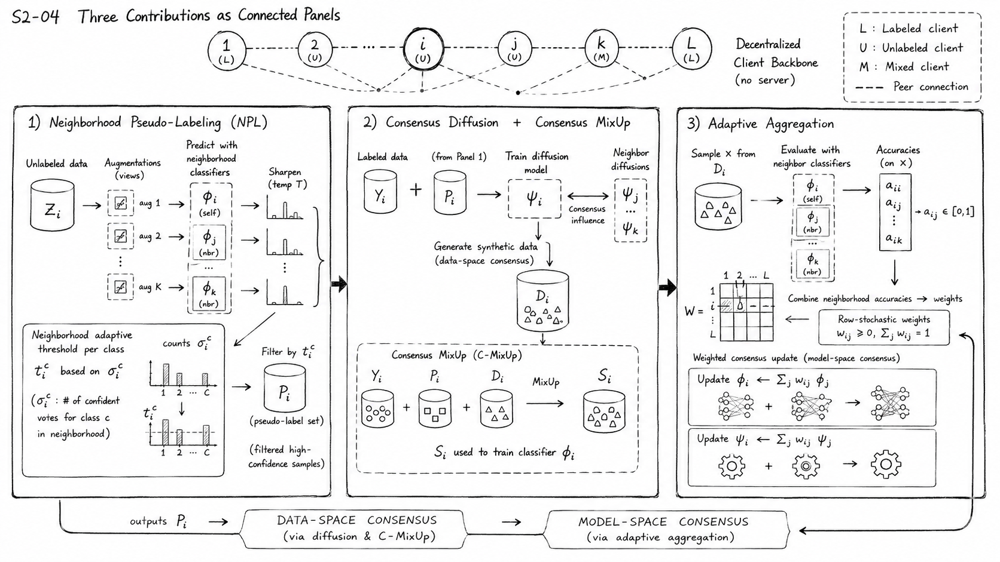 |  | 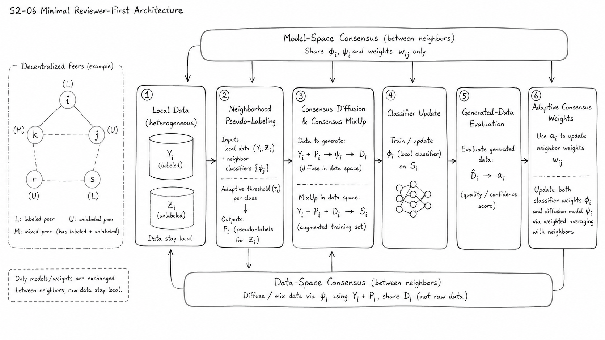 |

#### 第二轮局部筛选设计稿（R2, Chatgpt网页）

| S5_01 | S5_02 | S5_03 |
|---|---|---|
| 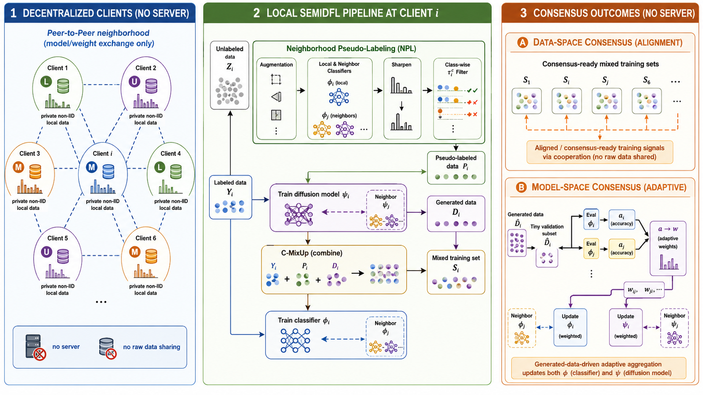 | 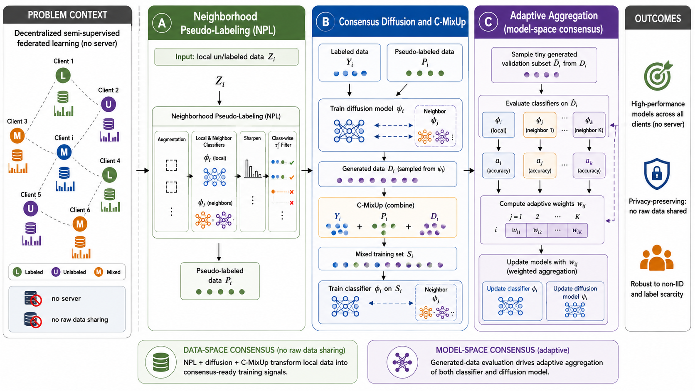 | 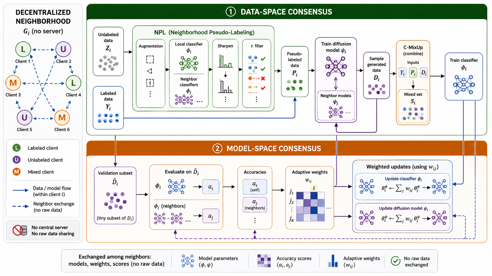 |
| S5_04 | S5_05 | S5_06 |
| 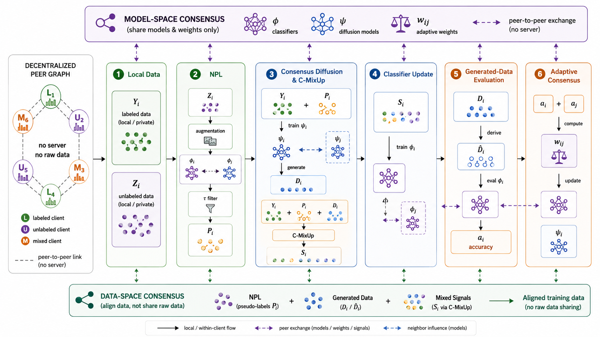 | 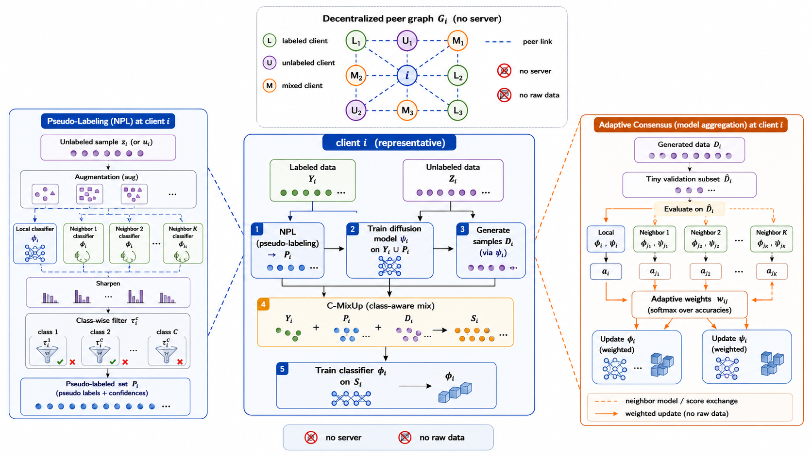 | 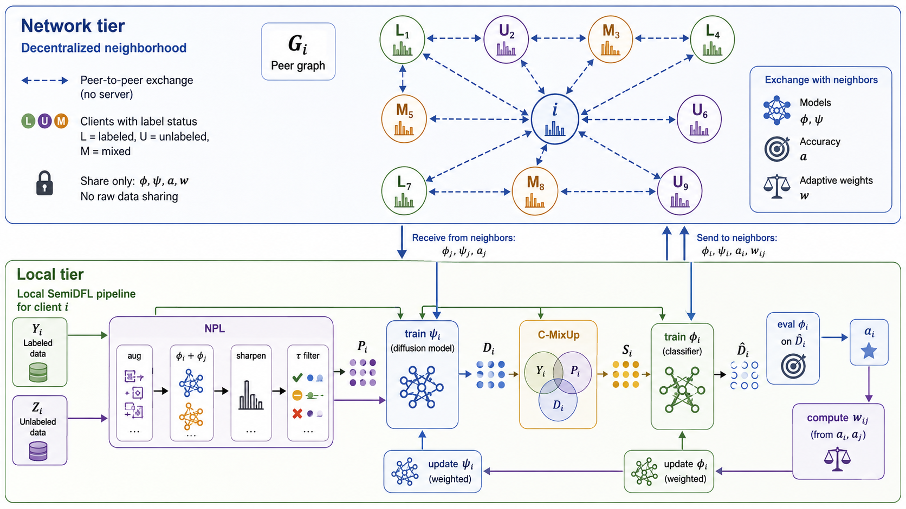 |

<a id="english"></a>

## paper-framework-figure-studio-pro | [中文](#chinese)

`paper-framework-figure-studio-pro` is a skill for making computer-science paper framework diagrams. Its goal is to provide diverse reference drafts for drawing framework figures so that users can continue the final figure-making process manually by comparing and following those drafts. It is suitable for method overviews, architecture diagrams, pipeline/process figures, and agent workflows. Special thanks to Xinyang Liu from Bristol for the support.

| Final Result | Hand-Drawn Candidate Example |
|---|---|
|  |  |

## Summary

- The package documented here is `paper-framework-figure-studio-pro-v3.1.4-skill.zip`. Older versions are kept in `old_versions/`, and sometimes an older version may be more suitable.
- In this version, the second-round outputs are biased toward manual reference material for later PPT drawing, so they may sometimes look less polished than the first-round hand-drawn sketches. If you prefer to keep the hand-drawn style, say so at the start of the second round and make clear that SVG drawing convenience does not need to be prioritized.
- v3.1.4 uses `S0` to `S6` as the default mainline: paper foundation, figure strategy, sketch exploration, direction selection, candidate brief, candidate image, and final figure selection with figure text support. This version does not aim to provide an editable SVG figure.
- This version adds image-caption co-design: candidate generation now considers title, caption, legend, and in-paper references, so the caption/legend can explain symbols and background while the figure keeps only necessary labels.
- The default visual style moves toward clean publication-ready schematic candidates, while keeping story-like lightweight sketches as an optional lens when they help explain a mechanism or reader path.
- The style taxonomy now pays more attention to figure subtype, layout grammar, reader path, information density, image-text division, and later SVG/PPT approximability.
- The core goal of this project is still not to force a single answer, but to provide diverse structural and visual reference drafts that support comparison, filtering, and later manual figure-making.
- In both ChatGPT web and Codex, the workflow is generally slow. Codex may perform better in some engineering-heavy scenarios, but it is usually much more token-expensive.

## Architecture Overview

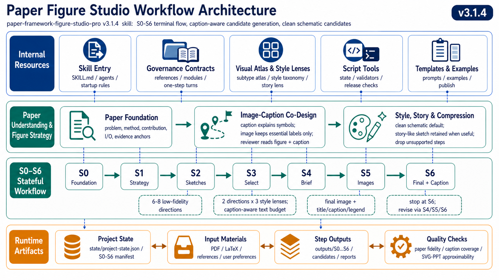

In workflow terms, v3.1.4 is not just a linear prompt chain. It is a stateful, governed, and recoverable execution system. At a high level, it can be understood as three kinds of work: the paper-foundation baseline, exploration/candidate/final selection, and cross-cutting state artifacts plus quality checks.

- **Paper-foundation layer**: `S0-PAPER-FOUNDATION` extracts algorithms, modules, formulas, terminology, arrow relationships, and evidence anchors from the paper first, so later stages share the same factual baseline.
- **Exploration-and-selection layer**: `S1` to `S6` handle figure-type diagnosis, sketch exploration, direction filtering, candidate refinement, and final selection. This layer emphasizes divergence first and convergence later.
- **Image-caption co-design layer**: from `S4` to `S6`, the workflow considers title, caption, legend, and in-paper references so the image keeps the necessary structure while the surrounding text explains symbols, context, and reader guidance.
- **State/governance/check layer**: across the whole workflow, the system maintains step states, artifact boundaries, and recovery points so the process is easier to resume, rerun, rewind, and inspect.

The built-in reference atlas mainly supports the exploration-and-selection layer. Before `S1-FIGURE-STRATEGY` and `S2-SKETCH-EXPLORE`, it provides visible coordinates for figure subtype, layout grammar, reader detail density, and visual style, so later candidates do not diverge from prose alone.

The v3.1.4 default mainline is:

```text
S0-PAPER-FOUNDATION -> S1-FIGURE-STRATEGY -> S2-SKETCH-EXPLORE -> S3-DIRECTION-SELECT -> S4-CANDIDATE-BRIEF -> S5-CANDIDATE-IMAGE -> S6-FINAL-SELECT
```

## Built-In Reference Atlas

v3.1.4 continues to use F1-F4 as a design reference atlas, while placing more emphasis on style lenses, reader paths, and image-text division. They establish visible decision coordinates before target-paper candidates are generated, so later candidate comparison does not rely only on prose and can diverge and converge inside a visible reference system.

These are reference/concept images, not candidate figures for a target paper, and they do not replace the formal candidate-generation steps.

| F1 | F2 |
|---|---|
|  |  |

| F3 | F4 |
|---|---|
|  |  |

- `F1.png`: framework figure subtype overview
- `F2.png`: visual grammar and layout
- `F3.png`: reader role and detail
- `F4.png`: visual communication styles

## Two-Stage Workflow

- **Global exploration**: `S1-FIGURE-STRATEGY -> S2-SKETCH-EXPLORE -> S3-DIRECTION-SELECT`
- **Local refinement and final selection**: `S4-CANDIDATE-BRIEF -> S5-CANDIDATE-IMAGE -> S6-FINAL-SELECT`
- **Image-caption co-design**: runs through `S4` to `S6`, using caption/legend to carry explanations and reduce unnecessary in-figure words and symbols.

## Step List

| Step | Type | Purpose |
|---|---|---|
| S0-PAPER-FOUNDATION | TEXT_ONLY | Build the factual paper foundation across algorithms, modules, terminology, formulas, and arrow relationships |
| S1-FIGURE-STRATEGY | TEXT_ONLY | Diagnose figure type, narrative role, and reader effect |
| S2-SKETCH-EXPLORE | IMAGE_ONLY_PLUS_PROMPT | Global exploration sketches |
| S3-DIRECTION-SELECT | TEXT_ONLY | Filter directions for local refinement |
| S4-CANDIDATE-BRIEF | TEXT_ONLY | Prepare the local-refinement candidate matrix and prompts |
| S5-CANDIDATE-IMAGE | IMAGE_ONLY_PLUS_PROMPT | Generate local-refinement candidate figures |
| S6-FINAL-SELECT | TEXT_ONLY | Select the final framework figure and provide title, caption, legend, and in-paper reference suggestions |

## Limitations and Known Issues

- The workflow is not especially fast in either environment, especially when it needs multiple candidate-generation and human-screening rounds.
- The results are not fully stable and still require human intervention and review. Output quality can vary across papers, environments, and rounds, so human judgment, filtering, and correction are still necessary. The bundled example also preserves several negative cases.
- Codex may produce better results in some full-project scenarios, but it is usually much more token-hungry.
- v3.1.4 does not treat SVG/PPT recreation as the default delivery target. Fully editable versions still require later manual reconstruction or a separate process.
- Image-caption co-design can reduce in-figure text, but users still need to check whether the caption, legend, and in-paper references accurately cover key symbols and mechanisms.

## Using in ChatGPT Web

1. First add `paper-framework-figure-studio-pro-v3.1.4-skill.zip` to the project's Sources.
2. Then add the target paper PDF to Sources. To reproduce the example, you can use `semiDFL.pdf`.
3. Turn on **Extended thinking**.
4. When the workflow reaches an image stage, switch to **Create image**.

Startup example:

```text
Please strictly follow the human-in-the-loop workflow steps in paper-framework-figure-studio-pro-v3.1.4-skill.zip to draw a diagram for semiDFL.pdf. Do not look at the diagram already inside semiDFL.pdf. What I mean here is not that the model is forbidden from independently coming up with something similar, but that it should not be anchored by the existing figure and should decide based on the actual situation whether a similar structure should or should not be generated.
```

## Using in Codex

1. Put `paper-framework-figure-studio-pro-v3.1.4-skill.zip` in the current project directory.
2. Put the target paper PDF in the same directory, or specify its relative path in the prompt.
3. If token budget is limited, prefer ChatGPT web.

Startup example:

```text
Please strictly follow the human-in-the-loop workflow steps in paper-framework-figure-studio-pro-v3.1.4-skill.zip to draw a diagram for semiDFL.pdf. Do not look at the diagram already inside semiDFL.pdf. What I mean here is not that the model is forbidden from independently coming up with something similar, but that it should not be anchored by the existing figure and should decide based on the actual situation whether a similar structure should or should not be generated.
```

## Experimental Results

The experiments in this section were run in both ChatGPT web and Codex, using GPT-5.5 as the LLM. Results may differ when using other models, different reasoning settings, or different runtime environments.

In ChatGPT web, when the next step is image generation, it is better to manually click the `Create image` label in the input area before continuing.

The figure above is `example_semiDFL_v3.1.4/final_Image_codex_v3.1.4.png`, the final selected framework figure from the bundled semiDFL example workflow. `example_semiDFL_v3.1.4/semiDFL.pdf` is the paper used in this example. The same directory also keeps the ChatGPT web global-screening sketches, local-screening drafts, final figure, ChatGPT web interaction record, and Codex runtime video for full workflow comparison.

- Example results directory: `example_semiDFL_v3.1.4/`
- Example paper: `example_semiDFL_v3.1.4/semiDFL.pdf`
- First-round global screening sketches (ChatGPT web): `example_semiDFL_v3.1.4/R1_results_codex_v3.1.4/`
- Second-round local screening design drafts (ChatGPT web): `example_semiDFL_v3.1.4/R2_results_codex_v3.1.4/`
- Final selected framework figure (ChatGPT web): `example_semiDFL_v3.1.4/final_Image_codex_v3.1.4.png`
- ChatGPT web interaction record: `example_semiDFL_v3.1.4/semiDFL_chatgpt_web_v3.1.4.mhtml`
- Codex runtime recording: `example_semiDFL_v3.1.4/semiDFL_codex_v3.1.4.mp4`

### Experimental Screenshots

#### Round 1 Global Screening Sketches (R1, ChatGPT web)

| S1-02 | S2-01 | S2-03 |
|---|---|---|
|  |  |  |
| S2-04 | S2-05 | S2-06 |
|  |  |  |

#### Round 2 Local Screening Design Drafts (R2, ChatGPT web)

| S5_01 | S5_02 | S5_03 |
|---|---|---|
|  |  |  |
| S5_04 | S5_05 | S5_06 |
|  |  |  |
