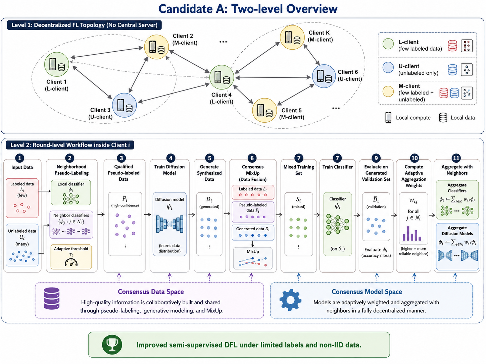
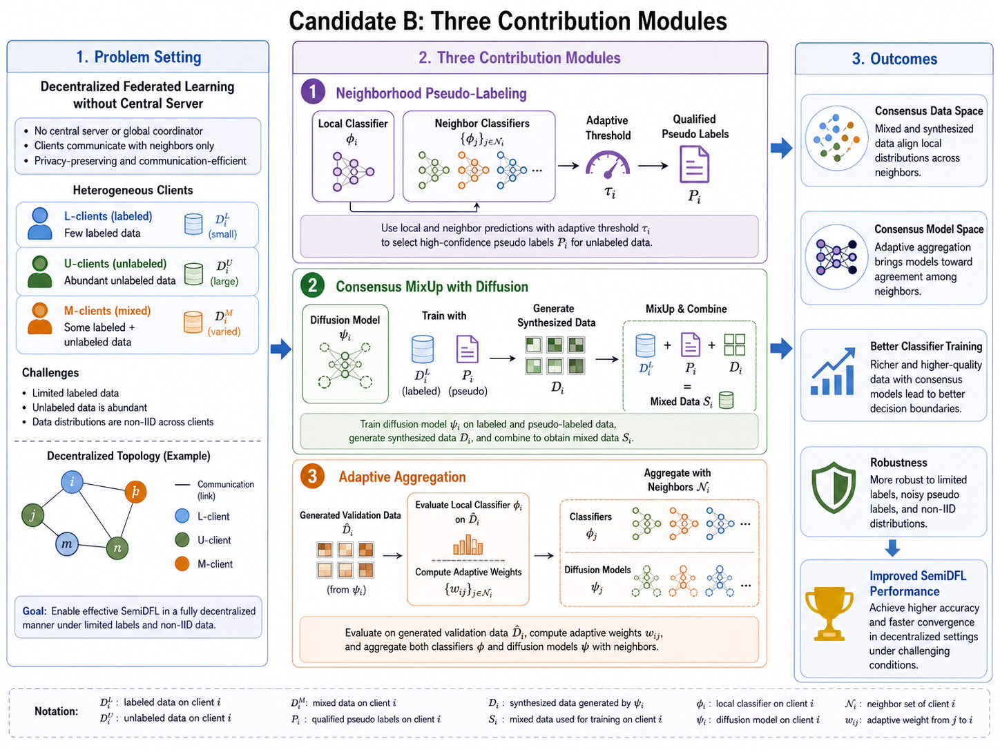
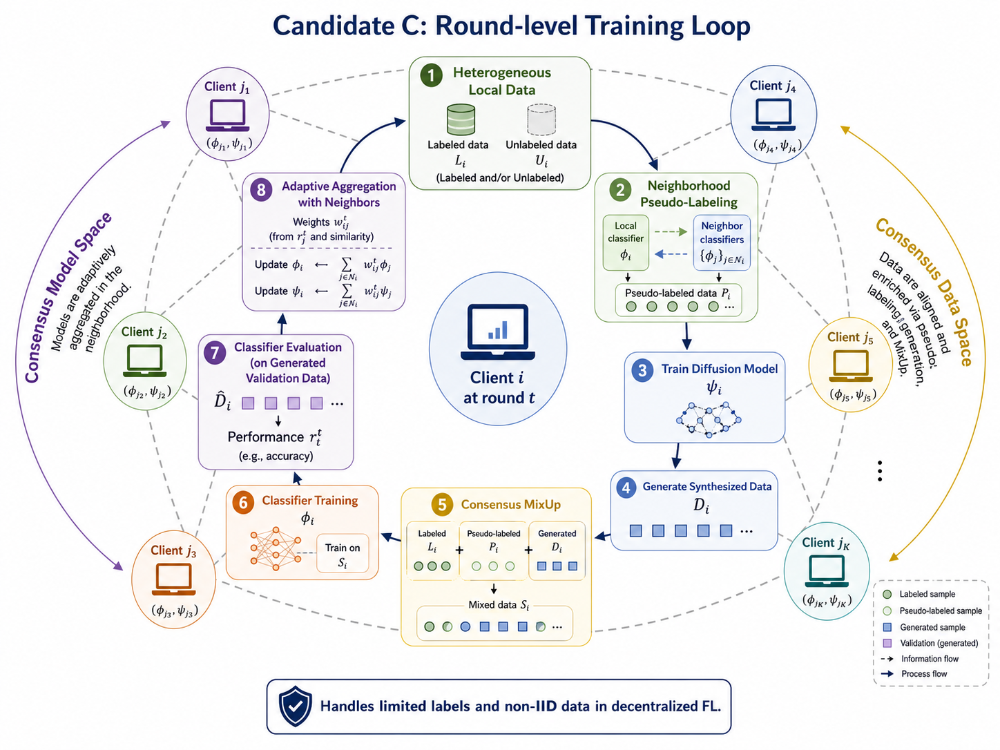
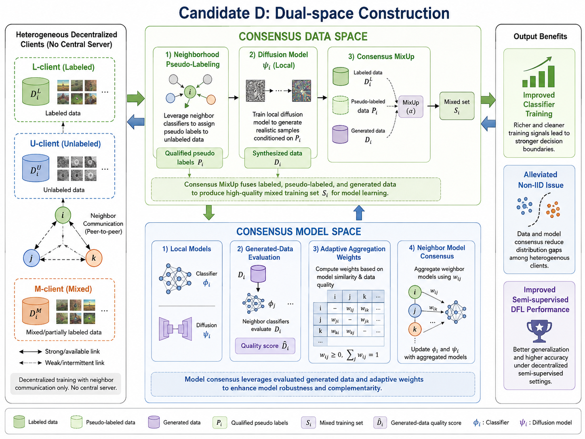
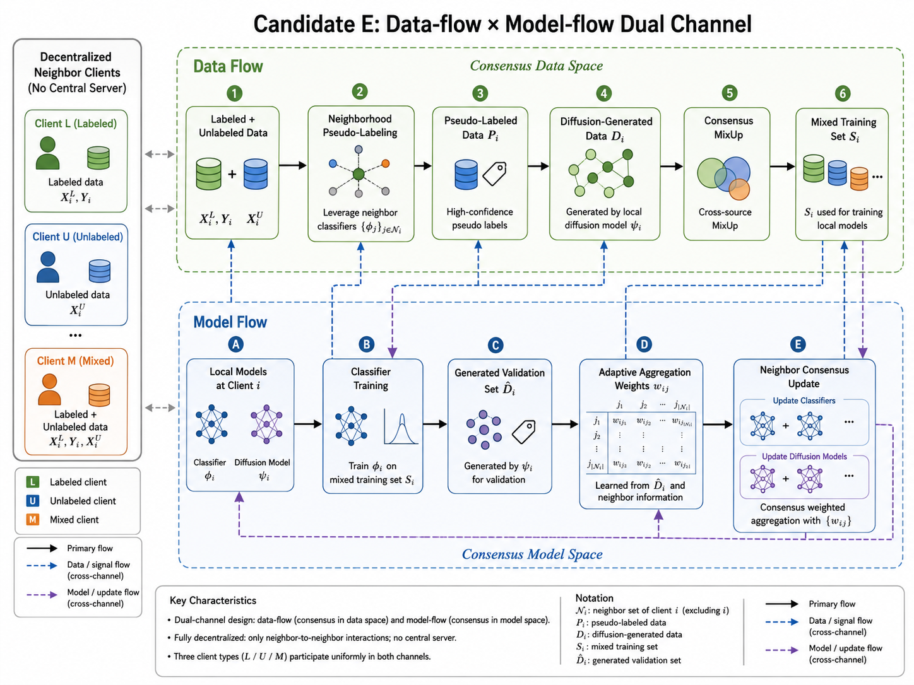
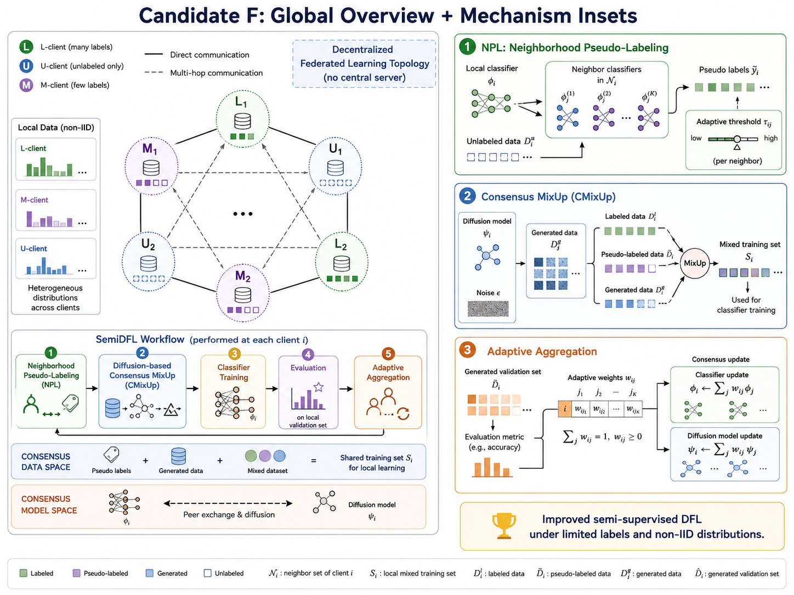

# 论文框架图制图 Skill

`paper-framework-figure-studio-pro` 用于帮助研究者为论文生成 framework diagram、method diagram、pipeline diagram、architecture diagram、agent workflow 和 mechanism diagram 等框架图。它适合把论文 PDF、摘要、方法说明或草稿转化为可比较的制图方案、候选图、修改建议、caption、legend 和正文中的图说明。


上图是 `example_semiDFL/result.png`，也是这个示例流程得到的论文（semiDFL)新的框架图。`example_semiDFL/semidfl-chatgpt-example.mhtml` 是在 ChatGPT 网页版执行 `paper-framework-figure-studio-pro` 的完整页面导出，可作为复现实例参考。（感谢bristol大学的刘同学提供支持）

## 中文

它会先展示内置的子类型/风格示意图谱，再进入论文理解、方案比较和候选图生成流程。

### semiDFL 示例文件说明

`example_semiDFL` 目录保存了一个完整的 ChatGPT 网页版制图例子：

- `semidfl-chatgpt-example.mhtml`：ChatGPT 网页版执行记录。
- `F1.png` 到 `F4.png`：构建 skill 时总结出的不同类型图示例，也对应内置的 subtype/style atlas。
- `c1.png` 到 `c6.png`：示例流程中生成的 6 张候选图，用于比较和选择方向。
- `result.png`：最终选定并整理后的图，适合放在论文第一段相关介绍之后作为方法总览图。

### 构建 skill 时总结出的图类型示例

| F1 | F2 |
|---|---|
|  |  |

| F3 | F4 |
|---|---|
|  |  |

### ChatGPT 网页版生成的候选图

| C1 | C2 | C3 |
|---|---|---|
|  |  |  |

| C4 | C5 | C6 |
|---|---|---|
|  |  |  |

### 内置示意图谱

首次启动时，skill 会展示已保存的子类型/风格 atlas，不会立刻分析论文，也不会现场生图。`F1-F4` 是这套图谱的示例展示：

- F1：framework figure subtype overview。
- F2：visual grammar and layout。
- F3：reader role and detail。
- F4：visual communication styles。

### Skill 总结出的分类体系

这个 skill 会从多个角度判断一张论文图应该如何设计，而不是只把图简单归为“框架图”或“流程图”。

- 按论文角色分类：方法总览图、模型架构图、训练或推理流程图、系统工作流图、机制解释图、案例走查图、实验协议或 benchmark 设置图、失败模式或局限性图。
- 按信息结构分类：模块-关系型、阶段-流程型、数据流型、输入-输出型、多分支对比型、层级结构型、闭环迭代型、中心机制扩散型。
- 按读者问题分类：这篇方法整体做什么、各模块如何连接、数据如何流动、训练和推理如何发生、创新点在哪里、为什么该机制有效、与已有方法的差异在哪里。
- 按视觉叙事分类：从左到右流程、从上到下 pipeline、中心模块辐射、三栏对比、双层架构、循环优化、问题到解决方案、输入到输出。
- 按视觉传达风格分类：clean editorial flat、formal architecture schematic、minimal line-art schematic、blueprint technical drawing、premium scientific illustration、isometric / soft 3D、mini-evidence infographic 等。
- 按制图阶段分类：文字候选方案、视觉候选板、候选图生成、候选图评审、最终图 brief、正式图生成、caption 和正文图说明。
- 按参考图使用方式分类：只参考布局、只参考风格、只参考信息密度、只参考标签组织、只参考配色、只参考局部模块表达。

### 推荐使用方式

优先在 ChatGPT 网页版中使用，并选择 **Extended thinking**。网页版更适合完成完整的论文理解、候选图生成和多轮修图流程。

如果下一步是生成图片，建议在 ChatGPT 网页版中手动选择 **Create image** 模式，再让它继续生成候选图或最终图。ChatGPT 网页版应使用 Create image / ChatGPT Images 2.0。

在 Codex 里也可以使用。Codex 环境会优先使用 `$imagegen`；如果不可用，再使用 ChatGPT Images 2.0 API 或其他批准的生图 API。Codex 更适合整理本地文件、修改 skill、打包、检查 README 或同步安装目录；主要制图流程仍建议放在 ChatGPT 网页版完成。

### ChatGPT 网页版使用步骤

1. 把 `paper-framework-figure-studio-pro-v2.0.1-skill.zip` 放进 ChatGPT 的 Sources。
2. 把论文 PDF 也放进 Sources，例如 `semiDFL.pdf`。
3. 选择 Extended thinking。
4. 输入类似下面的 prompt：

```text
请严格按照 paper-framework-figure-studio-pro-v2.0.1-skill.zip 里 skill 的步骤，对 semiDFL.pdf 绘制 diagram。不要参考 semiDFL.pdf 里面已有的 diagram。
```

如果你的论文文件名不是 `semiDFL.pdf`，请把 prompt 里的文件名替换为实际上传到 Sources 的文件名。

首次回复只会展示启动计划和内置示意图谱，不会分析论文或生成图片。后续当 skill 完成文字方案比较，并提示下一步要生成候选图或最终图时，建议手动切换到 **Create image** 模式后继续。

### 制图流程

1. 首次启动：展示流程和已保存的子类型/风格示意图谱，不现场生图。
2. 提供论文 PDF、摘要、方法说明、目标章节或已有草稿。
3. 说明是否要避开论文中已有 diagram，以及是否提供参考图。
4. Skill 判断这张图更适合 framework、architecture、pipeline、workflow 还是 mechanism diagram，并展示相关示意图。
5. 先生成 4-6 个文字方案，通常是 6 个。
6. 设置候选图方向；如果有参考图，可以说明每张图只参考布局、风格、信息密度、标签或配色中的哪些属性。
7. 生成多张候选图或示意图供比较，通常 6 张。
8. 从候选图中选择最接近的一张，或指出需要修改的地方。
9. 根据选择继续生成正式版本或修订版本。
10. 最后整理 caption、legend 和正文中的图说明文字。

### 使用时的交互规则

- 每次文本回复都会给出当前步骤、当前状态、已生成产物和下一步建议。
- 如果用户没有按照推荐 prompt 提问，skill 也会先理解用户的真实意图，执行可执行的部分，再把结果映射回原流程中的步骤。
- 文字回复和现场生图不能在同一轮完成。文字回复可以展示已保存的 atlas 图，但不能同时调用 Create image、`$imagegen` 或图像 API。
- 出现多个方案、布局、风格或 prompt 选项时，下一步会优先建议生成多张候选图或示意图供比较，而不是只让用户从文字方案里选。

## English

`paper-framework-figure-studio-pro` helps researchers create framework diagrams, method diagrams, pipeline diagrams, architecture diagrams, agent workflows, and mechanism diagrams for research papers. It turns a paper PDF, abstract, method description, or draft notes into comparable diagram directions, candidate figures, revision guidance, captions, legends, and in-paper figure descriptions.


The image near the top of this README is `example_semiDFL/result.png`, the final framework diagram from the included semiDFL example. `example_semiDFL/semidfl-chatgpt-example.mhtml` is the exported ChatGPT web run.

It first shows a saved subtype/style atlas, then proceeds through paper understanding, direction comparison, and candidate image generation.

### Included semiDFL Example

- `semidfl-chatgpt-example.mhtml`: exported ChatGPT web execution record.
- `F1.png` to `F4.png`: figure-type examples summarized while building the skill.
- `c1.png` to `c6.png`: six candidate figures generated during the example workflow.
- `result.png`: final selected diagram.

### Figure-Type References Summarized During Skill Construction

| F1 | F2 |
|---|---|
|  |  |

| F3 | F4 |
|---|---|
|  |  |

### Candidate Figures Generated in ChatGPT Web

| C1 | C2 | C3 |
|---|---|---|
|  |  |  |

| C4 | C5 | C6 |
|---|---|---|
|  |  |  |

### Classification Axes Summarized by the Skill

The skill classifies research-paper figures from multiple angles instead of treating every output as a generic framework or flowchart.

- By paper role: method overview figure, model architecture figure, training or inference pipeline, system workflow, mechanism explanation, case walkthrough, experiment protocol or benchmark setup, failure-mode or limitation figure.
- By information structure: module-relation structure, stage-flow structure, data-flow structure, input-output structure, multi-branch comparison, hierarchy, closed-loop iteration, center-mechanism expansion.
- By reader question: what the method does overall, how modules connect, how data moves, how training or inference happens, where the novelty is, why the mechanism works, and how it differs from prior methods.
- By visual narrative: left-to-right process, top-to-bottom pipeline, center-radiating mechanism, three-column comparison, two-layer architecture, cyclic optimization, problem-to-solution, input-to-output.
- By visual communication style: clean editorial flat, formal architecture schematic, minimal line-art schematic, blueprint technical drawing, premium scientific illustration, isometric / soft 3D, mini-evidence infographic, and related styles.
- By production stage: text directions, visual candidate board, candidate figure generation, candidate review, final figure brief, formal image generation, caption and in-paper figure description.
- By reference-image usage: layout only, style only, information density only, label organization only, color only, or local module expression only.

### Recommended Use

Prefer using this skill in the ChatGPT web app with **Extended thinking** enabled. The web app is better suited for the full workflow: paper understanding, candidate figure generation, and iterative figure revision.

If the next step is image generation, manually select **Create image** mode in ChatGPT web before asking it to generate candidate figures or the final figure. ChatGPT web should use Create image / ChatGPT Images 2.0.

You can also use it in Codex. Codex should use `$imagegen` first; if unavailable, it should use ChatGPT Images 2.0 API or another approved image-generation API. Codex is best for local file organization, skill editing, packaging, README updates, and installation checks. The main figure-making workflow is usually better in ChatGPT web.

### ChatGPT Web Usage

1. Add `paper-framework-figure-studio-pro-v2.0.1-skill.zip` to ChatGPT Sources.
2. Add the paper PDF to Sources as well, for example `semiDFL.pdf`.
3. Select Extended thinking.
4. Type a prompt like this:

```text
Please strictly follow the workflow in paper-framework-figure-studio-pro-v2.0.1-skill.zip to draw a diagram for semiDFL.pdf. Do not refer to any existing diagram inside semiDFL.pdf.
```

If your paper file is not named `semiDFL.pdf`, replace the file name with the exact file name uploaded to Sources.

The first reply only shows the startup plan and saved atlas boards. It does not analyze the paper or generate images. When the skill has finished comparing text directions and the next step is to generate candidate figures or a final figure, switch to **Create image** mode before continuing.

### Figure-Making Workflow

1. First startup: show the workflow and saved subtype/style atlas boards, without live image generation.
2. Provide the paper PDF, abstract, method description, target section, or draft notes.
3. Specify whether existing diagrams in the paper should be ignored and whether reference images are provided.
4. The skill diagnoses whether the figure should be a framework, architecture, pipeline, workflow, or mechanism diagram, and shows relevant atlas boards.
5. It first proposes 4-6 text directions, usually 6.
6. You confirm the candidate-image direction. If reference images are provided, specify which attributes to borrow from each image, such as layout, style, information density, labels, or color.
7. It generates multiple candidate figures or schematic candidates for comparison, usually 6.
8. You select the closest candidate or describe what needs to change.
9. It then generates a formal version or revision based on the selected direction.
10. It can finally draft the caption, legend, and in-paper figure description.

### Interaction Rules

- Every text reply reports the current step, current state, produced artifacts, and recommended next question.
- If the user does not follow the recommended prompt, the skill still interprets the request, performs the valid part, and maps the result back to the original workflow step.
- Text replies and live image generation cannot happen in the same response. Text replies may show saved atlas boards, but they must not call Create image, `$imagegen`, or an image API in the same turn.
- Whenever multiple schemes, layouts, styles, or prompt options are presented, the next step should prioritize generating multiple candidate images or schematic candidates for visual comparison.
