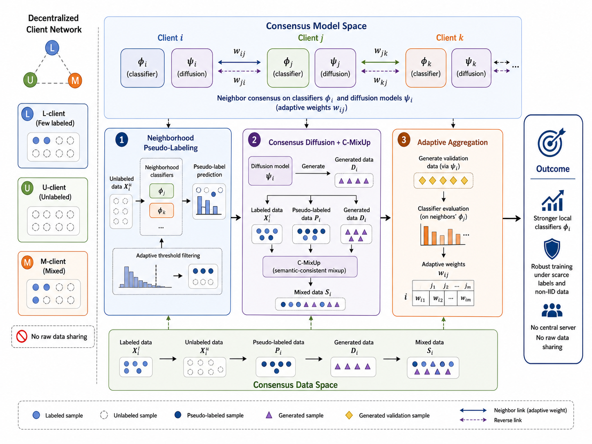
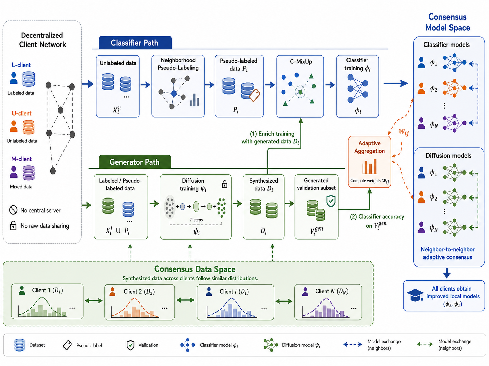
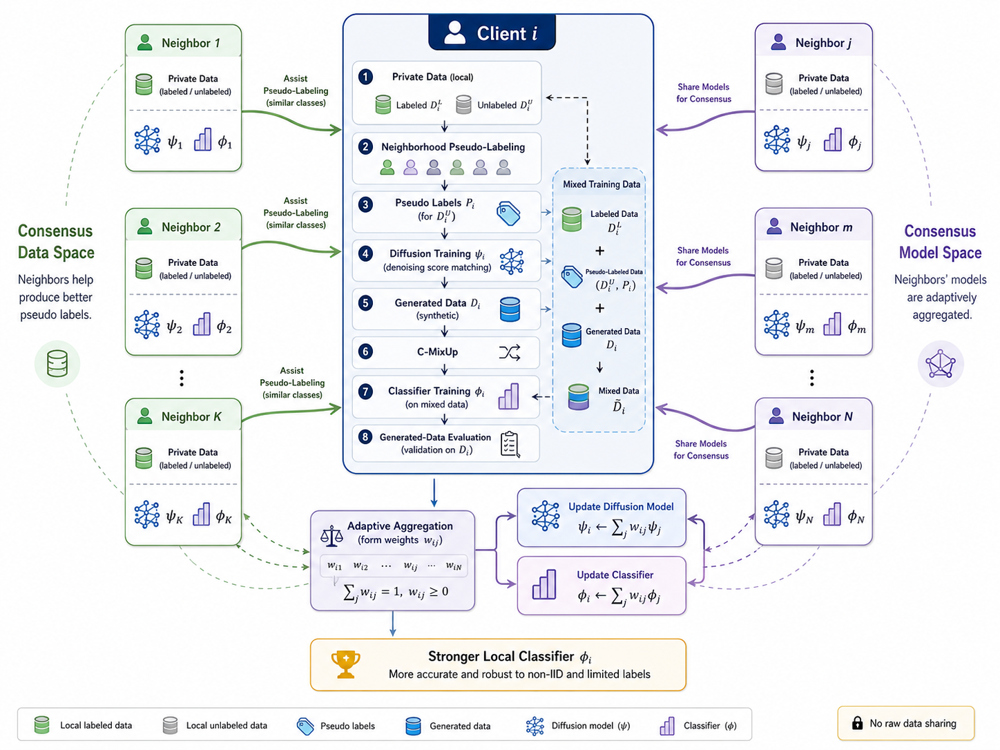
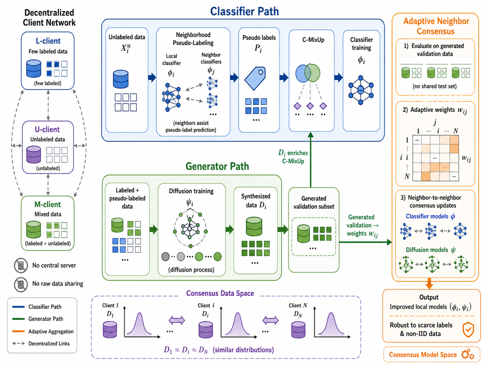

# 论文框架图制图 Skill

## 中文

`paper-framework-figure-studio-pro` 用于帮助研究者为论文生成 framework diagram、method diagram、pipeline diagram、architecture diagram 和 agent workflow 等框架图。它适合把论文 PDF、摘要、方法说明或草稿转化为可比较的制图方案、候选图、修改建议、caption 和图注说明。

### 推荐使用方式

优先在 ChatGPT 网页版中使用，并选择 **Extended thinking**。网页版更适合完成完整的论文理解、候选图生成和多轮修图流程。

如果接下来的步骤是生成图片，最好在 ChatGPT 网页版中手动选择 **Create image** 模式，再让它继续生成候选图或最终图。

在 Codex 里也可以尝试使用，但可能会遇到图像生成或上下文处理问题，而且会比较费 token。除非你明确需要在本地工程目录中整理文件、改 skill 或生成配套文档，否则不建议把主要制图流程放在 Codex 里完成。

### ChatGPT 网页版使用步骤

1. 把 `paper-framework-figure-studio-pro-v1.2.0-skill.zip` 放进 ChatGPT 的 Sources。
2. 把论文 PDF 也放进 Sources，例如 `semiDFL.pdf`。
3. 选择 Extended thinking。
4. 输入类似下面的 prompt：

```text
请严格按照 paper-framework-figure-studio-pro-v1.2.0-skill.zip 里 skill 的步骤，对 semiDFL.pdf 绘制 diagram。不要参考 semiDFL.pdf 里面已有的 diagram。
```

如果你的论文文件名不是 `semiDFL.pdf`，请把 prompt 里的文件名替换为实际上传到 Sources 的文件名。

当 skill 已经完成文字方案比较，并提示下一步要生成候选图或最终图时，建议手动切换到 **Create image** 模式后再继续。

### example_semiDFL 示例

`example_semiDFL` 文件夹保存了一次 SemiDFL 论文框架图制图示例：

- `semidfl-chatgpt-example.mhtml`：在 ChatGPT 网页版中使用该 skill 的示例记录。查看或复现实验前，需要先把论文 PDF 和 `paper-framework-figure-studio-pro-v1.2.0-skill.zip` 都放进 ChatGPT 的 Sources。
- `candidate-1.png`、`candidate-2.png`、`candidate-3.png`：三张候选图。
- `final-result.png`：最后选定并整理后的结果图。

#### Candidate 1



#### Candidate 2



#### Candidate 3



#### Final Result



### 制图流程

1. 提供论文 PDF、摘要、方法说明、目标章节或已有草稿。
2. 说明是否要避开论文中已有 diagram，以及是否提供参考图。
3. Skill 先判断这张图更适合 framework、architecture、pipeline、workflow 还是 mechanism diagram。
4. 先生成 4-6 个文字方案，通常是 6 个。
5. 选择或确认候选图方向；如果有参考图，可以说明每张图只参考布局、风格、信息密度、标签或配色中的哪些属性。
6. 生成多张候选图或示意图供比较。
7. 从候选图中选择最接近的一张，或指出需要修改的地方。
8. 根据选择继续生成正式版本或修订版本。
9. 最后整理 caption、legend 和正文中的图说明文字。

## English

`paper-framework-figure-studio-pro` helps researchers create framework diagrams, method diagrams, pipeline diagrams, architecture diagrams, and agent workflows for research papers. It turns a paper PDF, abstract, method description, or draft notes into comparable diagram directions, candidate figures, revision guidance, captions, and figure descriptions.

### Recommended Use

Prefer using this skill in the ChatGPT web app with **Extended thinking** enabled. The web app is better suited for the full workflow: paper understanding, candidate figure generation, and iterative figure revision.

If the next step is image generation, it is best to manually select **Create image** mode in the ChatGPT web app before asking it to generate candidate figures or the final figure.

You can also try it in Codex, but image generation and context handling may be less reliable, and it can consume many tokens. Unless you specifically need local file organization, skill editing, or repository documentation, the main figure-making workflow is better done in ChatGPT web.

### ChatGPT Web Usage

1. Add `paper-framework-figure-studio-pro-v1.2.0-skill.zip` to ChatGPT Sources.
2. Add the paper PDF to Sources as well, for example `semiDFL.pdf`.
3. Select Extended thinking.
4. Type a prompt like this:

```text
Please strictly follow the workflow in paper-framework-figure-studio-pro-v1.2.0-skill.zip to draw a diagram for semiDFL.pdf. Do not refer to any existing diagram inside semiDFL.pdf.
```

If your paper file is not named `semiDFL.pdf`, replace the file name in the prompt with the exact file name uploaded to Sources.

When the skill has finished comparing text directions and the next step is to generate candidate figures or a final figure, manually switch to **Create image** mode before continuing.

### example_semiDFL Example

The `example_semiDFL` folder contains one SemiDFL paper framework-diagram example:

- `semidfl-chatgpt-example.mhtml`: an example record of using this skill in ChatGPT web. To view or reproduce the example, first put both the paper PDF and `paper-framework-figure-studio-pro-v1.2.0-skill.zip` into ChatGPT Sources.
- `candidate-1.png`, `candidate-2.png`, `candidate-3.png`: three candidate figures.
- `final-result.png`: the selected and polished final result.

#### Candidate 1


#### Candidate 2


#### Candidate 3


#### Final Result


### Figure-Making Workflow

1. Provide the paper PDF, abstract, method description, target section, or draft notes.
2. Specify whether existing diagrams in the paper should be ignored and whether reference images are provided.
3. The skill diagnoses whether the figure should be a framework, architecture, pipeline, workflow, or mechanism diagram.
4. It first proposes 4-6 text directions, usually 6.
5. You confirm the candidate-image direction. If reference images are provided, specify which attributes to borrow from each image, such as layout, style, information density, labels, or color.
6. It generates multiple candidate figures or schematic candidates for comparison.
7. You select the closest candidate or describe what needs to change.
8. It then generates a formal version or revision based on the selected direction.
9. It can finally draft the caption, legend, and in-paper figure description.
