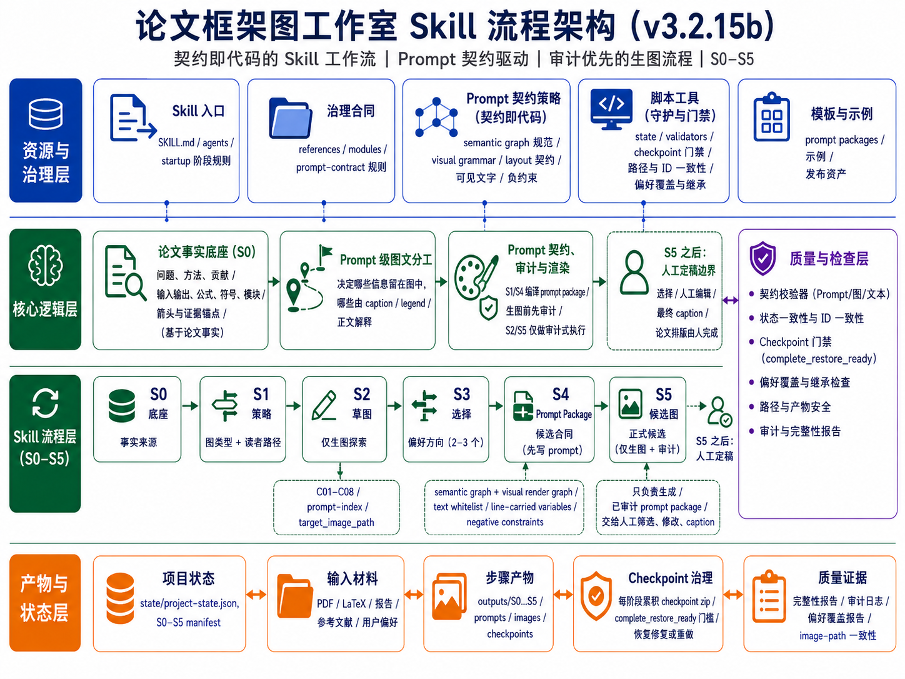
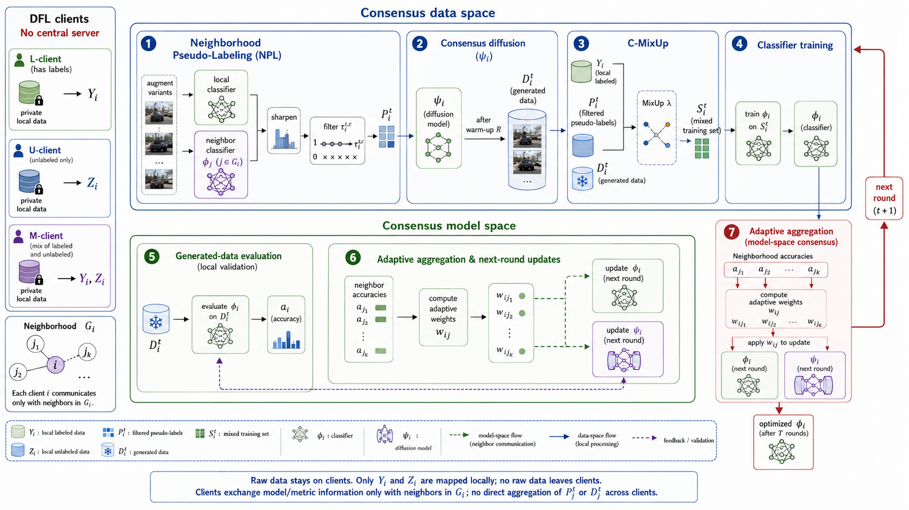
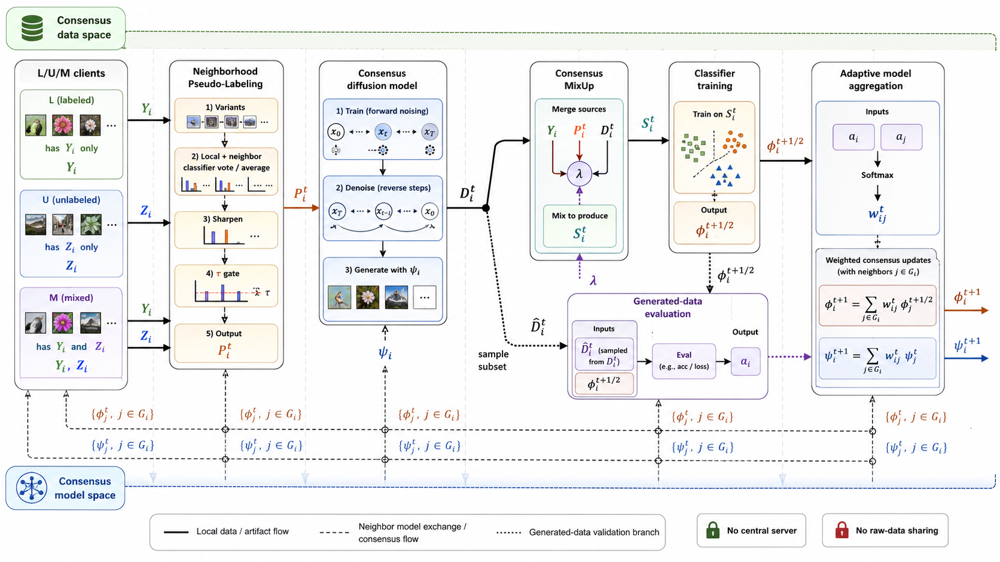
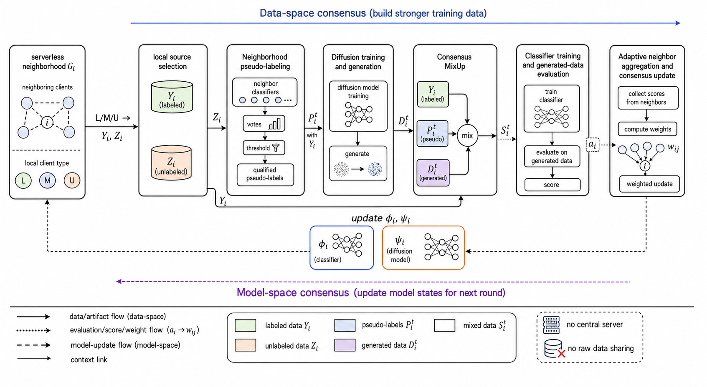
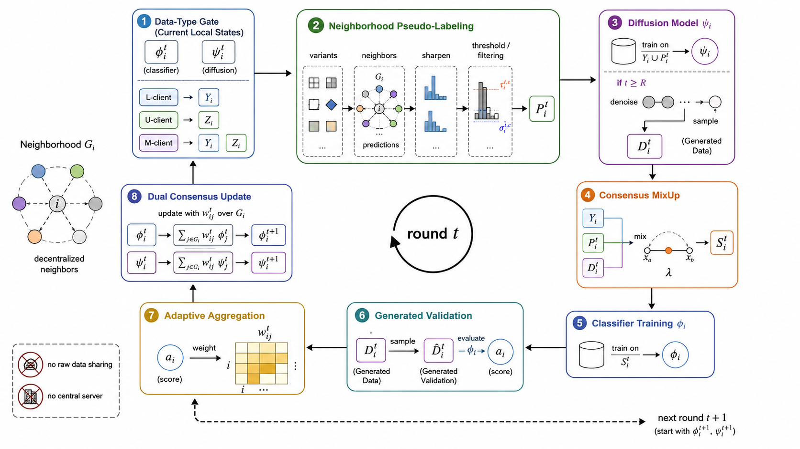
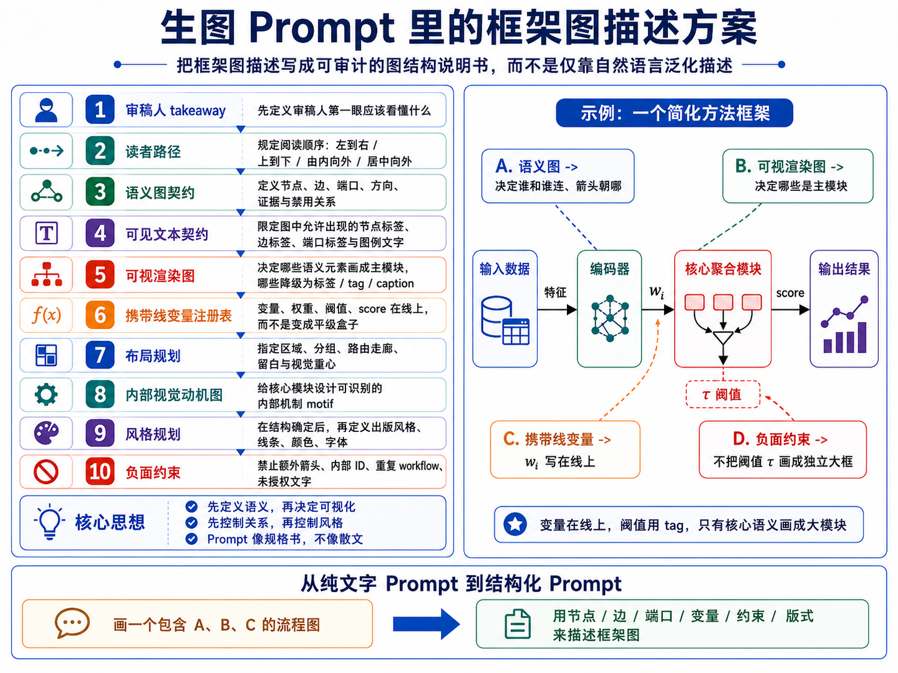
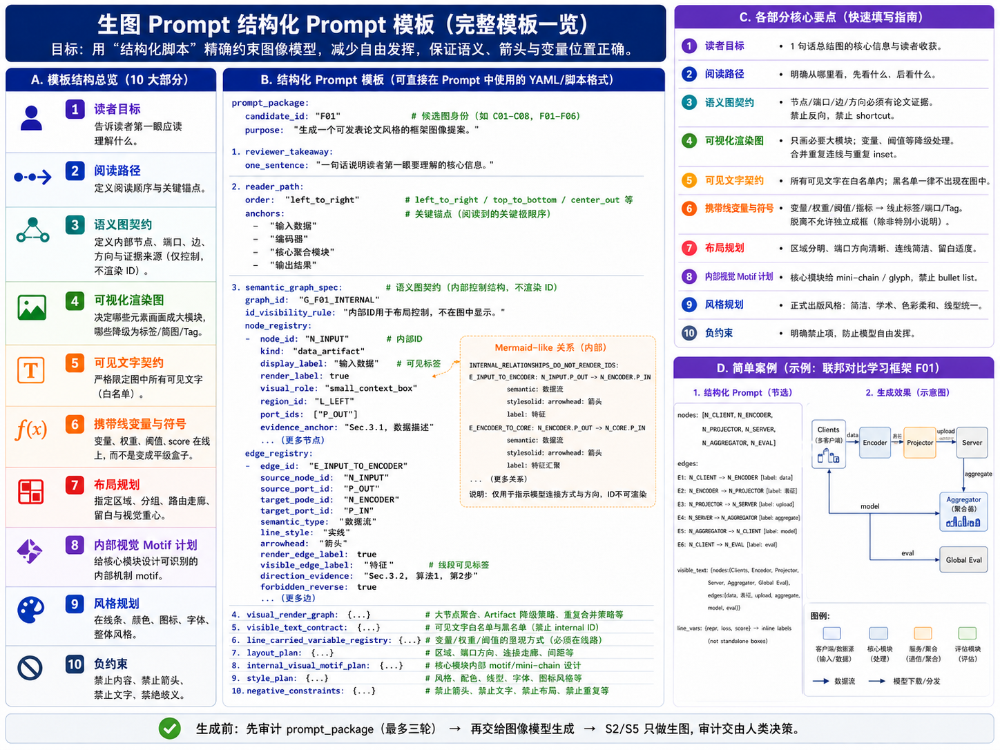
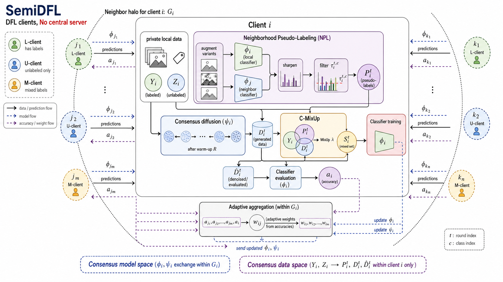
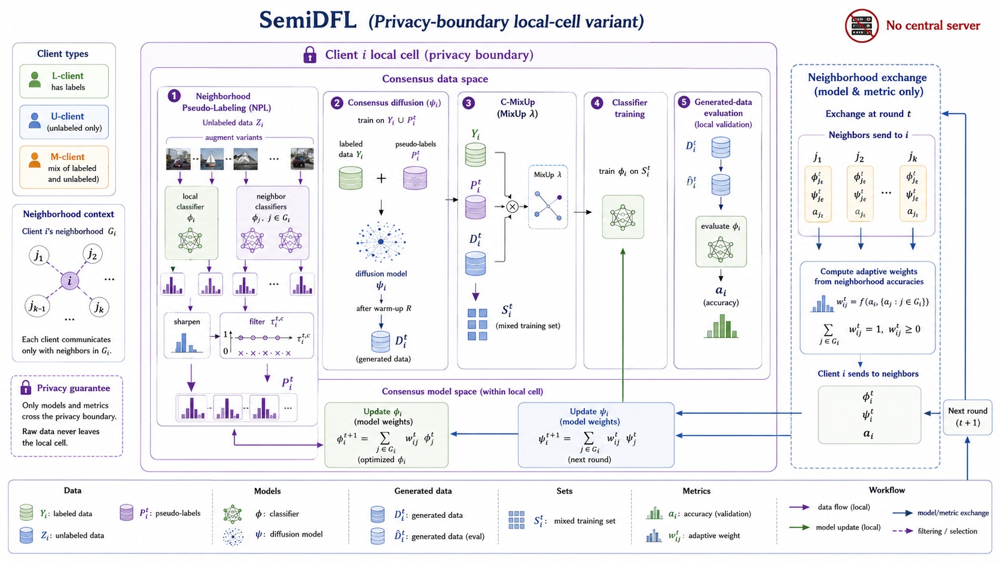
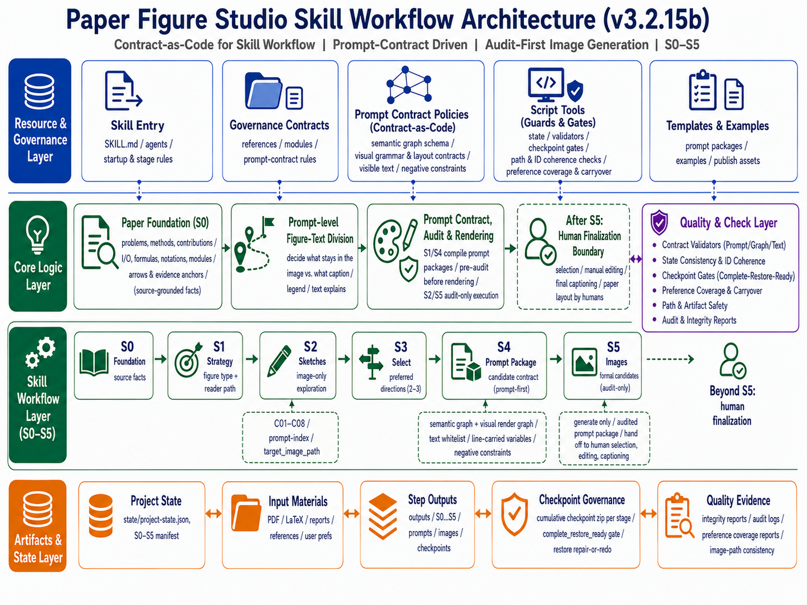

# 论文框架图制图 Skill

<a id="chinese"></a>

## 中文 | [English](#english)

`paper-framework-figure-studio-pro` 是面向计算机科学论文框架图的制图 skill。它的目标是为论文 method overview、architecture diagram、pipeline/process figure 和 agent workflow 提供多样化候选草案，方便作者后续筛选、对照、人工编辑和定稿。当前 `main` 分支保留 **v3.2.15c** 包和示例；本文档的流程说明主要沿用 **v3.2.15b**，因为 **v3.2.15c** 只是小修并修复了 Codex 安装后无法找到 skill 的问题。旧版本已归档到对应 Git tags。感谢 Bristol 的刘欣阳同学提供协助。

**本版的主题：“契约规范下的随机之美”。**

<p align="center">
  
</p>

**重要提示：1，v3.2.15b 使用介绍视频已归档在 `v3.2.15b` tag 中；2，非 Codex 用户、非计算机专业用户如果想改这个 skill，请直接看中文部分最后的指南。**

如果觉得 README 不够全，可以这样问 AI：`请帮我分析 zip 里的 skill，告诉我它提供功能、如何启动、如何使用、每步可以如何提问、有哪些用例，并列出提示词例子供我参考。`

之前在抖音发的预告图文里展示的结果来自 **v3.2.15**。该版本已归档在 Git tag `v3.2.15` 中，但相对 v3.2.15b 稍微不稳定；如觉得更倾向于该版本，请查看对应 tag。
新的版本 **v3.2.15c** 修正了 **v3.2.15b** skill安装后无法被codex查找到的问题。此外， **v3.2.15c** 新增了 ACM/IEEE/AAAI 双栏论文 line-art schematic 表面风格，可在在S1/S3结束时的建议提示词基础上，显式人工添加后自动注入到 S2/S5 prompt。添加例子为：“第一轮采用 <ACM/IEEE/AAAI 双栏论文 line-art schematic> 表面风格 ” 。 **v3.2.15c** 还规范了表面风格提醒的位置：风格选项放在非复制提示里。

| v3.2.15b 示例                                                                                                   | v3.2.15 示例                                                                                 |
| --------------------------------------------------------------------------------------------------------------- | -------------------------------------------------------------------------------------------- |
|  |  |

| v3.2.15c Codex 第二轮结果                                                                                                           | v3.2.15c ChatGPT 网页端第二轮结果<br><strong>使用 extra high</strong>                                                                 |
| ------------------------------------------------------------------------------------------------------------------------------------ | ------------------------------------------------------------------------------------------------------------------------------------- |
|  |  |

## 总结

- 当前 `main` 分支使用 **v3.2.15c**；流程说明主要沿用 **v3.2.15b**。相对 v3.1.6a，这一版的核心变化是把“图生成后再审”的质量控制前移到 S1/S4 的 prompt package：先审 semantic graph、visual render graph、visible text contract、line-carried variables 和 negative constraints，再让 S2/S5 执行生图。
- 建议在 ChatGPT 网页端使用，因为 Codex 下很消耗 token，而且 image gen 生图不稳定。在网页端会遇到生图卡住问题，一个思路是新开 session，然后根据最近的 checkpoint zip 文件断点继续。但是 checkpoint zip 文件内容可能不全，可以在之前中断的 session 下输入提示词补全 zip 文件，相关提示词见 [使用方式](#使用方式)。**其实，不管 zip 是不是全，都可以用这句，因为使用者哪里知道全不全。** 另外一种解决方案，是找到上一步输入的提示词，重新编辑执行一遍，例如如果 S5 生图卡住，则上翻到输入到 S4 步骤的提示词，重新点击下方的编辑，然后再提交一次。
- 当前 main 的 skill 包是 `paper-framework-figure-studio-pro-v3.2.15c-skill.zip`；v3.2.15b skill 包已归档在 Git tag `v3.2.15b` 中。
- 这一版采用 S0-S5 人机协作流程，把论文事实、节点/边/端口、变量位置、可见文字和图文分工先编译成可审计的生图 prompt，再进入生图阶段。
- “契约规范下的随机之美”。觉得效果不好怎么办？ChatGPT 网页端直接在输入 S4/S5 提示词的地方，重新编辑执行就行；底子（生图提示词）好，多试试总会有好的图。都走到这步了，来都来了，就多试几次呗，反正用网页端又不费 token。
- v3.2.15b 仍然保留两轮候选机制：第一轮 S2 做全局探索，默认生成 `C01-C08`；第二轮 S5 做正式候选，默认生成 `F01-F06`。这点和之前版本的“先发散、后收敛”逻辑一致。
- 经过再三思量，第一轮默认风格放弃手绘风，而采用正式出版风格；如果需要手绘风，可以在输入 S2 提示词时声明第一轮为手绘风。之所以这样做，是因为很多时候用户会在第一轮后就开始自己画，手绘风不适合看图画 PPT。
- v3.2.15b 的流程明确收束到 **S5**。S5 之后不再由 skill 自动做最终选择。
- v3.2.15b 仍然不把可编辑 SVG/PPT 作为默认交付目标。默认产物是提供给人工对照复刻的候选参考图；如果需要完全可编辑版本，仍需要后续人工重绘或单独处理。
- 在 `outputs` 的 S2 和 S5 下，每个候选图的子文件夹中都给出了生图 prompt；如果后续要自行生成 SVG 图，可以用来借鉴。
- 图文关系仍然重要，但重点改成 **prompt 级图文分工**：在 S1/S4 先决定哪些信息留在图里，哪些交给 caption、legend 或正文解释。
- checkpoint 治理更严格：每个阶段的 checkpoint 需要能从累计 roots、已有 assets 和登记 rasters 中重建为完整恢复包；如果无法恢复，就触发 repair-or-redo，而不是把残缺 checkpoint 当作可继续状态。
- 旧版本的完整包和完整示例已按版本归档在 Git tags 中，不再放在 main 分支目录下；README 为展示效果保留了 v3.2.15 / v3.2.15b 的本地图片镜像（`3.2.15_result/`、`3.2.15b_figure/`、`3.2.15b_result/`）。因为每个人的审美观不一样，可能有的用户更喜欢之前的版本。
- 不管在 ChatGPT 网页环境还是 Codex 环境下，整个流程通常都比较慢；如果一开始启动 skill 时模型试图一口气跑完，建议重启 session，并明确要求不要一次跑完整流程。
- 如果在 Codex 里执行，建议每个 public stage 结束后不要继续接着跑，而是重启一个 session，再粘贴类似这句默认提示词继续：`刚才中断了，请按照 paper-framework-figure-studio-pro skill 的要求，根据当前状态和已登记产物，继续执行下一步；不要重跑已经完成的步骤。`
- 如果希望风格更适合手动绘制 PPT，或者更符合期刊要求，请在 S5 步骤后输入风格转换提示词，参考 [使用方式](#使用方式) 里的提示词。
- 在输入 S1 步骤的提示词时，可以在默认的建议提示词基础上追加自己额外的要求，也可以放上自己倾向的一张或多张参考图，并改变默认第一轮推荐图的数量（最多 8 张）。生出候选图方案时会参考这些信息。

## 分段式流程

| Step                       | 类型                             | 作用                                                                    |
| -------------------------- | -------------------------------- | ----------------------------------------------------------------------- |
| Bootstrap / plan-only gate | TEXT_ONLY                        | 建立执行边界，避免一口气跑完整流程                                      |
| S0-PAPER-FOUNDATION        | TEXT_ONLY                        | 梳理论文中的算法、模块、术语、公式、箭头关系、证据锚点和风险项          |
| S1-FIGURE-STRATEGY         | TEXT_ONLY + PROMPT_PACKAGE_PREP  | 诊断图类型、读者路径和视觉策略，并准备/预审 S2 prompt packages          |
| S2-SKETCH-EXPLORE          | IMAGE_GENERATION_ONLY            | 按 S1 的 prompt-index 生成第一轮 C01-C08 候选图                         |
| S3-DIRECTION-SELECT        | TEXT_ONLY                        | 审阅 S2 候选，形成 issue ledger、方向选择、风格信号和用户偏好承接记录   |
| S4-CANDIDATE-BRIEF         | TEXT_ONLY + PROMPT_PACKAGE_PREP  | 生成正式候选矩阵、S5 prompt-index 和 prompt packages                    |
| S5-CANDIDATE-IMAGE         | IMAGE_GENERATION_ONLY / TERMINAL | 生成第二轮正式候选图；assistant workflow 到此结束，后续由人类筛选和定稿 |

## Prompt 契约与框架图描述

<p align="center">
  
</p>

v3.2.15b 把“画一张框架图”拆成可检查的结构说明：审稿人第一眼应理解什么、读者路径如何安排、哪些节点和边必须出现、哪些文字允许出现在图内、变量应该在线上还是在图例/caption 中解释，以及哪些内容必须禁止。这样 prompt 更像规格书，而不是普通散文描述。

## 修复与检查点设置

<p align="center">
  
</p>

S2/S5 是 image-generation-only public stages，不承担重新规划、排序或终审。真正的修复发生在 S1/S4 的 prompt package 阶段：如果 prompt 契约中存在 source、箭头、变量位置、文字白名单、重复流程或负约束问题，先修 prompt，再进入生图。

偏好驱动的第二轮覆盖也必须在 S4 分配阶段落实。如果用户在 S3 指定了 C01、C02 或 C08 这类第一轮候选偏好，S4/S5 需要把它们转化为 formal candidate 的 local-essence refinement，而不是静默丢弃。

## 结构化 Prompt 模板

<p align="center">
  
</p>

结构化 prompt 建议按候选身份、读者目标、语义图契约、可视化渲染规则、可见文字白名单、变量承载规则、布局、内部 motif、风格与负约束来组织。S2/S5 只负责执行这些已审计的 prompt，不在图像阶段补写结构逻辑。

## 当前目录说明

- v3.2.15c skill 包：`paper-framework-figure-studio-pro-v3.2.15c-skill.zip`
- v3.2.15c ACM/IEEE/AAAI line-art 示例结果：`example_semiDFL_v3.2.15c/`
- v3.2.15c 示例论文：`example_semiDFL_v3.2.15c/semiDFL.pdf`
- v3.2.15c ChatGPT 网页端 ACM/IEEE/AAAI line-art 聊天记录截图：`example_semiDFL_v3.2.15c/chatgpt_web_conversation_acm_ieee_aaai_line_art_v3.2.15c.png`
- v3.2.15c S1/S4 额外风格要求标注截图：`example_semiDFL_v3.2.15c/S1_prompt_annotated_acm_ieee_aaai_line_art_v3.2.15c.jpg` 和 `example_semiDFL_v3.2.15c/S4_prompt_annotated_acm_ieee_aaai_line_art_v3.2.15c.jpg`
- v3.2.15c ChatGPT 网页端第一轮 ACM/IEEE/AAAI line-art 候选：`example_semiDFL_v3.2.15c/R1_results_chatgpt_web_acm_ieee_aaai_line_art_v3.2.15c/`，`C01.png` 到 `C08.png`
- v3.2.15c Codex 第一轮 ACM/IEEE/AAAI line-art 候选：`example_semiDFL_v3.2.15c/R1_results_codex_acm_ieee_aaai_line_art_v3.2.15c/`，`C01.png` 到 `C08.png`
- v3.2.15c ChatGPT 网页端第二轮 ACM/IEEE/AAAI line-art 候选：`example_semiDFL_v3.2.15c/R2_results_chatgpt_web_acm_ieee_aaai_line_art_v3.2.15c/`，`F01.png` 到 `F06.png`
- v3.2.15c Codex 第二轮 ACM/IEEE/AAAI line-art 候选：`example_semiDFL_v3.2.15c/R2_results_codex_acm_ieee_aaai_line_art_v3.2.15c/`，`F01.png` 到 `F06.png`
- README 使用的 v3.2.15 展示结果图镜像：`3.2.15_result/`
- README 使用的 v3.2.15b 架构与 prompt 说明图镜像：`3.2.15b_figure/`
- README 使用的 v3.2.15b 展示结果图镜像：`3.2.15b_result/`

旧版本完整包和完整示例不在 `main` 当前目录中，请从对应 Git tag 查看：

| Tag | 内容 |
| --- | --- |
| `v2.5.0` | v2.5.0 包和示例 |
| `v3.0.9a` | v3.0.9 / v3.0.9a 包和示例 |
| `v3.1.4` | v3.1.4 包和示例 |
| `v3.1.4a` | v3.1.4a 包和示例 |
| `v3.1.6a` | v3.1.6 / v3.1.6a 包、示例和使用视频 |
| `v3.2.15` | v3.2.15 包和示例 |
| `v3.2.15b` | v3.2.15b 包、示例、架构图和使用视频 |

## 许可

本项目采用 **MIT-0 License** 发布，便于他人复用、修改和再分发 skill 文本、示例与模板。

## 使用方式

ChatGPT 网页版使用时，先把当前 main 中的 `paper-framework-figure-studio-pro-v3.2.15c-skill.zip` 和目标论文 PDF 放进项目 Sources；如需要，可使用 `example_semiDFL_v3.2.15c/semiDFL.pdf`。在需要图像生成的阶段，手动切换到 `Create image`。

Codex 使用时，把当前 main 中的 skill zip 和目标论文 PDF 放在当前工程目录中，或在 prompt 中写清楚相对路径。

如需 v3.2.15b 使用介绍视频，请查看 Git tag `v3.2.15b` 中的 `chatgpt-web-usage-v3.2.15b.mp4` 和 `codex-usage-v3.2.15b.mp4`。

ChatGPT 网页端启动提示词示例：

```text
请严格按照sources里paper-framework-figure-studio-pro-v3.2.15c-skill.zip 里 skill 的人机交互步骤，对sources里semiDFL.pdf 绘制 diagram。不要查看semiDFL.pdf 里面已有的diagram；这里的“不要查看”不是说不能自己构思出类似图，而是不要被原图先入为主，应根据论文实际内容决定生成或不生成类似结构。
```

Codex 启动提示词示例：

```text
请严格按照paper-framework-figure-studio-pro-v3.2.15c-skill.zip 里 skill 的人机交互步骤，对example_semiDFL_v3.2.15c/semiDFL.pdf 绘制 diagram。不要查看semiDFL.pdf 里面已有的diagram；这里的“不要查看”不是说不能自己构思出类似图，而是不要被原图先入为主，应根据论文实际内容决定生成或不生成类似结构。
```

中断后继续时，可以只要求下一步建议。ChatGPT 网页端示例：

```text
刚才中断了， 请使用 sources/paper-framework-figure-studio-pro-v3.2.15c-skill.zip 里的 skill 根据当前状态（见stage-S3.zip),只建议下一步提示词，不要自动执行下一步
```

Codex 示例：

```text
刚才中断了，请使用 paper-framework-figure-studio-pro v3.2.15b skill 根据当前状态，只建议下一步提示词，不要自动执行下一步。
```

ChatGPT 网页端补全 zip 文件提示词：

```text
我发现S*阶段的累加checkpoint zip文件里内容不全，不足以支撑新开session后基于zip文件内容断点继续，请完善里面内容，重新打包
```

保存 checkpoint 的 zip 文件可能有冗余，可以使用下面提示词清理：

```text
“下载 S3 累加 checkpoint / restore bundle“ 里面有冗余重复内容，不应该包含前面stage的checkpoint打包文件。 请删除后，再给我。
```

S5 后风格转换提示词示例：

```text
请按照下面要求，修改所有提示词先：ACM/IEEE/AAAI 双栏论文里手工绘制的 line-art schematic：白底、细线、少色、少图标、无渐变/阴影/大标题/设计原则面板/装饰性照片缩略图。
依据的科研绘图规则主要包括：IEEE 建议使用矢量或高分辨率原图，并用颜色之外的形状、线型、亮度等冗余编码表达含义；Nature 规格强调 Arial/Helvetica 等无衬线字体与小字号统一标注；PLOS 给出了 8 pt 字体和约 0.2 mm 线宽的实用基准；Wiley 将 flowcharts/diagrams 归入 line art，并偏好可出版处理的矢量/PDF 类图形。
```

产生完新的提示词后，再输入如下提示词：

```text
基于这些新 prompt 重新执行 S5-CANDIDATE-IMAGE。
```

## 实验结果

本节展示 **v3.2.15b** 结果，README 直接引用 `3.2.15b_result/` 中的本地图片镜像；完整示例仍归档在 Git tag `v3.2.15b` 中。示例论文为 `example_semiDFL_v3.2.15b/semiDFL.pdf`。第一轮是全局探索候选 `C01-C08`，第二轮是正式候选 `F01-F06`，均来自 ChatGPT 网页环境。

### 第一轮候选图（R1, v3.2.15b）

| C01 | C02 | C03 | C04 |
| --- | --- | --- | --- |
|  |  |  |  |
| C05 | C06 | C07 | C08 |
|  |  |  |  |

### 第二轮候选图（R2, v3.2.15b）

| F01 | F02 | F03 |
| --- | --- | --- |
|  |  |  |
| F04 | F05 | F06 |
|  |  |  |

## 非 Codex / 非计算机专业改 Skill 指南

如果你不是计算机专业，但使用的是 Codex，可以让 Codex 参考这个 skill 的本地知识，倒推出构建过程，然后迁移到你的领域：

```text
我是 ** 专业，但是这个 skill 是面向计算机专业的，因为它的内在知识来源于对计算机文献的阅读。现在请你参考 skill 里的本地知识，倒推出这个 skill 的建立过程，然后为我所在的 ** 领域构建类似的框架图 skill。我已经将相关文献 PDF 放在了 ** 文件夹里。
```

如果使用其他工具，例如 Trae 或 Claude Code，可以先说明当前环境的生图能力，让工具把 skill 调整到可用路线：

```text
目前这个 skill 需要调用 ChatGPT Images 2.0，或者通过 image gen 调用 Images 2.0。我现在的环境里没有配置这个能力，使用的是 ***。请根据我目前的环境修改 skill。如果能直接使用当前环境的生图 skill，就直接使用；否则，如果需要调用 API，请向我询问相关信息。
```

<a id="english"></a>

## English | [中文](#chinese)

`paper-framework-figure-studio-pro` is a skill for making computer-science paper framework diagrams. It provides diverse candidate drafts for method overviews, architecture diagrams, pipeline/process figures, and agent workflows so authors can screen, compare, manually edit, and finalize the figure later. The current `main` branch keeps the **v3.2.15c** package and examples; the workflow explanation mostly follows **v3.2.15b**, because **v3.2.15c** is a small fix release that also fixes the Codex skill-discovery issue after installation. Older versions are archived in their corresponding Git tags. Special thanks to Xinyang Liu from Bristol for the support.

**Theme of this version: "Random Beauty Under Contractual Constraints."**

<p align="center">
  
</p>

**Important: 1. The v3.2.15b usage walkthrough videos are archived in the `v3.2.15b` tag. 2. If you are not using Codex, or if you are outside computer science and want to adapt this skill, see the guide at the end of the English section.**

If this README does not feel complete enough, ask AI with: `Please analyze the skill inside the zip file and tell me what functions it provides, how to start it, how to use it, how I can ask questions at each step, what use cases it supports, and prompt examples I can reference.`

The preview image-post previously shared on Douyin used **v3.2.15** outputs. That version is archived in the Git tag `v3.2.15`, but it is slightly less stable than v3.2.15b. If you prefer that version, use the corresponding tag.
The new **v3.2.15c** version fixes an issue where the **v3.2.15b** skill could not be found by Codex after installation. It also adds an ACM/IEEE/AAAI double-column-paper line-art schematic surface style. Based on the suggested prompt after S1/S3, users can explicitly add this style and it will be automatically injected into the S2/S5 prompt. Example addition: "Use <ACM/IEEE/AAAI double-column paper line-art schematic> surface style for the first round." **v3.2.15c** also standardizes where surface-style reminders appear: style options are placed in the non-copy prompt.

| v3.2.15b example                                                                                                | v3.2.15 example                                                                              |
| --------------------------------------------------------------------------------------------------------------- | -------------------------------------------------------------------------------------------- |
|  |  |

| v3.2.15c Codex second-round result                                                                                         | v3.2.15c ChatGPT web second-round result<br><strong>extra high used</strong>                                                                    |
| --------------------------------------------------------------------------------------------------------------------------- | ------------------------------------------------------------------------------------------------------------------------------------------------ |
|  |  |

## Summary

- The current `main` branch uses **v3.2.15c**; the workflow explanation mostly follows **v3.2.15b**. Compared with v3.1.6a, the key change is that quality control is moved from "audit after image generation" into the S1/S4 prompt package: semantic graph, visual render graph, visible text contract, line-carried variables, and negative constraints are audited before S2/S5 generate images.
- ChatGPT Web is recommended because Codex consumes a lot of tokens and image generation is unstable there. In ChatGPT Web, image generation may sometimes get stuck. One workaround is to open a new session and resume from the latest checkpoint zip file. However, the checkpoint zip may be incomplete. In the interrupted session, use the prompt in [Usage](#usage) to complete the zip file. **In practice, you can use this prompt whether or not the zip is complete, because users cannot know whether it is complete.** Another solution is to find the previous prompt, edit it, and run it again. For example, if image generation gets stuck at S5, scroll back to the prompt that started S4, click the edit button below it, and submit it again.
- The current main skill package is `paper-framework-figure-studio-pro-v3.2.15c-skill.zip`; the v3.2.15b skill package is archived in the Git tag `v3.2.15b`.
- This version uses an S0-S5 human-in-the-loop workflow. Paper facts, nodes/edges/ports, variable placement, visible text, and figure-text division are first compiled into auditable image-generation prompts before the workflow enters the image generation stage.
- "Random Beauty Under Contractual Constraints." If the result does not look good, directly edit and rerun the S4/S5 prompt in ChatGPT Web. When the base image prompt is solid, trying a few more times usually produces a good figure. At that point, it is worth trying several times, and the web version does not consume Codex tokens.
- v3.2.15b still keeps the two-round candidate mechanism: S2 performs global exploration and defaults to `C01-C08`; S5 produces formal candidates and defaults to `F01-F06`. This keeps the earlier "diverge first, converge later" logic.
- After repeated consideration, the default first-round style no longer uses a hand-drawn look; it uses a formal publication style instead. If a hand-drawn first round is needed, state that explicitly when entering the S2 prompt. The reason is that users often start redrawing the figure after the first round, and a hand-drawn style is not suitable when using the generated image as a reference for making PPT figures.
- The v3.2.15b workflow explicitly ends at **S5**. After S5, the skill no longer makes the final selection automatically.
- v3.2.15b still does not use editable SVG/PPT as the default delivery target. The default outputs are candidate reference images for manual comparison and reconstruction. Fully editable versions still require later manual redrawing or a separate process.
- Under S2 and S5 in `outputs`, each candidate figure subfolder includes its image-generation prompt. If you later want to generate SVG figures yourself, those prompts can be used as references.
- Figure-text coordination remains important, but the emphasis is now **prompt-level figure-text division**: S1/S4 decide which information stays in the figure and which information should be explained by the caption, legend, or manuscript text.
- Checkpoint governance is stricter: each stage checkpoint should be rebuildable from cumulative roots, existing assets, and registered rasters into a complete restore bundle. If it cannot be restored, repair-or-redo is triggered instead of treating the incomplete checkpoint as usable.
- Full older-version packages and complete examples are archived as Git tags and are no longer kept in the `main` branch directory; this README keeps local image mirrors for v3.2.15 / v3.2.15b display only (`3.2.15_result/`, `3.2.15b_figure/`, `3.2.15b_result/`). Because aesthetic preference differs from person to person, some users may prefer earlier versions.
- The workflow is usually slow in both ChatGPT web and Codex. If the model tries to run the whole skill in one pass at startup, restart the session and explicitly tell it not to run the full workflow at once.
- In Codex, it is better not to continue immediately after each public stage. Restart a session, then paste a continuation prompt such as: `The previous run was interrupted. Please continue with the next step according to the paper-framework-figure-studio-pro skill, based on the current state and registered artifacts. Do not rerun completed steps.`
- If you want a style that is easier to redraw manually in PPT or better aligned with journal requirements, enter a style-conversion prompt after S5. See the prompt in [Usage](#usage).
- When entering the S1 prompt, you can append extra requirements to the default suggested prompt, add one or more preferred reference figures, and change the default number of first-round recommended figures (up to 8). Candidate directions will take that information into account.

## Staged Workflow

| Step                       | Type                             | Purpose                                                                                                             |
| -------------------------- | -------------------------------- | ------------------------------------------------------------------------------------------------------------------- |
| Bootstrap / plan-only gate | TEXT_ONLY                        | Establish execution boundaries and prevent the full workflow from running in one pass                               |
| S0-PAPER-FOUNDATION        | TEXT_ONLY                        | Extract algorithms, modules, terminology, formulas, arrow relationships, evidence anchors, and risks                |
| S1-FIGURE-STRATEGY         | TEXT_ONLY + PROMPT_PACKAGE_PREP  | Diagnose figure type, reader path, and visual strategy; prepare and pre-audit S2 prompt packages                    |
| S2-SKETCH-EXPLORE          | IMAGE_GENERATION_ONLY            | Generate first-round C01-C08 candidates from the S1 prompt index                                                    |
| S3-DIRECTION-SELECT        | TEXT_ONLY                        | Review S2 candidates, build an issue ledger, choose directions, and record style signals plus user preferences      |
| S4-CANDIDATE-BRIEF         | TEXT_ONLY + PROMPT_PACKAGE_PREP  | Produce the formal candidate matrix, S5 prompt index, and prompt packages                                           |
| S5-CANDIDATE-IMAGE         | IMAGE_GENERATION_ONLY / TERMINAL | Generate second-round formal candidates; the assistant workflow ends here, and humans screen and finalize afterward |

## Prompt Contracts and Figure Description

<p align="center">
  
</p>

v3.2.15b turns "draw a framework figure" into a checkable structural specification: what reviewers should understand at a glance, how the reader path should flow, which nodes and edges must appear, which visible text is allowed, whether variables should sit on lines or be explained in the caption, and which content must be prohibited. The prompt behaves more like a specification than a prose request.

## Repair and Checkpoint Gate

<p align="center">
  
</p>

S2/S5 are image-generation-only public stages. They do not re-plan, rank, or terminally audit candidates. Repair happens during S1/S4 prompt-package preparation: if a prompt contract has source, arrow, variable-placement, visible-text, duplicate-workflow, or negative-constraint problems, the prompt is repaired before generation.

Preference-led second-round coverage must also be handled during S4 allocation. If users name preferred first-round candidates such as C01, C02, or C08 in S3, S4/S5 should translate them into formal candidates through local-essence refinement rather than silently dropping them.

## Structured Prompt Template

<p align="center">
  
</p>

The recommended prompt structure covers candidate identity, reader goal, semantic graph contract, visual rendering rules, visible text allowlist, variable-carrying rules, layout, internal motifs, style, and negative constraints. S2/S5 execute these audited prompts instead of adding new structural logic in the image stage.

## Current Directory Map

- v3.2.15c skill package: `paper-framework-figure-studio-pro-v3.2.15c-skill.zip`
- v3.2.15c ACM/IEEE/AAAI line-art example results: `example_semiDFL_v3.2.15c/`
- v3.2.15c example paper: `example_semiDFL_v3.2.15c/semiDFL.pdf`
- v3.2.15c ChatGPT web ACM/IEEE/AAAI line-art conversation screenshot: `example_semiDFL_v3.2.15c/chatgpt_web_conversation_acm_ieee_aaai_line_art_v3.2.15c.png`
- v3.2.15c annotated S1/S4 screenshots showing the extra style requirement: `example_semiDFL_v3.2.15c/S1_prompt_annotated_acm_ieee_aaai_line_art_v3.2.15c.jpg` and `example_semiDFL_v3.2.15c/S4_prompt_annotated_acm_ieee_aaai_line_art_v3.2.15c.jpg`
- v3.2.15c ChatGPT web first-round ACM/IEEE/AAAI line-art candidates: `example_semiDFL_v3.2.15c/R1_results_chatgpt_web_acm_ieee_aaai_line_art_v3.2.15c/`, `C01.png` to `C08.png`
- v3.2.15c Codex first-round ACM/IEEE/AAAI line-art candidates: `example_semiDFL_v3.2.15c/R1_results_codex_acm_ieee_aaai_line_art_v3.2.15c/`, `C01.png` to `C08.png`
- v3.2.15c ChatGPT web second-round ACM/IEEE/AAAI line-art candidates: `example_semiDFL_v3.2.15c/R2_results_chatgpt_web_acm_ieee_aaai_line_art_v3.2.15c/`, `F01.png` to `F06.png`
- v3.2.15c Codex second-round ACM/IEEE/AAAI line-art candidates: `example_semiDFL_v3.2.15c/R2_results_codex_acm_ieee_aaai_line_art_v3.2.15c/`, `F01.png` to `F06.png`
- README display mirror for v3.2.15 results: `3.2.15_result/`
- README display mirror for v3.2.15b architecture and prompt figures: `3.2.15b_figure/`
- README display mirror for v3.2.15b results: `3.2.15b_result/`

Full older-version packages and complete examples are not in the current `main` directory. Use the corresponding Git tag:

| Tag | Contents |
| --- | --- |
| `v2.5.0` | v2.5.0 package and example |
| `v3.0.9a` | v3.0.9 / v3.0.9a packages and examples |
| `v3.1.4` | v3.1.4 package and example |
| `v3.1.4a` | v3.1.4a package and example |
| `v3.1.6a` | v3.1.6 / v3.1.6a packages, examples, and walkthrough videos |
| `v3.2.15` | v3.2.15 package and example |
| `v3.2.15b` | v3.2.15b package, examples, architecture figures, and walkthrough videos |

## License

This project is released under the **MIT-0 License**, so the skill text, examples, and templates can be reused, modified, and redistributed.

## Usage

In ChatGPT Web, add the current main `paper-framework-figure-studio-pro-v3.2.15c-skill.zip` and the target paper PDF to the project Sources. If needed, use `example_semiDFL_v3.2.15c/semiDFL.pdf`. When the workflow reaches an image-generation stage, manually switch to `Create image`.

In Codex, put the current main skill zip and target paper PDF in the current project directory, or specify the relative PDF path in the prompt.

For the v3.2.15b walkthrough videos, use `chatgpt-web-usage-v3.2.15b.mp4` and `codex-usage-v3.2.15b.mp4` from the Git tag `v3.2.15b`.

ChatGPT Web startup prompt example:

```text
Please strictly follow the human-in-the-loop workflow steps in the skill inside sources/paper-framework-figure-studio-pro-v3.2.15c-skill.zip to draw a diagram for sources/semiDFL.pdf. Do not look at the existing diagram inside semiDFL.pdf. Here, "do not look" does not mean you cannot independently design a similar figure; it means you should not be anchored by the original figure, and should decide from the actual paper content whether to generate a similar structure or not.
```

Codex startup prompt example:

```text
Please strictly follow the human-in-the-loop workflow steps in paper-framework-figure-studio-pro-v3.2.15c-skill.zip to draw a diagram for example_semiDFL_v3.2.15c/semiDFL.pdf. Do not look at the existing diagram inside semiDFL.pdf. Here, "do not look" does not mean you cannot independently design a similar figure; it means you should not be anchored by the original figure, and should decide from the actual paper content whether to generate a similar structure or not.
```

When continuing after an interruption, ask only for the next suggested prompt. ChatGPT Web example:

```text
The previous run was interrupted. Please use the skill in sources/paper-framework-figure-studio-pro-v3.2.15c-skill.zip and the current state (see stage-S3.zip) to suggest only the next prompt. Do not automatically execute the next step.
```

Codex example:

```text
The previous run was interrupted. Please use the paper-framework-figure-studio-pro v3.2.15b skill and the current state to suggest only the next prompt. Do not automatically execute the next step.
```

ChatGPT Web prompt for completing a checkpoint zip file:

```text
I found that the cumulative checkpoint zip file for stage S* is incomplete and is not sufficient to support resuming from the zip file in a new session. Please complete its contents and repackage it.
```

The checkpoint zip may contain redundant files. Use the following prompt to clean it:

```text
The "download S3 cumulative checkpoint / restore bundle" contains redundant repeated content. It should not include checkpoint zip files from previous stages. Please remove them and give it to me again.
```

Post-S5 style-conversion prompt example:

```text
Please first revise all prompts according to the following requirements: a hand-drawn-in-PPT-style line-art schematic suitable for ACM/IEEE/AAAI double-column papers: white background, thin lines, limited colors, few icons, no gradients/shadows/large titles/design-principle panels/decorative photo thumbnails.
The research-figure rules behind this include: IEEE recommends vector or high-resolution source artwork and redundant encodings beyond color, such as shape, line style, and brightness; Nature specifications emphasize Arial/Helvetica-style sans-serif fonts and consistent small-size labels; PLOS provides practical baselines such as 8 pt fonts and about 0.2 mm line width; Wiley classifies flowcharts/diagrams as line art and prefers publication-ready vector/PDF-style graphics.
```

After the new prompts are produced, enter the following prompt:

```text
Re-run S5-CANDIDATE-IMAGE based on these new prompts.
```

## Experimental Results

This section shows the **v3.2.15b** outputs and directly references local image mirrors in `3.2.15b_result/`; the complete example remains archived in the Git tag `v3.2.15b`. The example paper is `example_semiDFL_v3.2.15b/semiDFL.pdf`. Round 1 contains global-exploration candidates `C01-C08`; Round 2 contains formal candidates `F01-F06`; both were produced in the ChatGPT web environment.

### Round 1 Candidates (R1, v3.2.15b)

| C01 | C02 | C03 | C04 |
| --- | --- | --- | --- |
|  |  |  |  |
| C05 | C06 | C07 | C08 |
|  |  |  |  |

### Round 2 Candidates (R2, v3.2.15b)

| F01 | F02 | F03 |
| --- | --- | --- |
|  |  |  |
| F04 | F05 | F06 |
|  |  |  |

## Adapting This Skill Outside Codex or Computer Science

If you are outside computer science but use Codex, ask Codex to infer the construction process from the local knowledge in this skill and migrate it to your field:

```text
I am in **, but this skill is designed for computer science, because its internal knowledge comes from reading computer-science papers. Please use the local knowledge inside this skill as a reference, infer the process used to build it, and then build a similar framework-diagram skill for my ** field. I have put the relevant paper PDFs in the ** folder.
```

If you are using another tool such as Trae or Claude Code, first describe your current image-generation capability and ask the tool to adapt the skill to that route:

```text
This skill currently needs to call ChatGPT Images 2.0, or to call Images 2.0 through image gen. My current environment does not have that configured; I am using *** instead. Please modify the skill according to my current environment. If the current environment has an image-generation skill that can be used directly, use it directly. Otherwise, if an API call is needed, ask me for the required information.
```
