# 论文框架图制图 Skill

<a id="chinese"></a>

## 中文 | [English](#english)

`paper-framework-figure-studio-pro` 是面向计算机科学论文框架图的制图 skill。它的目标是为绘制框架图提供多样性的参考草案，方便后续人工对照制图；适合 method overview、architecture diagram、pipeline/process figure 和 agent workflow。感谢 bristol 的刘欣阳同学提供的协助。

**重要提示：非 Codex 用户、非计算机专业用户如果想改这个 skill，请直接看中文部分最后的指南。**

| ChatGPT 网页版最终图 | Codex 最终图 |
|---|---|
|  | 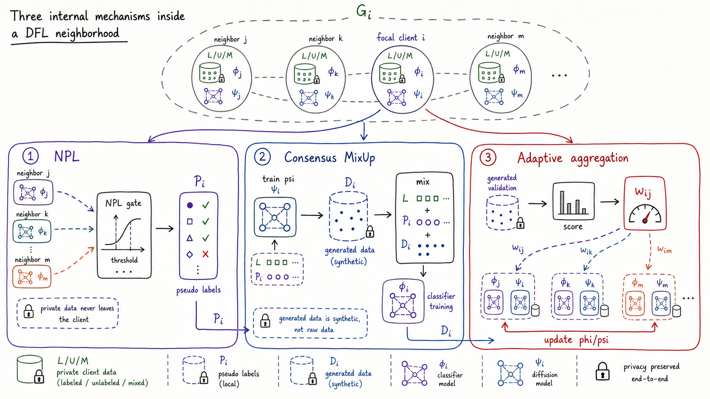 |

## 总结

- 当前介绍的版本包是 `paper-framework-figure-studio-pro-v3.1.4a-skill.zip`。旧版本放在 `old_versions/` 文件夹中，可能有时候旧版本更合适。本版本建议在 ChatGPT 网页环境下使用，开启 extended thinking 模式；如果下一步要生图，强烈建议手动点击 `Create image`。
- 第二轮结果更偏向后续手动 PPT 作图，因此视觉美感不如第一轮手绘草图。S3 步骤结束时的提示词里会提醒后续采用哪种风格，默认是 clean publication schematic style，而不是手绘草图风格；这时候需要把提示词修改为手绘草图风格。
- v3.1.4a 的默认主线收敛为 `S0` 到 `S7`：从论文事实底座、图策略、草图探索、方向选择、候选 brief、候选图、最终图与说明配套输出，到第 7 阶段的最终图文联合审查；这一版不考虑提供可编辑的 SVG 图。
- 这一版新增“图文说明协同”：生成候选图时同步考虑 title、caption、legend 和正文引用，让说明文字承接符号解释和必要背景，从而减少图中不必要的文字、符号和重复标注。
- 在第一轮选择时，提供一个“有故事性的轻量手绘”作为可选风格透镜，用在确实有助于讲清机制或读者路径的场景。
- 风格分类进一步关注图类型、布局语法、读者路径、信息密度、图文分工和后续 SVG/PPT 近似重绘可行性。
- 这个项目的核心目标仍然不是给出唯一答案，而是提供多样性的结构和视觉参考草案，帮助用户做比较、筛选和后续人工制图。
- 不管在 ChatGPT 网页环境还是 Codex 环境下，整个流程通常都比较慢；其中 Codex 在一些工程化场景下可能效果更好，但往往也更费 token。

## 架构介绍

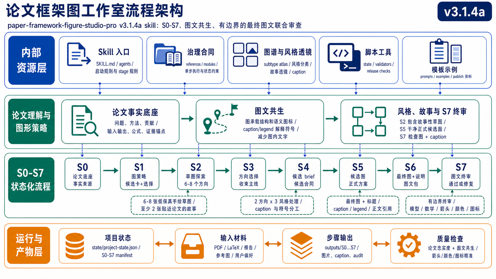

从流程设计来看，v3.1.4a 不是简单的一串 prompt，而是一个带状态、带治理、可恢复的分层执行系统。整体可以理解为四类工作：最前面的论文事实底座，中间的探索、候选与最终选择，第 7 阶段的最终图文联合审查，以及贯穿全流程的状态产物与质量检查。

- **论文事实底座层**：`S0-PAPER-FOUNDATION` 负责把论文中的算法、模块、公式、术语、箭头关系和证据锚点先抽取出来，作为后续所有步骤共享的事实基线。
- **探索与选择层**：`S1` 到 `S6` 负责图类型诊断、草图探索、方向筛选、候选细化和最终选择。这一层强调先发散后收敛，先给出可比较的参考草案，再逐步收束到更贴近论文的结果。
- **图文说明协同层**：在 `S4` 到 `S7` 中同步考虑 title、caption、legend 和正文引用，让图像本身保留必要结构，让说明文字承担符号解释、背景补充和读者引导。
- **S7 最终图文联合审查层**：`S7-FINAL-JOINT-AUDIT` 是终态质量门。它把最终选中的图、caption、legend 和正文引用句作为一个整体检查，确认模型、算法、流程、数学、箭头、颜色、图标和图文分工不违背论文思想；只有通过后才算流程完成，否则回退到文本修复、图像修复或方向修复。
- **状态治理与检查层**：围绕整个流程，系统会维护步骤状态、产物边界和恢复点，使流程更容易回滚、重跑和检查。

内置参考图谱主要服务于探索与选择层：它在 `S1-FIGURE-STRATEGY` 和 `S2-SKETCH-EXPLORE` 之前提供图类型、布局语法、读者细节密度和视觉风格坐标，避免后续候选图只靠文字说明发散。

v3.1.4a 的默认主线如下：

```text
S0-PAPER-FOUNDATION -> S1-FIGURE-STRATEGY -> S2-SKETCH-EXPLORE -> S3-DIRECTION-SELECT -> S4-CANDIDATE-BRIEF -> S5-CANDIDATE-IMAGE -> S6-FINAL-SELECT -> S7-FINAL-JOINT-AUDIT
```

## 内置参考图谱

v3.1.4a 继续把 F1-F4 作为设计参考图谱，并在此基础上更强调风格透镜、读者路径和图文分工。把这些图列入设计思想，是为了在进入目标论文候选图之前，先建立可见的视觉决策坐标，让候选图比较不只依赖文字描述，而是在可对照的参考体系中发散和收敛。

## 分段式流程

- **全局探索过程**：`S1-FIGURE-STRATEGY -> S2-SKETCH-EXPLORE -> S3-DIRECTION-SELECT`
- **局部细化与最终选择**：`S4-CANDIDATE-BRIEF -> S5-CANDIDATE-IMAGE -> S6-FINAL-SELECT`
- **第 7 阶段最终图文联合审查**：`S7-FINAL-JOINT-AUDIT` 对最终图、caption、legend 和正文引用句一起审查，确认语义、箭头、颜色、图标、数学和流程关系准确后才结束。
- **图文说明协同**：贯穿 `S4` 到 `S7`，用 caption/legend 承接解释，减少图内不必要的文字和符号。

## 步骤列表

| Step | 类型 | 作用 |
|---|---|---|
| S0-PAPER-FOUNDATION | TEXT_ONLY | 论文精读底座，梳理论文中的算法、模块、术语、公式和箭头关系 |
| S1-FIGURE-STRATEGY | TEXT_ONLY | 诊断图类型、叙事角色和读者效果 |
| S2-SKETCH-EXPLORE | IMAGE_ONLY_PLUS_PROMPT | 全局探索草图 |
| S3-DIRECTION-SELECT | TEXT_ONLY | 从全局探索中筛出进入局部细化的方向 |
| S4-CANDIDATE-BRIEF | TEXT_ONLY | 局部细化准备，生成正式候选矩阵和 prompts |
| S5-CANDIDATE-IMAGE | IMAGE_ONLY_PLUS_PROMPT | 局部细化正式候选图 |
| S6-FINAL-SELECT | TEXT_ONLY | 从候选中选出最终架构图，并配套 title、caption、legend 和正文引用建议 |
| S7-FINAL-JOINT-AUDIT | TEXT_ONLY | 第 7 阶段终审：把最终图与 caption、legend、正文引用句共同检查，确认论文忠实度、模型/算法/流程/数学、箭头、颜色、图标和图文分工都准确；通过后流程才完成，否则给出回退修复目标 |

## 限制与已知问题

- 不管在哪种环境下，整体流程都不会特别快，尤其是需要多轮候选图生成和人工筛选时。
- 效果并不稳定，仍需要人工干涉和评审；不同论文、不同环境和不同轮次下的输出质量波动较大，仍然需要人工判断、人工筛选和人工修正，当前示例里也保留了不少反面例子。
- Codex 环境下在一些完整工程场景里可能效果更好，但通常会更费 token。
- v3.1.4a 暂不把 SVG/PPT 复刻作为默认交付目标；如果需要完全可编辑版本，仍需要后续人工重绘或单独处理。
- 图文说明协同可以减少图内文字，但仍需要用户检查 caption、legend 和正文引用是否准确覆盖关键符号与机制。

## ChatGPT 网页版使用

1. 先把 `paper-framework-figure-studio-pro-v3.1.4a-skill.zip` 放进项目的 Sources。
2. 再把目标论文 PDF 放进 Sources；如果要复现实验结果，可使用 `semiDFL.pdf`。
3. 打开 **Extended thinking**。
4. 在需要图像阶段时，切换到 **Create image**。

启动示例：

```text
请严格按照paper-framework-figure-studio-pro-v3.1.4a-skill.zip里skill的人机交互步骤，对semiDFL.pdf绘制diagram。不要查看semiDFL.pdf里面的diagram，注意这里说的不要查看并不是说不能自己也构思出类似的，而是说不要将其先入为主，而是根据实际情况决定生成或不生成类似的
```

## Codex 使用

1. 把 `paper-framework-figure-studio-pro-v3.1.4a-skill.zip` 放在当前工程目录中。
2. 把目标论文 PDF 也放在工程目录中，或者在 prompt 里写清楚相对路径。
3. Codex 环境建议使用 GPT-5.5（高/快速）。
4. 如果 token 额度有限，优先用 ChatGPT 网页环境。

启动示例：

```text
请严格按照 paper-framework-figure-studio-pro-v3.1.4a-skill.zip 里skill的人机交互步骤， 对 semiDFL.pdf 绘制diagram。不要查看semiDFL.pdf里面的diagram，注意这里说的不要查看并不是说不能自己也构思出类似的，而是说不要将其先入为主，而是根据实际情况决定生成或不生成类似的
```

## 实验结果

本节实验在 ChatGPT 网页版和 Codex 下执行。Codex 环境采用 GPT-5.5（高/快速）；如果使用其他模型、不同推理强度或不同运行环境，生成质量和流程表现可能不一致。

在 ChatGPT 网页版中，如果下一步需要生成图像，建议先在输入框位置手动点击 `Create image` 标签，再继续执行。

开头两张对照图分别是 `example_semiDFL_v3.1.4a/final_Image_chatgpt_web_v3.1.4a.png` 和 `example_semiDFL_v3.1.4a/final_Image_codex_v3.1.4a.png`，对应本仓库随附的 semiDFL 示例流程在 ChatGPT 网页版和 Codex 下的最终选定框架图。`example_semiDFL_v3.1.4a/semiDFL.pdf` 是这个例子使用的论文；同目录保留了两种环境下的全局筛选草图、局部筛选设计稿、最终图、ChatGPT 网页环境交互记录和 Codex 运行录像，方便完整对照流程。

- 示例结果目录：`example_semiDFL_v3.1.4a/`
- 示例论文：`example_semiDFL_v3.1.4a/semiDFL.pdf`
- 第一轮全局筛选草图（ChatGPT 网页版）：`example_semiDFL_v3.1.4a/R1_results_chatgpt_web_v3.1.4a/`
- 第二轮局部筛选设计稿（ChatGPT 网页版）：`example_semiDFL_v3.1.4a/R2_results_chatgpt_web_v3.1.4a/`
- 最终选择的框架图（ChatGPT 网页版）：`example_semiDFL_v3.1.4a/final_Image_chatgpt_web_v3.1.4a.png`
- 第一轮全局筛选草图（Codex）：`example_semiDFL_v3.1.4a/R1_results_codex_v3.1.4a/`
- 第二轮局部筛选设计稿（Codex）：`example_semiDFL_v3.1.4a/R2_results_codex_v3.1.4a/`
- 最终选择的框架图（Codex）：`example_semiDFL_v3.1.4a/final_Image_codex_v3.1.4a.png`
- ChatGPT 网页环境交互记录：`example_semiDFL_v3.1.4a/semiDFL_chatgpt_web_v3.1.4a.mhtml`
- Codex 运行情况记录：`example_semiDFL_v3.1.4a/semiDFL_codex_v3.1.4a.mp4`

### 中文实验截图

#### 第一轮全局筛选草图（R1, ChatGPT 网页版）

| S2-01 | S2-02 | S2-03 |
|---|---|---|
| 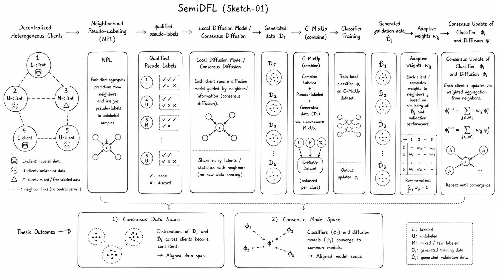 | 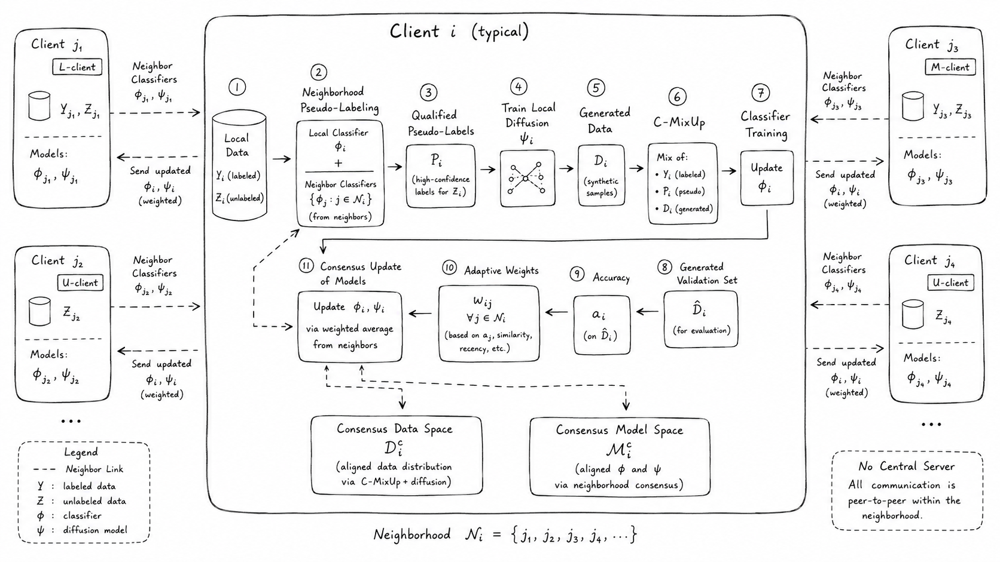 | 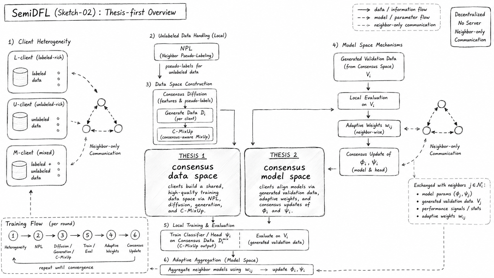 |
| S2-04 | S2-05 | S2-06 |
| 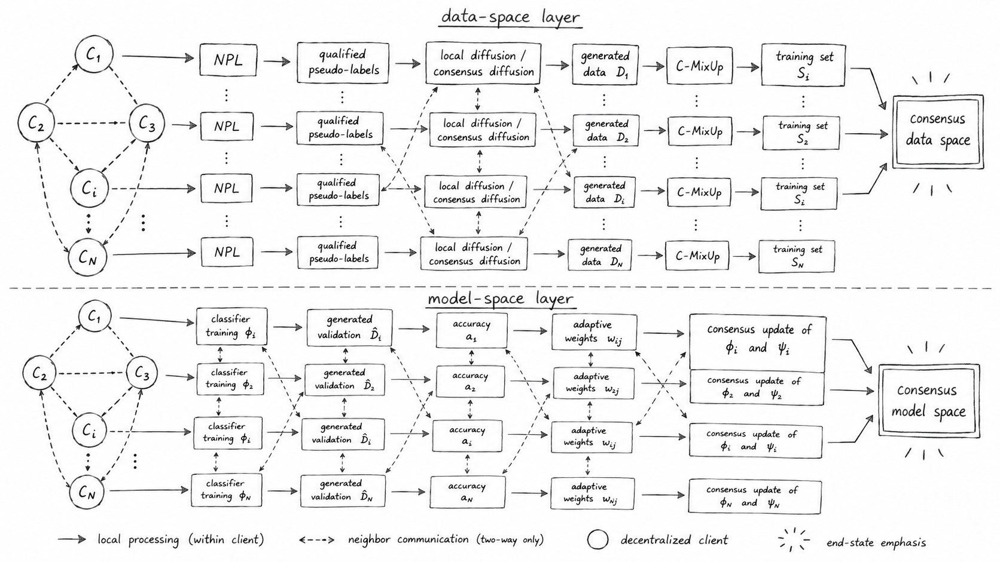 | 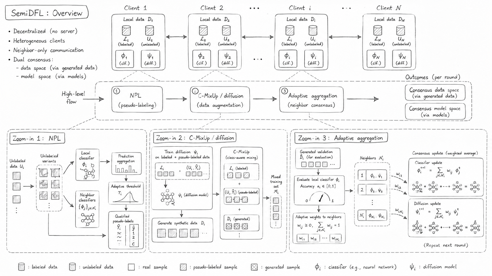 | 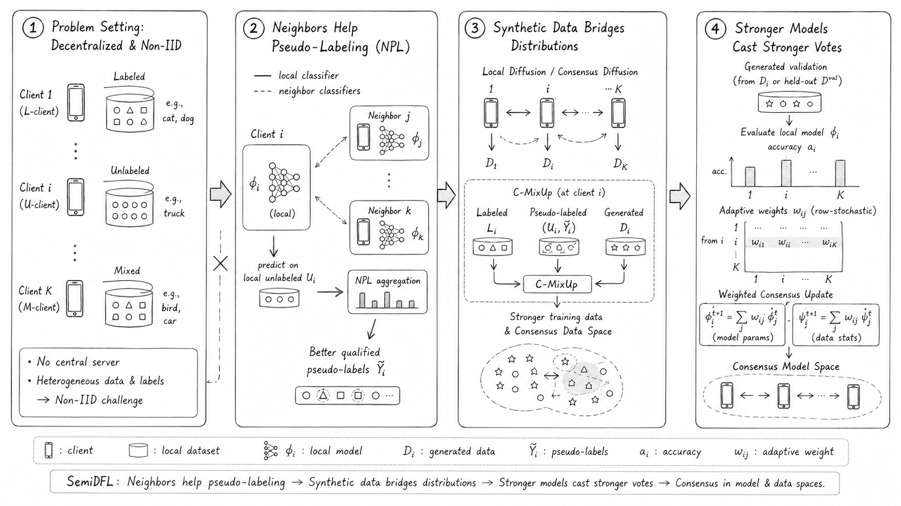 |

#### 第二轮局部筛选设计稿（R2, ChatGPT 网页版）

| S5-01 | S5-02 | S5-03 |
|---|---|---|
| 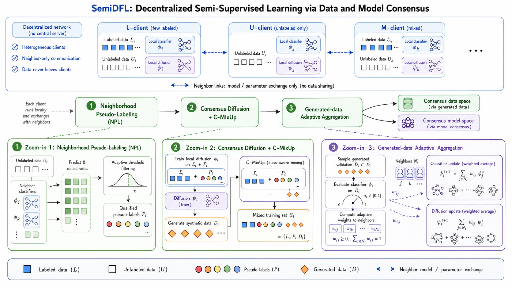 | 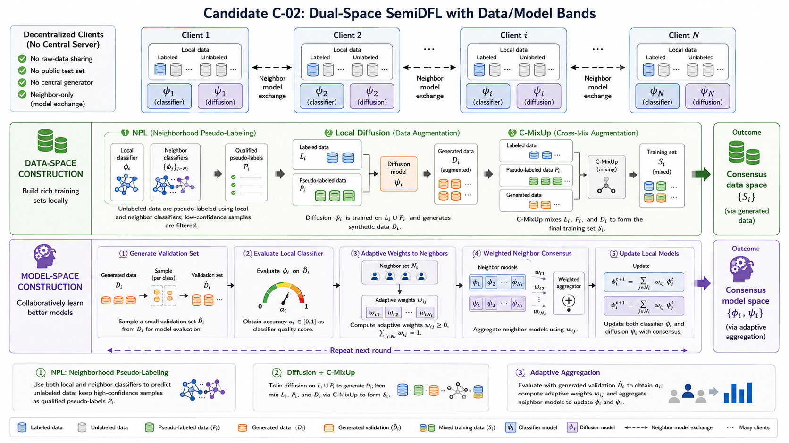 | 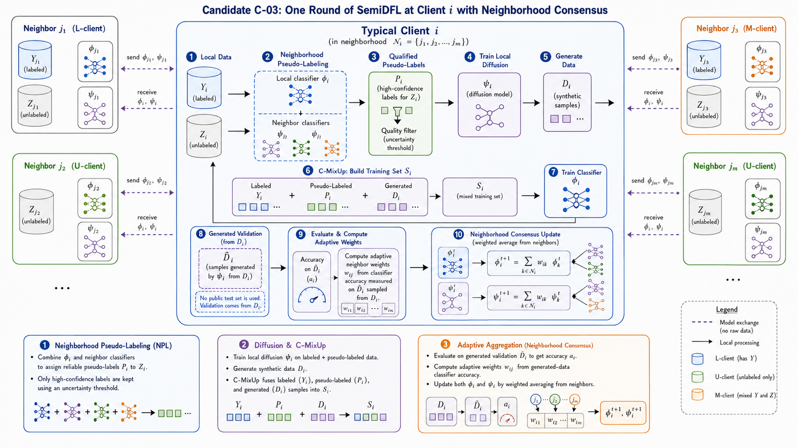 |
| S5-04 | S5-05 | S5-06 |
| 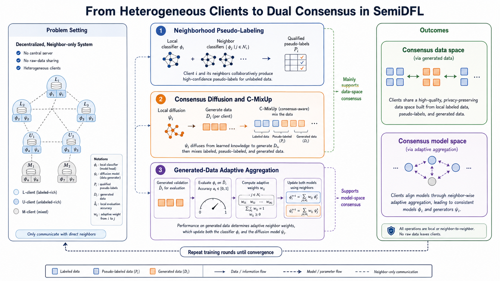 | 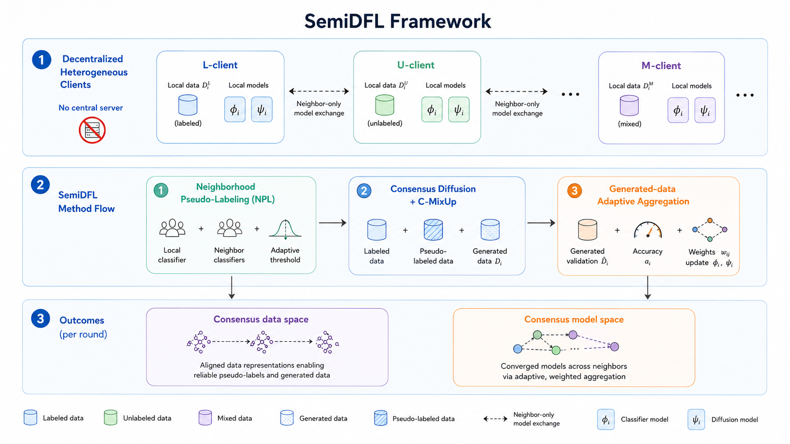 | 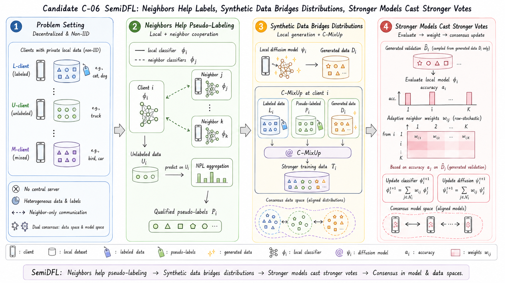 |

## 非 Codex / 非计算机专业改 Skill 指南

- 如果你不是计算机专业，但使用的是 Codex，可以直接让 Codex 自己完成迁移，并要求它用当前环境里可用的最高模型、最高推理强度和最完整的执行设置来做。可以这样写：

```text
我是 ** 专业，但是这个 skill 是面向计算机专业的，因为它的内在知识来源于对计算机文献的阅读。现在请你参考 skill 里的本地知识，倒推出这个 skill 的建立过程，然后为我所在的 ** 领域构建类似的框架图 skill。我已经将相关文献 PDF 放在了 ** 文件夹里。
```

- 如果使用其他 vibe coding 工具，例如 Trae 或 Claude Code（CC），可以先让工具根据当前环境修改 skill。可以这样写：

```text
目前这个 skill 需要调用 ChatGPT Images 2.0，或者通过 image gen 调用 Images 2.0。我现在的环境里没有配置这个能力，使用的是 ***。请根据我目前的环境修改 skill。如果能直接使用当前环境的生图 skill，就直接使用；否则，如果需要调用 API，请向我询问相关信息。
```

<a id="english"></a>

## paper-framework-figure-studio-pro | [中文](#chinese)

`paper-framework-figure-studio-pro` is a skill for making computer-science paper framework diagrams. Its goal is to provide diverse reference drafts for drawing framework figures so that users can continue the final figure-making process manually by comparing and following those drafts. It is suitable for method overviews, architecture diagrams, pipeline/process figures, and agent workflows. Special thanks to Xinyang Liu from Bristol for the support.

**Important: If you are not using Codex, or if you are outside computer science and want to adapt this skill, see the guide at the end of the English section.**

| ChatGPT Web Final Figure | Codex Final Figure |
|---|---|
|  |  |

## Summary

- The package documented here is `paper-framework-figure-studio-pro-v3.1.4a-skill.zip`. Older versions are kept in `old_versions/`, and sometimes an older version may be more suitable. This version is recommended for use in the ChatGPT web environment with extended thinking enabled; if the next step requires image generation, it is strongly recommended to manually click `Create image`.
- In this version, the second-round outputs are biased toward manual reference material for later PPT drawing, so they may sometimes look less polished than the first-round hand-drawn sketches. At the end of S3, the prompt will remind you which style to use next; the default is clean publication schematic style rather than a hand-drawn sketch style, so you need to modify the prompt to use the hand-drawn sketch style at that point.
- v3.1.4a uses `S0` to `S7` as the default mainline: paper foundation, figure strategy, sketch exploration, direction selection, candidate brief, candidate image, final figure selection with figure text support, and the Stage 7 final joint audit. This version does not aim to provide an editable SVG figure.
- This version adds image-caption co-design: candidate generation now considers title, caption, legend, and in-paper references, so the caption/legend can explain symbols and background while the figure keeps only necessary labels.
- During first-round selection, the workflow provides story-like lightweight sketches as an optional style lens for cases where they help explain a mechanism or reader path.
- The style taxonomy now pays more attention to figure subtype, layout grammar, reader path, information density, image-text division, and later SVG/PPT approximability.
- The core goal of this project is still not to force a single answer, but to provide diverse structural and visual reference drafts that support comparison, filtering, and later manual figure-making.
- In both ChatGPT web and Codex, the workflow is generally slow. Codex may perform better in some engineering-heavy scenarios, but it is usually much more token-expensive.

## Architecture Overview

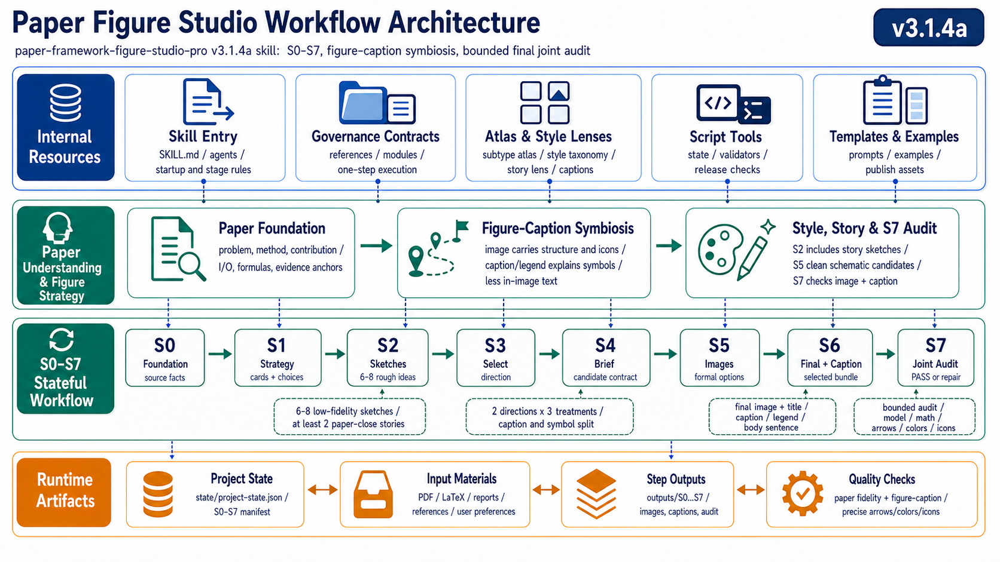

In workflow terms, v3.1.4a is not just a linear prompt chain. It is a stateful, governed, and recoverable execution system. At a high level, it can be understood as four kinds of work: the paper-foundation baseline, exploration/candidate/final selection, the Stage 7 final joint audit, and cross-cutting state artifacts plus quality checks.

- **Paper-foundation layer**: `S0-PAPER-FOUNDATION` extracts algorithms, modules, formulas, terminology, arrow relationships, and evidence anchors from the paper first, so later stages share the same factual baseline.
- **Exploration-and-selection layer**: `S1` to `S6` handle figure-type diagnosis, sketch exploration, direction filtering, candidate refinement, and final selection. This layer emphasizes divergence first and convergence later.
- **Image-caption co-design layer**: from `S4` to `S7`, the workflow considers title, caption, legend, and in-paper references so the image keeps the necessary structure while the surrounding text explains symbols, context, and reader guidance.
- **Stage 7 final joint audit layer**: `S7-FINAL-JOINT-AUDIT` is the terminal quality gate. It evaluates the selected image together with the caption, legend, and in-paper reference sentence, checking paper fidelity, model/algorithm/process/math correctness, arrow semantics, color semantics, icon relevance, and the image-caption split. The workflow is complete only after this audit passes; otherwise S7 routes the work back to text repair, image repair, or direction repair.
- **State/governance/check layer**: across the whole workflow, the system maintains step states, artifact boundaries, and recovery points so the process is easier to resume, rerun, rewind, and inspect.

The built-in reference atlas mainly supports the exploration-and-selection layer. Before `S1-FIGURE-STRATEGY` and `S2-SKETCH-EXPLORE`, it provides visible coordinates for figure subtype, layout grammar, reader detail density, and visual style, so later candidates do not diverge from prose alone.

The v3.1.4a default mainline is:

```text
S0-PAPER-FOUNDATION -> S1-FIGURE-STRATEGY -> S2-SKETCH-EXPLORE -> S3-DIRECTION-SELECT -> S4-CANDIDATE-BRIEF -> S5-CANDIDATE-IMAGE -> S6-FINAL-SELECT -> S7-FINAL-JOINT-AUDIT
```

## Built-In Reference Atlas

v3.1.4a continues to use F1-F4 as a design reference atlas, while placing more emphasis on style lenses, reader paths, and image-text division. They establish visible decision coordinates before target-paper candidates are generated, so later candidate comparison does not rely only on prose and can diverge and converge inside a visible reference system.

## Staged Workflow

- **Global exploration**: `S1-FIGURE-STRATEGY -> S2-SKETCH-EXPLORE -> S3-DIRECTION-SELECT`
- **Local refinement and final selection**: `S4-CANDIDATE-BRIEF -> S5-CANDIDATE-IMAGE -> S6-FINAL-SELECT`
- **Stage 7 final joint audit**: `S7-FINAL-JOINT-AUDIT` reviews the final image, caption, legend, and in-paper reference together, then either passes the workflow or sends it back for text, image, or direction repair.
- **Image-caption co-design**: runs through `S4` to `S7`, using caption/legend to carry explanations and reduce unnecessary in-figure words and symbols.

## Step List

| Step | Type | Purpose |
|---|---|---|
| S0-PAPER-FOUNDATION | TEXT_ONLY | Build the factual paper foundation across algorithms, modules, terminology, formulas, and arrow relationships |
| S1-FIGURE-STRATEGY | TEXT_ONLY | Diagnose figure type, narrative role, and reader effect |
| S2-SKETCH-EXPLORE | IMAGE_ONLY_PLUS_PROMPT | Global exploration sketches |
| S3-DIRECTION-SELECT | TEXT_ONLY | Filter directions for local refinement |
| S4-CANDIDATE-BRIEF | TEXT_ONLY | Prepare the local-refinement candidate matrix and prompts |
| S5-CANDIDATE-IMAGE | IMAGE_ONLY_PLUS_PROMPT | Generate local-refinement candidate figures |
| S6-FINAL-SELECT | TEXT_ONLY | Select the final framework figure and provide title, caption, legend, and in-paper reference suggestions |
| S7-FINAL-JOINT-AUDIT | TEXT_ONLY | Stage 7 terminal audit: evaluate the final image together with caption, legend, and in-paper reference text; check paper fidelity, model/algorithm/process/math correctness, arrows, colors, icons, and image-caption division before marking the workflow complete |

## Limitations and Known Issues

- The workflow is not especially fast in either environment, especially when it needs multiple candidate-generation and human-screening rounds.
- The results are not fully stable and still require human intervention and review. Output quality can vary across papers, environments, and rounds, so human judgment, filtering, and correction are still necessary. The bundled example also preserves several negative cases.
- Codex may produce better results in some full-project scenarios, but it is usually much more token-hungry.
- v3.1.4a does not treat SVG/PPT recreation as the default delivery target. Fully editable versions still require later manual reconstruction or a separate process.
- Image-caption co-design can reduce in-figure text, but users still need to check whether the caption, legend, and in-paper references accurately cover key symbols and mechanisms.

## Using in ChatGPT Web

1. First add `paper-framework-figure-studio-pro-v3.1.4a-skill.zip` to the project's Sources.
2. Then add the target paper PDF to Sources. To reproduce the example, you can use `semiDFL.pdf`.
3. Turn on **Extended thinking**.
4. When the workflow reaches an image stage, switch to **Create image**.

Startup example:

```text
Please strictly follow the human-in-the-loop workflow steps in paper-framework-figure-studio-pro-v3.1.4a-skill.zip to draw a diagram for semiDFL.pdf. Do not look at the diagram already inside semiDFL.pdf. What I mean here is not that the model is forbidden from independently coming up with something similar, but that it should not be anchored by the existing figure and should decide based on the actual situation whether a similar structure should or should not be generated.
```

## Using in Codex

1. Put `paper-framework-figure-studio-pro-v3.1.4a-skill.zip` in the current project directory.
2. Put the target paper PDF in the same directory, or specify its relative path in the prompt.
3. In Codex, use GPT-5.5 (High/Fast).
4. If token budget is limited, prefer ChatGPT web.

Startup example:

```text
Please strictly follow the human-in-the-loop workflow steps in paper-framework-figure-studio-pro-v3.1.4a-skill.zip to draw a diagram for semiDFL.pdf. Do not look at the diagram already inside semiDFL.pdf. What I mean here is not that the model is forbidden from independently coming up with something similar, but that it should not be anchored by the existing figure and should decide based on the actual situation whether a similar structure should or should not be generated.
```

## Experimental Results

The experiments in this section were run in both ChatGPT web and Codex. The Codex run used GPT-5.5 (High/Fast). Results may differ when using other models, different reasoning settings, or different runtime environments.

In ChatGPT web, when the next step is image generation, it is better to manually click the `Create image` label in the input area before continuing.

The two comparison figures near the top are `example_semiDFL_v3.1.4a/final_Image_chatgpt_web_v3.1.4a.png` and `example_semiDFL_v3.1.4a/final_Image_codex_v3.1.4a.png`, the final selected framework figures from the bundled semiDFL example workflow in ChatGPT web and Codex. `example_semiDFL_v3.1.4a/semiDFL.pdf` is the paper used in this example. The same directory keeps the global-screening sketches, local-screening drafts, final figures, ChatGPT web interaction record, and Codex runtime video for both-environment workflow comparison.

- Example results directory: `example_semiDFL_v3.1.4a/`
- Example paper: `example_semiDFL_v3.1.4a/semiDFL.pdf`
- First-round global screening sketches (ChatGPT web): `example_semiDFL_v3.1.4a/R1_results_chatgpt_web_v3.1.4a/`
- Second-round local screening design drafts (ChatGPT web): `example_semiDFL_v3.1.4a/R2_results_chatgpt_web_v3.1.4a/`
- Final selected framework figure (ChatGPT web): `example_semiDFL_v3.1.4a/final_Image_chatgpt_web_v3.1.4a.png`
- First-round global screening sketches (Codex): `example_semiDFL_v3.1.4a/R1_results_codex_v3.1.4a/`
- Second-round local screening design drafts (Codex): `example_semiDFL_v3.1.4a/R2_results_codex_v3.1.4a/`
- Final selected framework figure (Codex): `example_semiDFL_v3.1.4a/final_Image_codex_v3.1.4a.png`
- ChatGPT web interaction record: `example_semiDFL_v3.1.4a/semiDFL_chatgpt_web_v3.1.4a.mhtml`
- Codex runtime recording: `example_semiDFL_v3.1.4a/semiDFL_codex_v3.1.4a.mp4`

### Experimental Screenshots

#### Round 1 Global Screening Sketches (R1, ChatGPT Web)

| S2-01 | S2-02 | S2-03 |
|---|---|---|
|  |  |  |
| S2-04 | S2-05 | S2-06 |
|  |  |  |

#### Round 2 Local Screening Design Drafts (R2, ChatGPT Web)

| S5-01 | S5-02 | S5-03 |
|---|---|---|
|  |  |  |
| S5-04 | S5-05 | S5-06 |
|  |  |  |

## Adapting This Skill Outside Codex or Computer Science

- If you are outside computer science and using Codex, let Codex do the adaptation itself, using the strongest available model, highest reasoning setting, and most complete execution settings. You can write:

```text
I am in **, but this skill is designed for computer science, because its internal knowledge comes from reading computer-science papers. Please use the local knowledge inside this skill as a reference, infer the process used to build it, and then build a similar framework-diagram skill for my ** field. I have put the relevant paper PDFs in the ** folder.
```

- If you are using another vibe coding tool, such as Trae or Claude Code (CC), first ask it to adapt the skill to your current environment. You can write:

```text
This skill currently needs to call ChatGPT Images 2.0, or to call Images 2.0 through image gen. My current environment does not have that configured; I am using *** instead. Please modify the skill according to my current environment. If the current environment has an image-generation skill that can be used directly, use it directly. Otherwise, if an API call is needed, ask me for the required information.
```
